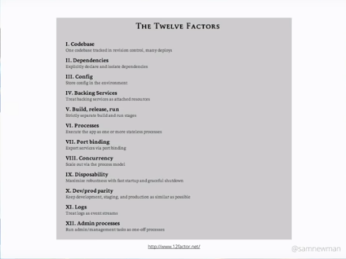

# Microservices by Sam Newman at Devoxx

## Intro

**Microservices**: small autonomous services that work together modelled around a business domain.

**Twelve factors**:

**Modeling things around business domain**:

**Culture of Automation**:

**Hide implementation details**:

**Decentralizing all the things**:

**Deploy independently**:

**Consumer First**:

* use swagger
* Use service discovery

**Isolating failure**:

**Highly observable**:

**Correlation IDs**:

