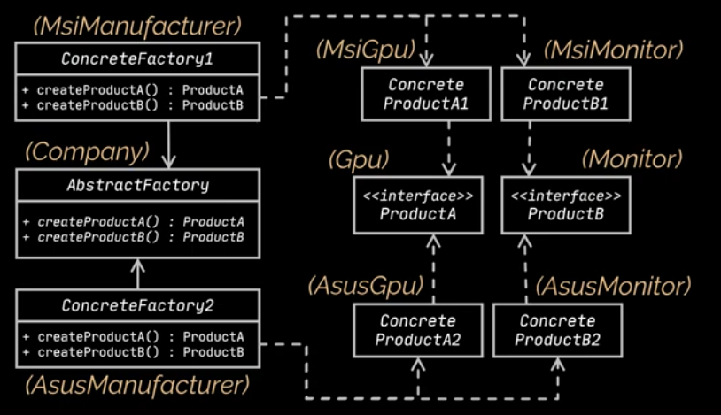

# Factory Design pattern

Factory Method is a creational design pattern that provides an interface for creating objects in a superclass, but
allows subclasses to alter the type of objects that will be created. Detailed explanation guru
website: [guru](https://refactoring.guru/design-patterns/factory-method)

## Problem

If the code is coupled to one specific Class and business enforce us to Create another class, adopting the business to
this class will difficult because all the classes are coupled with the first one. For example, we have logistics app
with Truck class and, we want to add Ship Transportation and the case happens.

## Solution

Pattern suggests that we replace using new keyword directly for Object initialization with a factory method that handles
this for us and returns product object.
So all the subclasses of the baseclass have their own implementation of the factory method.

The code that uses the factory method (often called the client code) doesn't see a difference between the actual
products returned by various subclasses. The client treats all the products as abstract Transport. The client knows that
all transport objects are supposed to have the delivery method, but exactly how it works isn’t important to the client.

> We have three types of factory patterns:
> * Simple Factory pattern
> * Factory method pattern
> * Abstract Factory method pattern

## Simple Factory pattern

On this type we just externalize the Factory part to a single class. We have several if/else statements for identifying
which Type to instantiate. In this case we solve the Single responsibility but, we have open closed issue. because every
time we have a new Product, we need to modify the factory class.

## Factory method pattern

Using this we create an abstract createProduct() method and implement factories for different products. in this case
We only have to extend the factory class for new features.

## Abstract Factory method pattern

Allows us to produce families of related objects without specifying their concrete classes.
more details [here](https://refactoring.guru/design-patterns/abstract-factory)

