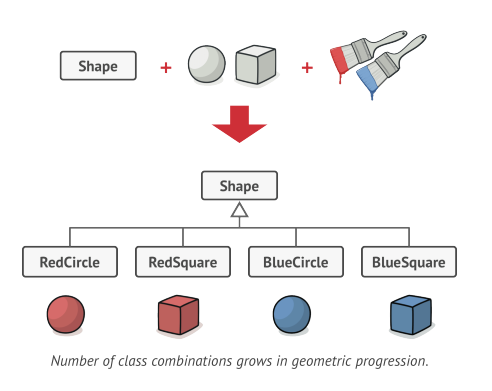
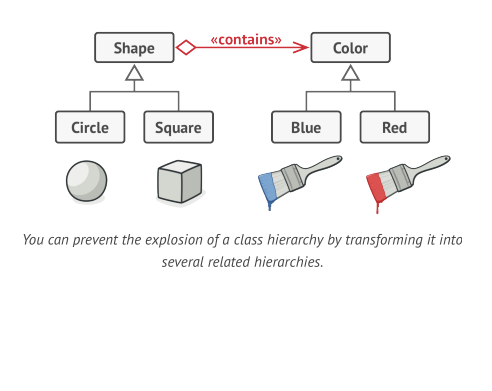

# Bridge Design Pattern

Bridge is a structural design pattern that lets you split a large class or a set of closely related classes into two
separate hierarchies—abstraction and implementation—which can be developed independently of each other.

## Problem



## Solution



The Bridge pattern attempts to solve this problem by switching from inheritance to composition. What this means is that
you extract one of the dimensions into a separate class hierarchy, so that the original classes will reference an object
of the new hierarchy, instead of having all of its state and behaviors within one class.

### GO4 explanation

Abstraction (also called interface) is a high-level control layer for some entity. This layer isn’t supposed to do any
real work on its own. It should delegate the work to the implementation layer (also called platform).

> Above statement is not exclusively pointing to interface and abstract classes in coding. This abstraction is also
> applicable on GUI and OS API separation.

## Application

Use the Bridge pattern when you want to divide and organize a monolithic class that has several variants of some
functionality (for example, if the class can work with various database servers).

## Code

### Abstraction

```java
public class Remote {
    private Device device;

    public Remote(Device device) {
        this.device = device;
    }

    void redButton() {
        if (device.isEnabled())
            device.disable();
        else
            device.enable();
    }

    void buttonUp() {
        device.volumeUp();
    }

    void buttonDown() {
        device.volumeDown();
    }

    void numberButton() {
        device.changeChannel();
    }
}
```

### Implementation

```java
public interface Device {
    boolean isEnabled();

    void enable();

    void disable();

    void changeChannel();

    int volumeUp();

    int volumeDown();
}
```

### Concrete Implementation

```java
public class Tv implements Device {
    @Override
    public boolean isEnabled() {
        return false;
    }

    @Override
    public void enable() {
        System.out.println("on");
    }

    @Override
    public void disable() {
        System.out.println("off");
    }

    @Override
    public void changeChannel() {
        System.out.println("channelChanged");
    }

    @Override
    public int volumeUp() {
        System.out.println("volumeUp");
        return 0;
    }

    @Override
    public int volumeDown() {
        System.out.println("volumeDown");
        return 0;
    }
}
```
