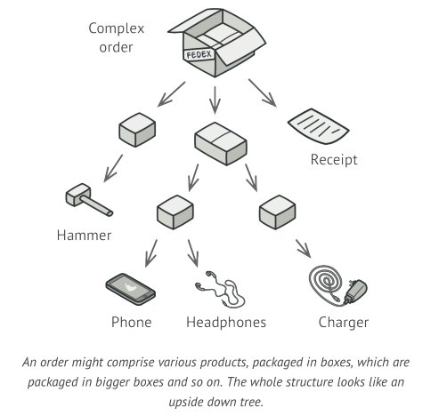
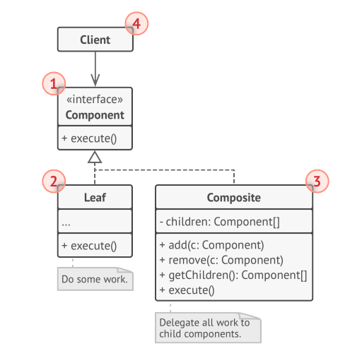
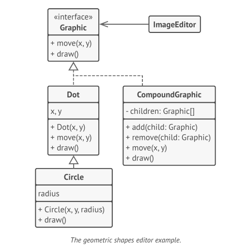

# Composite Design Pattern

Composite is a structural design pattern that lets you compose objects into tree structures and then work with these
structures as if they were individual objects.

## Problem



## Solution

The Composite pattern suggests that you work with Products and Boxes through a common interface which declares a method
for calculating the total price.

it’d simply return the product’s price. For a box, it’d go over each item the box contains, ask its price and then
return a total for this box. If one of these items were a smaller box, that box would also start going over its contents
and so on, until the prices of all inner components were calculated.

The greatest benefit of this approach is that you don’t need to care about the concrete classes of object that compose
the tree. You don’t need to know whether an object is a simple product or a sophisticated box. You can treat them all
the same via the common interface. When you call a method, the objects themselves pass the request down the tree.




## Code

### Common Interface

```java
public interface Graphic {
    void move(int x, int y);

    void draw();
}
```

### Component

```java
public class Dot implements Graphic {
    int x;
    int y;

    public Dot(int x, int y) {
        this.x = x;
        this.y = y;
    }

    @Override
    public void move(int x, int y) {
        this.x = x;
        this.y = y;
    }

    @Override
    public void draw() {
        System.out.println("draw dot");
    }
}
```

### Optional Component

```java
public class Circle extends Dot {
    int radios;

    public Circle(int x, int y, int radios) {
        super(x, y);
        this.radios = radios;
    }


    @Override
    public void draw() {
        System.out.println("drew circle");
    }
}
```

### Composite(container)

```java
public class GraphicCompound implements Graphic {
    List<Graphic> children = new ArrayList<>();

    public void add(Graphic shape) {
        children.add(shape);
    }

    public void remove(Graphic shape) {
        children.remove(shape);
    }

    @Override
    public void move(int x, int y) {
        children.forEach(graphic -> graphic.move(x, y));
    }

    @Override
    public void draw() {
        children.forEach(Graphic::draw);
    }
}

```
