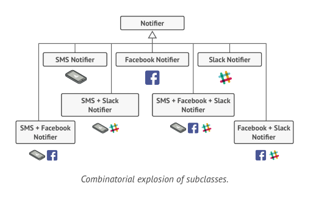
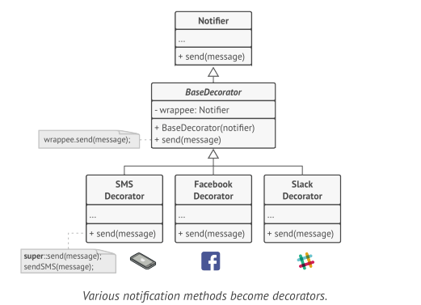
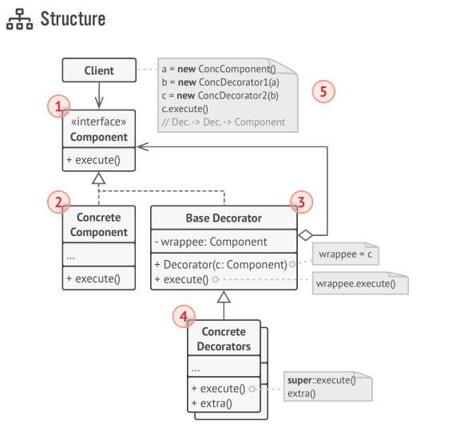
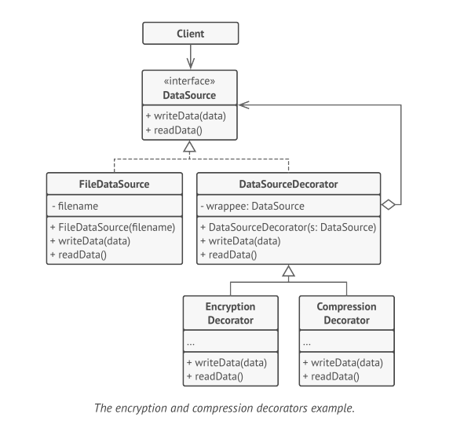

# Decorator Design Pattern

Decorator is a structural design pattern that lets you attach new behaviors to objects by placing these objects inside
special wrapper objects that contain the behaviors.

## Problem



## Solution

Extending a class is the first thing that comes to mind when you need to alter an object’s behavior. However,
inheritance has several serious caveats that you need to be aware of.

* Inheritance is static. You can’t alter the behavior of an existing object at runtime. You can only replace the whole
  object with another one that’s created from a different subclass.
* Subclasses can have just one parent class. In most languages, inheritance doesn't let a class inherit behaviors of
  multiple classes at the same time.

One of the ways to overcome these caveats is by using Composition instead of Inheritance. With composition one object
has a reference to another and delegates it some work, whereas with inheritance, the object itself is able to do that
work, inheriting the behavior from its superclass. We can also change the behavior at runtime.

Wrapper is the alternative nickname for the Decorator pattern that clearly expresses the main idea of the pattern. A
“wrapper” is an object that can be linked with some “target” object. The wrapper contains the same set of methods as the
target and delegates to it all requests it receives. However, the wrapper may alter the result by doing something either
before or after it passes the request to the target.





## Code

### Component

```java
public interface DataSource {
    void writeData(byte[] data);

    byte[] readData();
}
```

### Concrete Component

```java
public class FileDataSource implements DataSource {

    private String filename;

    public FileDataSource(String filename) {
        this.filename = filename;
    }

    @Override
    public void writeData(byte[] data) {
        System.out.println("wrote data in file");
    }

    @Override
    public byte[] readData() {
        System.out.println("read data from a file");
        return new byte[0];
    }
}
```

### Decorators

```java
public class EncryptionDataSourceDecorator implements DataSource {
    private DataSource dataSource;

    public EncryptionDataSourceDecorator(DataSource dataSource) {
        this.dataSource = dataSource;
    }

    @Override
    public void writeData(byte[] data) {
        dataSource.writeData(data);
        System.out.println("encrypted and wrote the file");
    }

    @Override
    public byte[] readData() {
        System.out.println("decrypted & read file");
        return dataSource.readData();
    }
}
```

```java
public class CompressionDataSourceDecorator implements DataSource {
    private DataSource dataSource;

    public CompressionDataSourceDecorator(DataSource dataSource) {
        this.dataSource = dataSource;
    }

    @Override
    public void writeData(byte[] data) {
        System.out.println("compressed and wrote file");
        dataSource.writeData(data);
    }

    @Override
    public byte[] readData() {
        System.out.println("decompressed and read file");
        return dataSource.readData();
    }
}

```

### Client Code

```java
public class Demo {
    public static void main(String[] args) {
        var datasource = new CompressionDataSourceDecorator
                (new EncryptionDataSourceDecorator
                        (new FileDataSource("ALO")));
        var data = "hello".getBytes();
        datasource.writeData(data);
        datasource.readData();
    }
}
```
