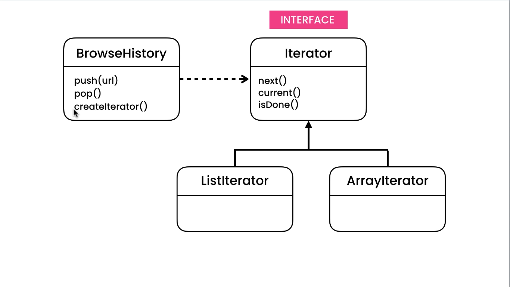

# Iterator Pattern

## Problem

We have a class that has a collection property. in other classes if we want to see all the values inside this collection
we have to iterate it using for or foreach loop. The problem here is if we ever change the class attribute type to array
the whole mechanism of the Main class need to be changed. This is like a remote controller break after changing the
lights of TV.

## Solutions

We need to provide methods to support iterations in the class.



```java
public interface Iterator<T> {
    boolean hasNext();

    T current();

    void next();
}
```

```java
public class BrowseHistory {
    private final List<String> history = new ArrayList<>();

    public void push(String url) {
        this.history.add(url);
    }

    public String pop() {
        String lastElement = history.get(history.size() - 1);
        history.remove(lastElement);
        return lastElement;
    }

    public Iterator<String> createIterator() {
        return new ListIterator(this);
    }

    private static class ListIterator implements Iterator<String> {
        BrowseHistory browseHistory;
        int index;

        public ListIterator(BrowseHistory browseHistory) {
            this.browseHistory = browseHistory;
        }

        @Override
        public boolean hasNext() {
            return index < browseHistory.history.size();
        }

        @Override
        public String current() {
            return browseHistory.history.get(index);
        }

        @Override
        public void next() {
            index++;
        }
    }
}
```

```java
public class Main {
    public static void main(String[] args) {
        BrowseHistory browseHistory = new BrowseHistory();
        browseHistory.push("a");
        browseHistory.push("b");
        browseHistory.push("c");

        Iterator<String> iterator = browseHistory.createIterator();
        while (iterator.hasNext()) {
            String current = iterator.current();
            LoggerFactory.getLogger(Main.class).info("value is: {} ", current);
            iterator.next();
        }
    }
}
```

## Benefits

As soon as we implement this pattern, If we ever change the type of the collection we no longer need to modify other
classes.
