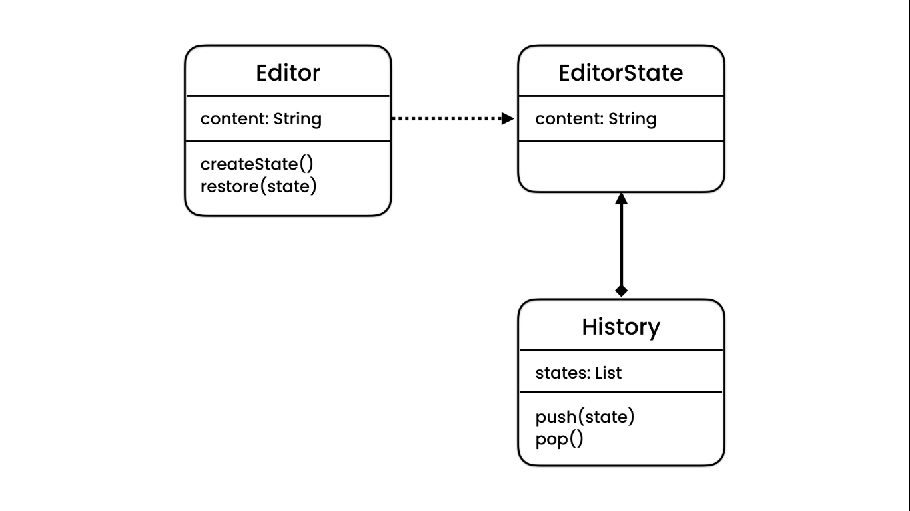
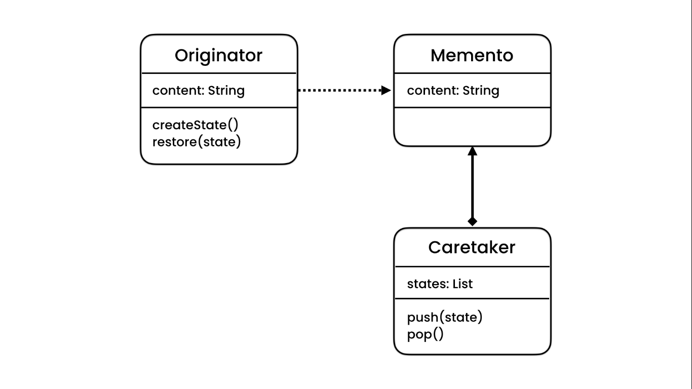

# Memento Pattern

## Concept & Problem

This is a pattern for implementing undo mechanisms. If we create a field for storing another one's previous state, we
can only restore one state and, also we need to define one extra for each field. We can also Use a list but then again
We need one for each class. We can externalize a separate class and use it within the class for managing states but this
will violate single responsibility.

## Solution

What we do is to Create a Memento class which is responsible for the states of the class we want (Originator)
THis class will have a composition relation with Caretaker class that has a Stack or List. With this pattern The 
Originator would only have a dependency relationship through createState & Restore methods with Memento class.
