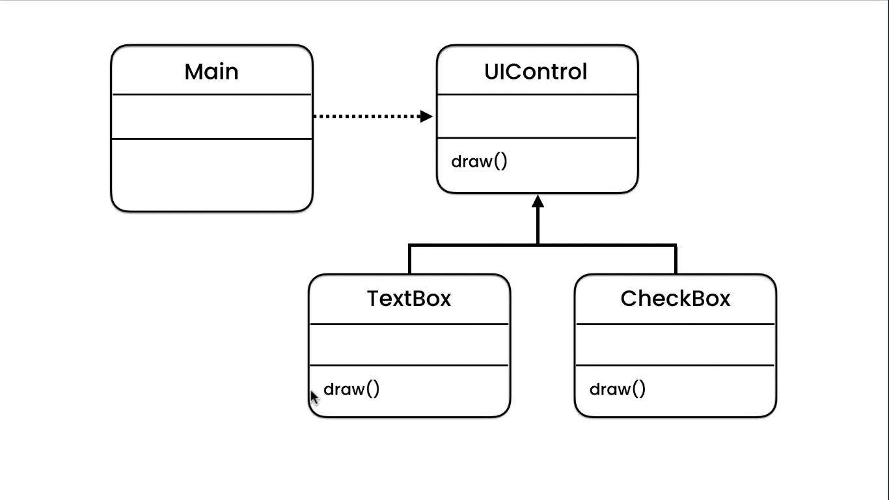
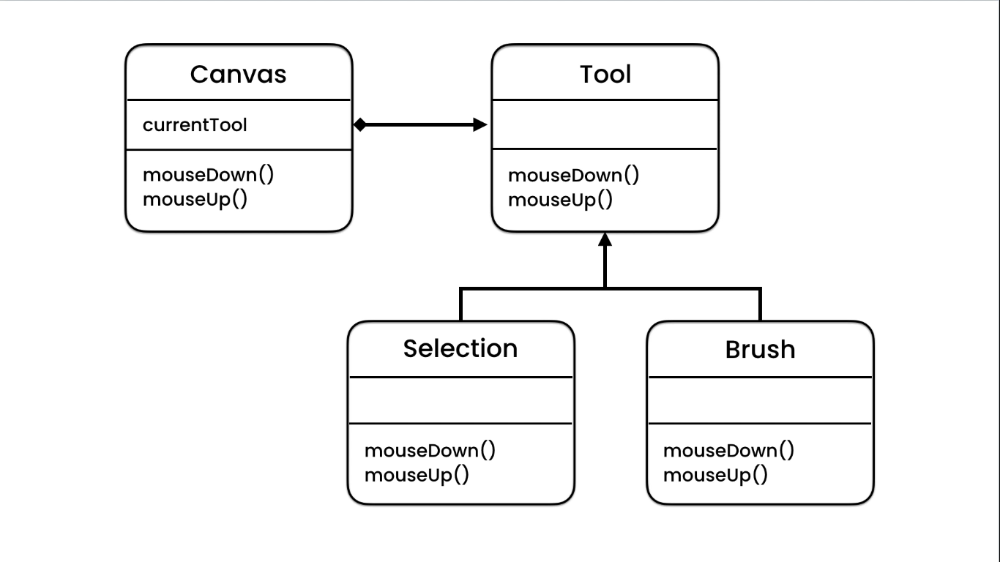
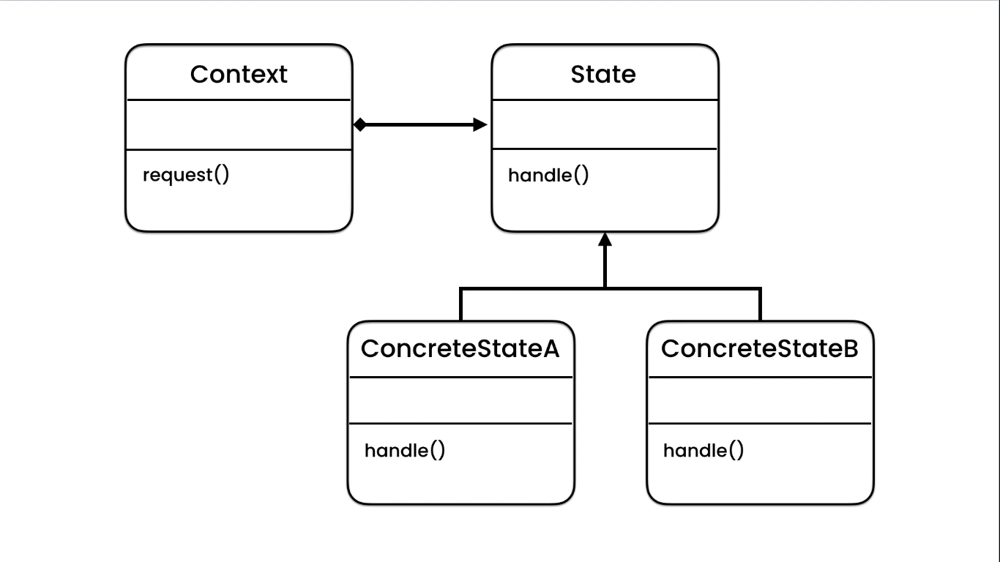

# State Pattern

---

## Problem

There are times we need to do something base on an object state or value, for example, in photoshop base on the tool we
choose from left sidebar the mouse icon should change when we are working in canvas area. Implementing this usually we
write long switch or if statements and make a decision base on the value which is pretty ugly and unmaintainable. Means
if we want to use it anywhere and, it changes we need to make changes everywhere.

```java
public class Problem {
    private CustomEnum ENUM;

    public Problem(CustomEnum ENUM) {
        this.ENUM = ENUM;
    }

    public void event() {
        if (ENUM.FOO)
            System.out.println("FOO SELECTED");
        else if (ENUM.BAR)
            System.out.println("BAR SELECTED");
    }
}
```

## Solution

We can solve this using polymorphism. We can create an abstract class and define event methods which may try to
resolve these enum types and execute specific operations base on them. Then we can implement this abstract form and
use them when we need them.

## Implementation

We create an abstract Class or Interface:

```java
public interface Tool {
    void mouseUp();

    void mouseDown();
}
```

Now we create custom Implementations base on need:

```java
public class BrushTool implements Tool {
    void mouseUp() {
        System.out.println("USING BRUSH TOOL");
    }

    void mouseDown() {
        System.out.println("DRAW a line");
    }
}

public class SelectionTool implements Tool {
    void mouseUp() {
        System.out.println("USING SELECTION TOOL");
    }

    void mouseDown() {
        System.out.println("SELECT a rectangle");
    }
}
```

Then we use these in Canvas:

```java
public class Canvas {
    private Tool tool;

    public Tool(Tool tool) {
        this.tool = tool;
    }

    void mouseUp() {
        tool.mouseUp();
    }

    void mouseDown() {
        tool.mouseDown();
    }

    public Tool getTool() {
        return tool;
    }

    public Canvas setTool(Tool tool) {
        this.tool = tool;
        return this;
    }
}

public class Main(String[] args) {
    public static void main(String[] args) {
        Canvas canvas = new Canvas(new BrushTool());

    }
}
```





## Abuse patterns (Design Smell)


We want to write a Stopwatch class, it has a button which operates base on the state of watch. it stops if it's running
or runs if it's stopped. We do this base on a boolean state.

```java
public class Stopwatch {
    private boolean isRunning;

    public Stopwatch() {
        this.isRunning = false;
    }

    public boolean click() {
        if (!isRunning)
            return isRunning = true;
        return isRunning = false;
    }
}
```

> _Now if we say **_BOOM_** Here we can have a state pattern and refactor it we'll have much more trouble because We
> need to create an interface and implement two instances base on state and then use it in stopwatch class. But the
> fact is we will abuse this pattern without considering that this stopwatch won't have any other state other than
> running or stopping. So we don't have maintainability or extensibility issues in the future._
