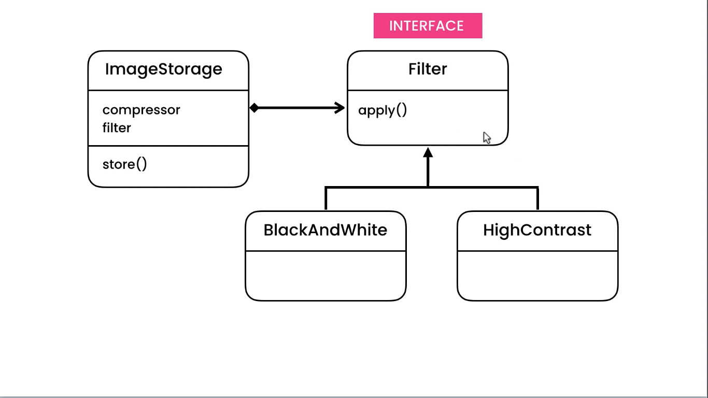
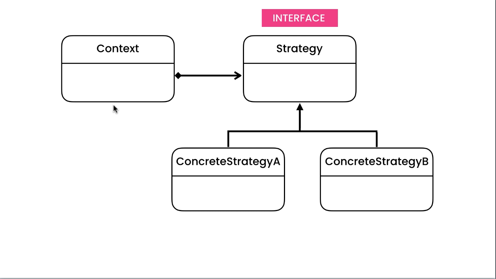
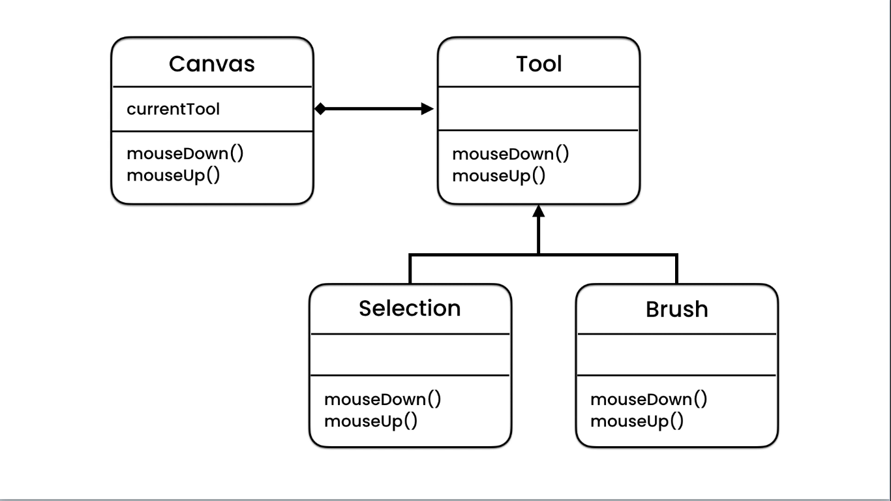
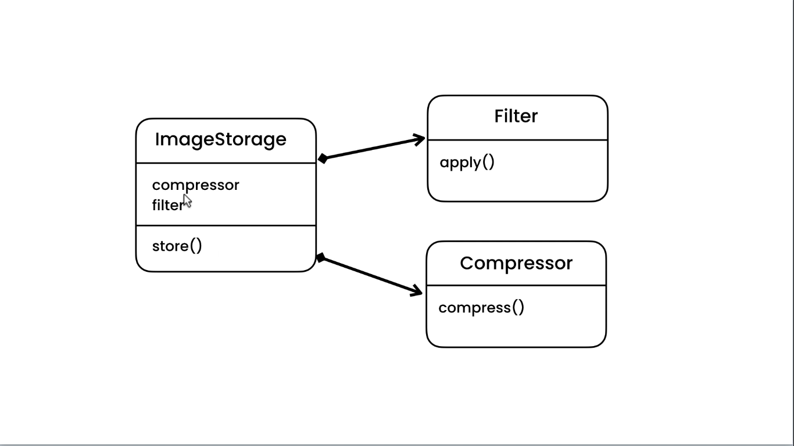

# Strategy Pattern

## Problem

We want to store an image, The image first needs to be compressed and filtered using known methods. Trying to achieve
this we end up putting conditions and using multiple if statements base on compress and filter types. In this way we
violate single responsibility problem because in order to store the image we are also determining compress method and
filter. Also, if we add a compress method or filter we need to modify this class because it's coupled with it.

## Solution

We are going to use the power of polymorphism to solve this problem.




The difference between strategy and state is that, in state the object can have a single state that corresponds with
interface and all behaviors are implemented by subclasses. in contrast, in strategy we don't have single state,
different behaviors are represented by different strategy objects.




## Code

```java
public interface ImageCompressor {
    void compress(String image);
}
```

```java
public class JpegCompressor implements ImageCompressor {
    @Override
    public void compress(String image) {
        System.out.println("compressed -> JPEG");
    }
}
```

```java
public interface ImageFilter {
    void filter(String image);
}
```

```java
public class BlackAndWhiteFilter implements ImageFilter {
    @Override
    public void filter(String image) {
        System.out.println("filter -> black & white");
    }
}
```

```java
public class ImageStorage {

    public void store(String image, ImageCompressor compressor, Imagefilter filter) {
        compressor.compress(image);
        filter.filter(image);
        System.out.println("stored " + image + " compressed & filtered");
    }
}
```
