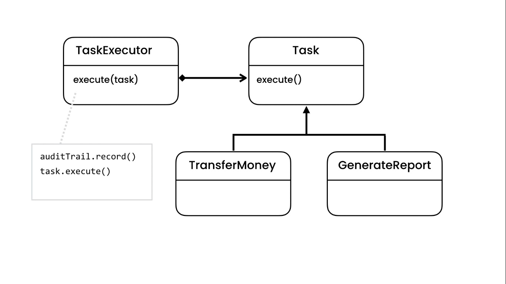
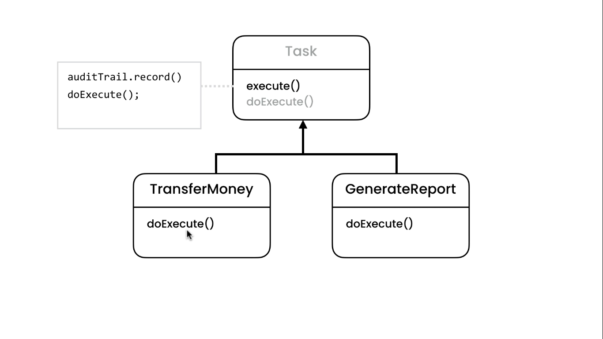
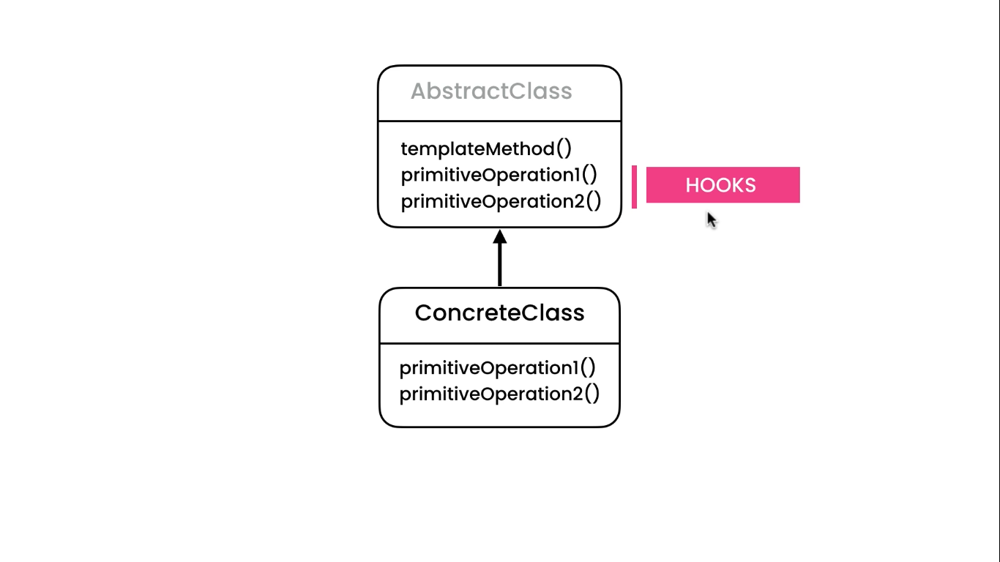

# Template Method Pattern

## Problem

We need an application to audit the trails of the actions like doing a transaction and reporting a task. In order to
achieve open closed we create a AuditTrails class and use it as a dependency in other classes we want. The problem is
Whenever we need to audit an event or task We need to follow this same steps:

* add AuditTrail as dependency
* initialize it in constructor

```java
public class AuditTrail {
    public void record() {
        System.out.println("record");
    }
}
```

```java
public class TransferMoney {
    private AuditTrail auditTrail;

    public TransferMoney(AuditTrail auditTrail) {
        this.auditTrail = auditTrail;
    }

    public void execute() {
        auditTrail.record();
        System.out.println("transferMoney");
    }
}
```

```java
public class ReportTask {
    private AuditTrail auditTrail;

    public ReportTask(AuditTrail auditTrail) {
        this.auditTrail = auditTrail;
    }

    public void execute() {
        auditTrail.record();
        System.out.println("reportTask");
    }
}
```

## Solution

We can either solve this using polymorphism in Strategy pattern or Inheritance.

### Strategy



### Inheritance




```java
public abstract class Task {
    private AuditTrail auditTrail;

    public Task() {
        auditTrail = new AuditTrail();
    }

    public Task(AuditTrail auditTrail) {
        this.auditTrail = new AuditTrail();
    }

    public void execute() {
        auditTrail.record();
        doExecute();
    }

    protected abstract void doExecute();
}
```

```java
public class TransferMoney extends Task {
    protected void doExecute() {
        System.out.println("transfer money");
    }
}
```

```java
public class ReportTask extends Task {
    protected void doExecute() {
        System.out.println("report task");
    }
}
```
