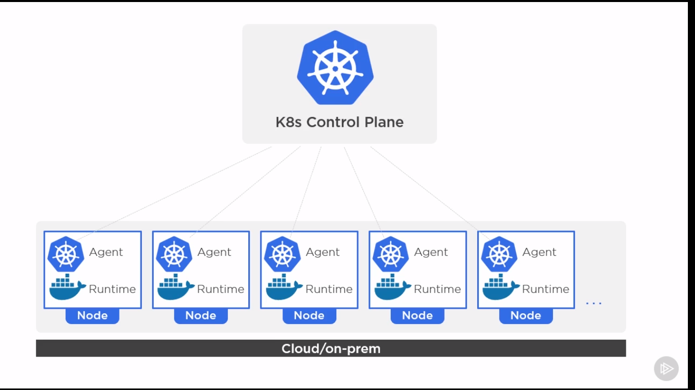
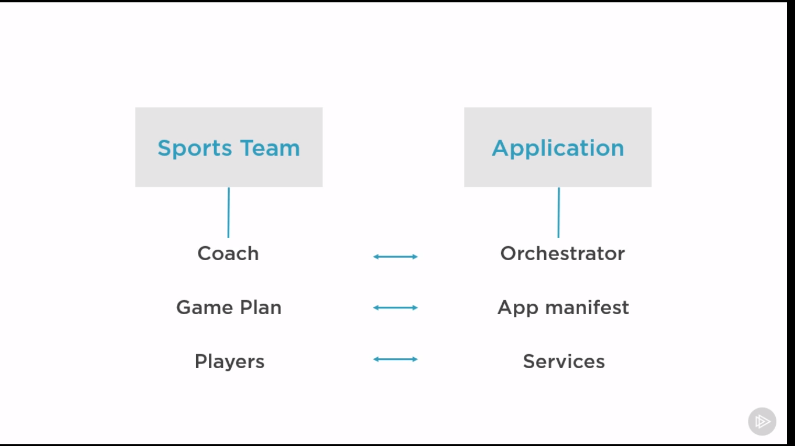

# Kubernetes

---

## What is kubernetes

Docker provides mechanism on starting, stopping and deleting containers. Which are low level stuff. but kubernetes
doesn't care about low level stuff. It cares about, scheduling, scaling, healing and updating containers without
downtime.

## How it works

For example, we have an application which has NGINX configured for frontend and MySQL for backend. We say that we
need two containers of the front end and one for backend.
Now if the load of the frontend goes up kubernetes can create another container on the other node without our
interception. It can also remove containers if the load is low. Also, if one node goes down it will immediately create
one for us.

> Another incredible thing kubernetes can do for us is that if our application is deployed on kubernetes we can easily
> change the location of our app, moving to cloud, on prem or even moving to another cloud.

What kubernetes is so much a star in is, orchestration. When project scales we can't deploy hundreds of containers on
different nodes manually. The first keys of orchestration is:

* define the parts of app and their requirements,
* how they interact
* deploy and manage the app

So we need game plan we pass it to kubernetes and it can deploy our app.

## Suitable workloads

First we need to abstract definition of:

* Stateful: application that needs to remember stuff, means if app goes down suddenly, has to come back up with all data
  without loss. Like a database which we use volume to remember state. If node one goes down, kubernetes should create
  one in node 2 without data loss.
* Stateless: Doesn't have to remember anything like web server.

Docker and Kubernetes sound like magic when we have a stateless app. But still applicable for legacy monolithic apps,
but It's going to be much harder.
