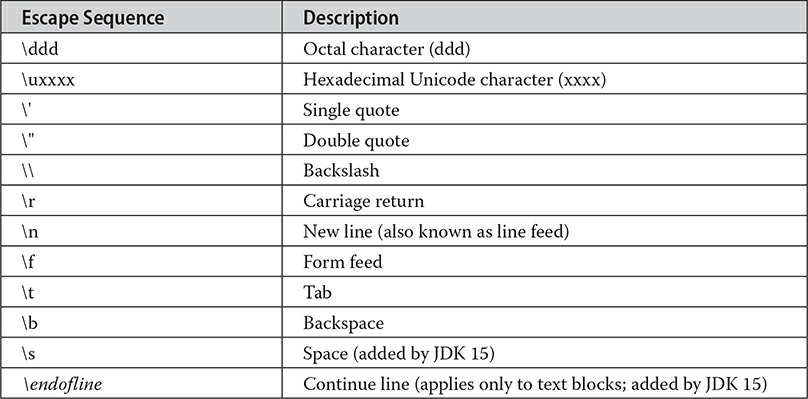
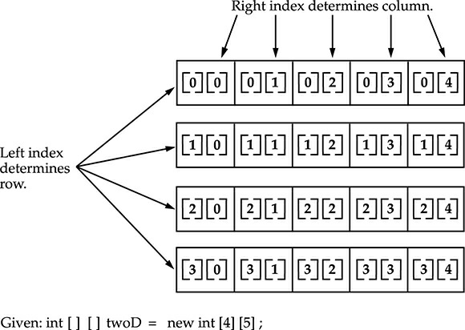

# Data Types, Variables, and Arrays

The most fundamental aspects of a software.

## Java Is a Strongly Typed Language

Every variable has a type, every expression has a type, and every type is strictly defined. All assignments, whether explicit or via parameter passing in method calls, are checked for type compatibility.

### The Primitive Types

#### Integers

| type  | width | minimum | maximum  |
| ----- | ----- | ------- | -------- |
| byte  | 8     | -2^7    | 2^7 - 1  |
| short | 16    | -2^15   | 2^15 - 1 |
| int   | 32    | -2^31   | 2^31 - 1 |
| long  | 64    | -2^63   | 2^63 - 1 |

#### Floating Types

| type   | width | minimum  | maximum  |
| ------ | ----- | -------- | -------- |
| double | 64    | 4.9e-324 | 1.8e+308 |
| float  | 32    | 1.4e-045 | 3.4e+038 |

#### Characters

A key point to understand is that Java uses Unicode to represent characters. `char` is 16 bits.

> In the formal specification for Java, char is referred to as an integral type, which means that it is in the same general category as int, short, long, and byte. However, because its principal use is for representing Unicode characters, char is commonly considered to be in a category of its own.

#### Booleans

Java has a primitive type, called boolean, for logical values. It can have only one of two possible values, true or false. This is the type returned by all relational operators, as in the case of a < b.

### Literals

#### Integer Literals

Any whole number value is an integer literal. Decimal, Octal(09), Binary(0B1231) and Hexadecimal(0Xf123b) bases are supported.

> Since Java is strongly typed, it is possible to assign an integer literal to one of Java’s other integer types, such as byte or long, without causing a type mismatch error. When a literal value is assigned to a `byte` or `short` variable, no error is generated if the literal value is within the range of the target type. An integer literal can always be assigned to a long variable. However, to specify a `long` literal, you will need to explicitly tell the compiler that the literal value is of type long. You do this by appending an upper- or lowercase L to the literal.

#### Floating Literals

Floating-point numbers represent decimal values with a fractional component. scientific notation uses a standard-notation floating-point number plus a suffix that specifies a power of 10 by which the number is to be multiplied. The exponent is indicated by an E or e followed by a decimal number, which can be positive o negative.
Hexadecimal floating-point literals are also supported, but they are rarely used. They must be in a form similar to scientific notation, but a P or p, rather than an E or e, is used. For example, 0x12.2P2 is a valid floating-point literal. The value following the P, called the binary exponent, indicates the power-of-two by which the number is multiplied. Therefore, 0x12.2P2 represents 72.5.

#### Boolean Literals

Boolean literals are simple. There are only two logical values that a boolean value can have, true and false. The values of true and false do not convert into any numerical representation. The true literal in Java does not equal 1, nor does the false literal equal 0. In Java, the Boolean literals can only be assigned to variables declared as boolean or used in expressions with Boolean operators.

#### Character Literals



#### String Literals

String literals in Java are specified like they are in most other languages—by enclosing a sequence of characters between a pair of double quotes.

> s you may know, in some other languages strings are implemented as arrays of characters. However, this is not the case in Java. Strings are actually object types. As you will see later in this book, because Java implements strings as objects, Java includes extensive string-handling capabilities that are both powerful and easy to use.

### Variables

#### Scope

block is begun with an opening curly brace and ended by a closing curly brace. A block defines a scope. A scope determines what objects are visible to other parts of your program. It also determines the lifetime of those objects.

> Scopes can be nested. For example, each time you create a block of code, you are creating a new, nested scope. When this occurs, the outer scope encloses the inner scope. This means that objects declared in the outer scope will be visible to code within the inner scope. However, the reverse is not true.
> _Variables are created when their scope is entered, and destroyed when their scope is left._

#### Type conversion & casting

If the two types are compatible, then Java will perform the conversion automatically. However, not all types are compatible, and thus, not all type conversions are implicitly allowed. For instance, there is no automatic conversion defined from double to byte.

Automatic conversion occurs when:

- Two Types are compatible
- The destination type is larger than the source type

> here are no automatic conversions from the numeric types to char or boolean. Also, char and boolean are not compatible with each other.
> As mentioned earlier, Java also performs an automatic type conversion when storing a literal integer constant into variables of type byte, short, long, or char

To create a conversion between two incompatible types, you must use a cast. A cast is simply an explicit type conversion. It has this general form:

`(target-type) value`

##### Narrowing

```Java
int i = 23;
byte b;
b = (byte) i;
```

##### Truncation

when a floating-point value is assigned to an integer type

##### Automatic type promotion in expressions

In an expression, the precision required of an intermediate value will sometimes exceed the range of either operand.

```Java
byte a = 40, b=50, c=100;
int d = a * b / c;
```

Java automatically promotes each byte, short, or char operand to int when evaluating an expression.

> This means that the subexpression a \* b is performed using integers not bytes.

Type Promotion Rules:

1. all byte, short, and char values are promoted to int
2. if one operand is a long, the whole expression is promoted to long.
3. If one operand is a float, the entire expression is promoted to float.
4. If any of the operands are double, the result is double.

### Arrays

An array is a group of like-typed variables that are referred to by a common name. Arrays of any type can be created and may have one or more dimensions. A specific element in an array is accessed by its index. Arrays offer a convenient means of grouping related information.

#### One dimentional

`type[ ] var-name;`

> The element type determines the data type of each element that comprises the array.

you must allocate an array using `new` and assign it to month_days. new is a special operator that allocates memory.

`array-var = new type [size];`

> size specifies the number of elements in the array

You can access a specific element in the array by specifying its index within square brackets.

Arrays can be allocated and initialized when they are declared.

> Java strictly checks to make sure you do not accidentally try to store or reference values outside of the range of the array. The Java run-time system will check that all array indexes are in the correct range.

#### Multidimensional Arrays

In Java, multidimensional arrays are implemented as arrays of arrays. To declare a multidimensional array variable, specify each additional index using another set of square brackets.

`int[][] twoD = new int[4][5];`



> When you allocate memory for a multidimensional array, you need only specify the memory for the first (leftmost) dimension. You can allocate the remaining dimensions separately. For example, this following code allocates memory for the first dimension of twoD when it is declared. It allocates the second dimension separately.

```Java
int[][] twoD = new int[4][];
twoD[0] = new int[5];
twoD[1] = new int[2];
twoD[2] = new int[4];
twoD[3] = new int[5];
```

> **_when you allocate dimensions individually, you do not need to allocate the same number of elements for each dimension._**

#### Alternative Array Declaration syntax

`type var-name[ ];`

### Type inference in Java

In principle, it would not be necessary to specify an explicit type for an initialized variable because it could be inferred by the type of its initializer.
it is now possible to let the compiler infer the type of a local variable based on the type of its initializer, thus avoiding the need to explicitly specify the type.

Advantages:

- it can streamline code by eliminating the need to redundantly specify a variable’s type when it can be inferred from its initializer.
- It can simplify declarations in cases in which the type name is quite lengthy
- when a type is difficult to discern or cannot be denoted.(from an anonymous class)

`var avg = 10.0;`

var is a placeholder for the actual, inferred type. However, when used in most other places, var is simply a user-defined identifier with no special meaning.

This code is valid:

```Java
Class varDemo {
    public static void main(String[] args) {
        // used as type inference
        var avg = 10.0;

        // used as a userDefined variable
        int var  = 1;

        // used as both
        var k = -var;
    }
}
```

Restrictions:

- only one variable can be declared at a time
- variable cannot use null as an initializer
- the variable being declared cannot be used by the initializer expression
- t also cannot be used as the name of other reference types, including an interface, enumeration, or annotation, or as the name of a generic type parameter
- Local variable type inference cannot be used to declare the exception type caught by a catch statement. Also, neither lambda expressions nor method references can be used as initializers.

`var myArray = new int[10]; // This is valid.`
`var myArray = { 1, 2, 3 }; // Wrong`
