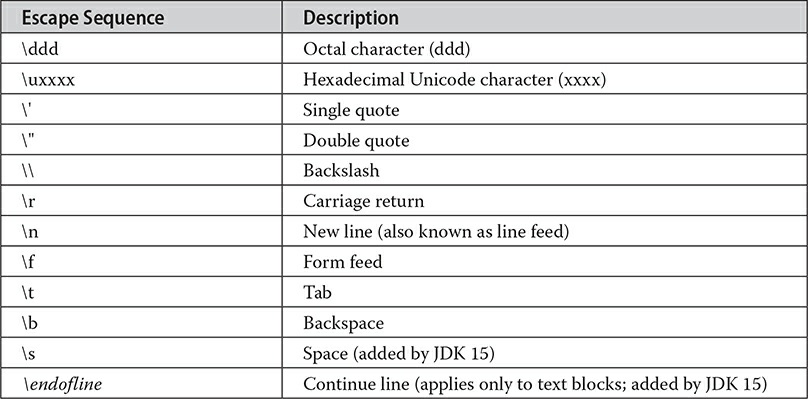

# Data Types, Variables, and Arrays

The most fundamental aspects of a software.

## Java Is a Strongly Typed Language

Every variable has a type, every expression has a type, and every type is strictly defined. All assignments, whether explicit or via parameter passing in method calls, are checked for type compatibility.

### The Primitive Types

#### Integers

| type  | width | minimum | maximum  |
| ----- | ----- | ------- | -------- |
| byte  | 8     | -2^7    | 2^7 - 1  |
| short | 16    | -2^15   | 2^15 - 1 |
| int   | 32    | -2^31   | 2^31 - 1 |
| long  | 64    | -2^63   | 2^63 - 1 |

#### Floating Types

| type   | width | minimum  | maximum  |
| ------ | ----- | -------- | -------- |
| double | 64    | 4.9e-324 | 1.8e+308 |
| float  | 32    | 1.4e-045 | 3.4e+038 |

#### Characters

A key point to understand is that Java uses Unicode to represent characters. `char` is 16 bits.

> In the formal specification for Java, char is referred to as an integral type, which means that it is in the same general category as int, short, long, and byte. However, because its principal use is for representing Unicode characters, char is commonly considered to be in a category of its own.

#### Booleans

Java has a primitive type, called boolean, for logical values. It can have only one of two possible values, true or false. This is the type returned by all relational operators, as in the case of a < b.

### Literals

#### Integer Literals

Any whole number value is an integer literal. Decimal, Octal(09), Binary(0B1231) and Hexadecimal(0Xf123b) bases are supported.

> Since Java is strongly typed, it is possible to assign an integer literal to one of Java’s other integer types, such as byte or long, without causing a type mismatch error. When a literal value is assigned to a `byte` or `short` variable, no error is generated if the literal value is within the range of the target type. An integer literal can always be assigned to a long variable. However, to specify a `long` literal, you will need to explicitly tell the compiler that the literal value is of type long. You do this by appending an upper- or lowercase L to the literal.

#### Floating Literals

Floating-point numbers represent decimal values with a fractional component. scientific notation uses a standard-notation floating-point number plus a suffix that specifies a power of 10 by which the number is to be multiplied. The exponent is indicated by an E or e followed by a decimal number, which can be positive o negative.
Hexadecimal floating-point literals are also supported, but they are rarely used. They must be in a form similar to scientific notation, but a P or p, rather than an E or e, is used. For example, 0x12.2P2 is a valid floating-point literal. The value following the P, called the binary exponent, indicates the power-of-two by which the number is multiplied. Therefore, 0x12.2P2 represents 72.5.

#### Boolean Literals

Boolean literals are simple. There are only two logical values that a boolean value can have, true and false. The values of true and false do not convert into any numerical representation. The true literal in Java does not equal 1, nor does the false literal equal 0. In Java, the Boolean literals can only be assigned to variables declared as boolean or used in expressions with Boolean operators.

#### Character Literals

#### String Literals

String literals in Java are specified like they are in most other languages—by enclosing a sequence of characters between a pair of double quotes.

> s you may know, in some other languages strings are implemented as arrays of characters. However, this is not the case in Java. Strings are actually object types. As you will see later in this book, because Java implements strings as objects, Java includes extensive string-handling capabilities that are both powerful and easy to use.
