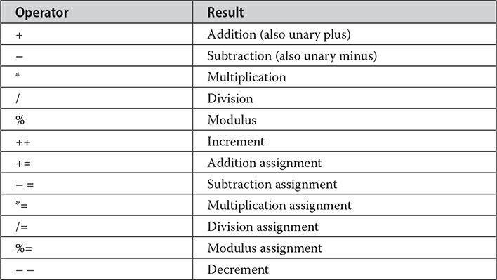
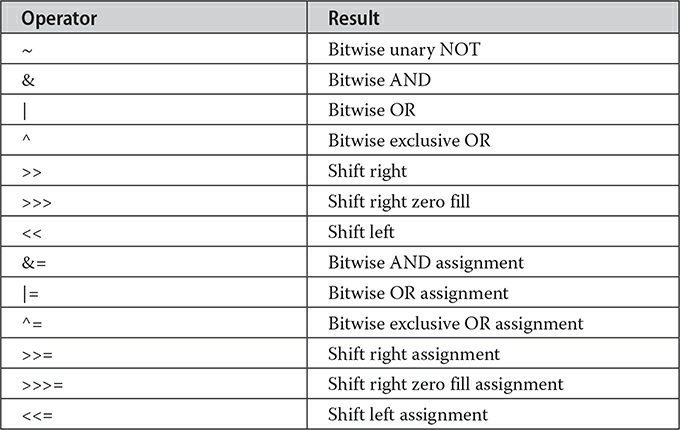
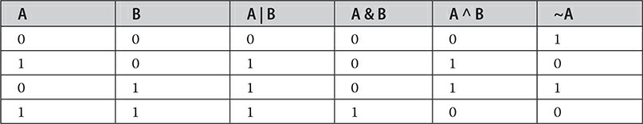
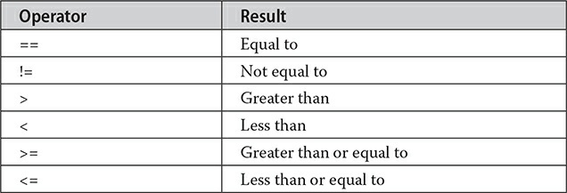
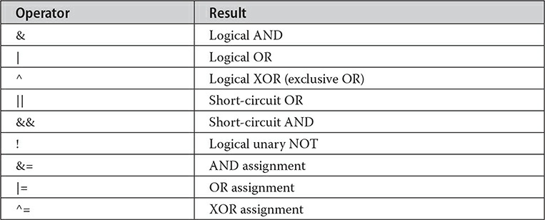
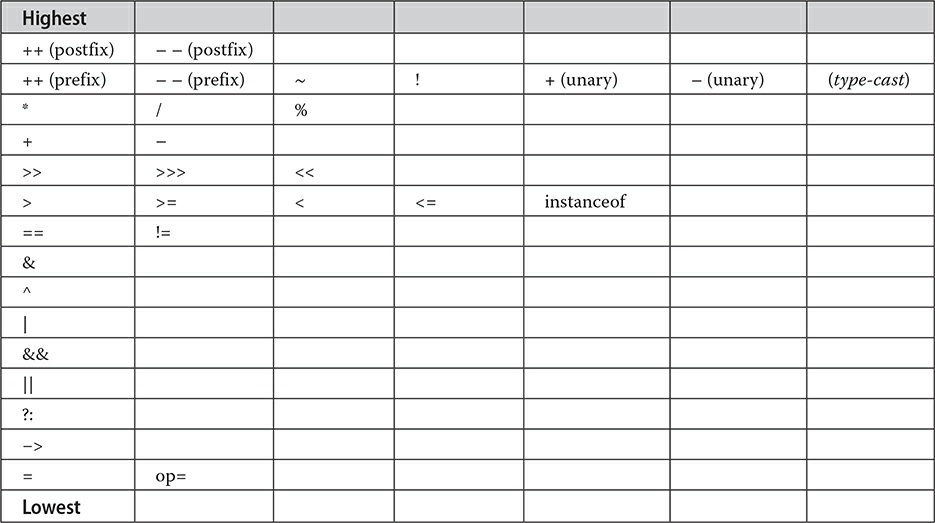

# Operators

## Arithmatic Operators



The operands of the arithmetic operators must be of a numeric type. You cannot use them on boolean types, but you can use them on char types, since the char type in Java is, essentially, a subset of int.

In case of increment and decrement operators:

> n the prefix form, the operand is incremented or decremented before the value is obtained for use in the expression. In postfix form, the previous value is obtained for use in the expression, and then the operand is modified.

## The Bitwise Operators

Java defines several bitwise operators that can be applied to the integer types: long, int, short, char, and byte. These operators act upon the individual bits of their operands.



All of the integer types are represented by binary numbers of varying bit widths. For example, the byte value for 42 in binary is 00101010, where each position represents a power of two, starting with 20 at the rightmost bit. The next bit position to the left would be 21, or 2, continuing toward the left with 22, or 4, then 8, 16, 32, and so on. So 42 has 1 bits set at positions 1, 3, and 5 (counting from 0 at the right); thus, 42 is the sum of 21 + 23 + 25, which is 2 + 8 + 32.

> Java uses Two's complements system in order to support signed numbers. It just reverse bits and adds 1 to get the negative number.

Java uses this because we don't want to have -0.

> Because Java uses two’s complement to store negative numbers—and because all integers are signed values in Java—applying the bitwise operators can
> easily produce unexpected results. For example, turning on the high-order bit will cause the resulting value to be interpreted as a negative number, whether this is what you intended or not. To avoid unpleasant surprises, just remember that the high-order bit determines the sign of an integer no matter how that high-order bit gets set.

### The Bitwise Logical Operators



```Java
public class BitLogic {
  public static void main(String[] args) {
    String[] binary = { "0000", "0001", "0010", "0011", "0100", "0101", "0110",
        "0111", "1000", "1001", "1010", "1100", "1101", "1111" };
    var a = 3;
    var b = 6;
    var c = a | b;
    var d = a & b;
    var e = a ^ b;
    var f = (~a & b) | (a & ~b);
    int g = ~a & 0x0f;

    System.out.println("a = " + binary[a]);
    System.out.println("b = " + binary[b]);
    System.out.println("c = " + binary[c]);
    System.out.println("d = " + binary[d]);
    System.out.println("e = " + binary[e]);
    System.out.println("f = " + binary[f]);
    System.out.println("g = " + binary[g]);
  }
}
```

> We can use the left shift operator by 1 as efficient way to \*2 the value but, we must care about high order bit(31 & 63) to not make the value negative)

Each time you shift a value to the right, it divides that value by two—and discards any remainder. In some cases, you can take advantage of this for high-performance integer division by 2. When you are shifting right, the top (leftmost) bits exposed by the right shift are filled in with the previous contents of the top bit. This is called sign extension and serves to preserve the sign of negative numbers when you shift them right.

> o shift a zero into the high-order bit no matter what its initial value was. This is known as an unsigned shift. To accomplish this, you will use Java’s unsigned, shift-right operator, >>>, which always shifts zeros into the high-order bit.

## Relational Operators



> The reason is that Java does not define true and false in the same way as C/C++. In C/C++, true is any nonzero value and false is zero. In Java, true and false are nonnumeric values that do not relate to zero or nonzero. Therefore, to test for zero or nonzero, you must explicitly employ one or more of the relational operators.




> In ternary operator the expressions can't be void.

## Operator Precedence

> Operators in the same row are equal in precedence. In binary operations, the order of evaluation is left to right (except for assignment, which evaluates right to left). Although they are technically separators, the [ ], ( ), and . can also act like operators. In that capacity, they would have the highest precedence. Also, notice the arrow operator (->). It is used in lambda expressions.


