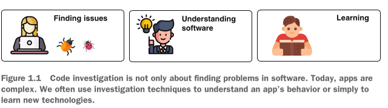
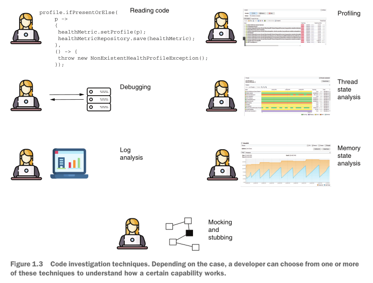
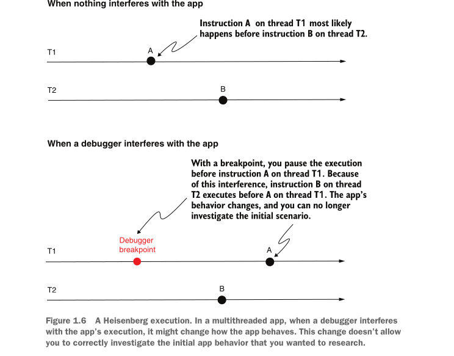
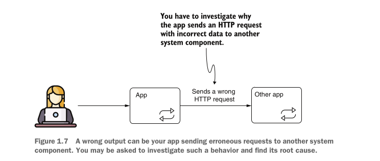
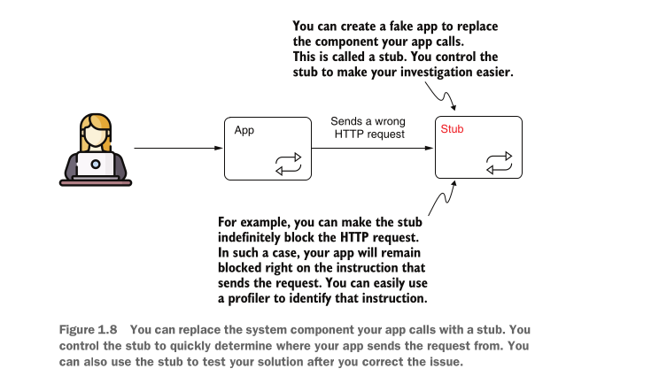

# Basics of investigating a codebase

Developers need efficient ways to investigate, analyze and understand the code they are working on.

> NOTE Software developers generally spend more time understanding how the software works than writing code to implement new features or correct errors.

While debugging should mean “finding issues and solving them,”
developers use it to name different purposes for analyzing how code works:

- Learning a new framework
- Finding the root cause of a problem
- Understanding existing logic to extend it with new capabilities

> Sometimes we don't have a running app, A problem may occur in production. This investigation, which relies on collected data after the app crashes, is called a **postmortem investigation** . For such cases, you can use logs, heap dumps, or thread dumps

## Typical scenarios for using investigation techniques

- To understand why a particular piece of code or software capability provides a different result than expected
- To learn how the technologies the app uses as dependencies work
- To identify causes for performance issues such as app slowness
- To find out root causes for cases in which an app suddenly stops

### Demystifying unexpected output

output: Any result of executing a piece of logic that might result in data change, the exchange of information, or action against a different component or system is an output.
for example: a record change in database, a result in console, HTTP response from another system.

#### Case1(simplest): part of the record inserted in database is missing

We can easily use debugging tool to investigate the values and see why they are lost.

#### Case2: When we have no idea where to start debugging

In this case where we have no idea where to put breakpoints or whatever we can use profiler sampling capability to investigate what code is being executed.

#### Case3: When dealing with multi threaded application

Situations become even more complicated when dealing with logic implemented through multiple threads, or a multithreaded architecture. In many such cases, using a debugger is not an option because multithreaded architectures tend to be sensitive to interference. In other words, the way the app behaves is different when you use the debugger. Developers call this characteristic a Heisenberg execution or Heisenbug.
A multithreaded architecture might change the way it behaves if you interfere with it, just like if you interfere with a quantum mechanics particle.

In such a difficult case a profiler may be useful however, even the profiler may face the heisenburg issue, Another alternative is to use logging, in the app. For certain issues, you can find a way to reduce the number of threads to one so that you can use a debugger for the investigation.

#### Case4: sending the wrong calls to another software component

Sometimes we cannot determine what request to another system is wrong, in this case we can use profiler, however a useful solution would be to replace the external component with a stub, then block the request in the stub so the request gets waited and find it with a profiler.

> We also have to investigate software issues when we face performance problems like consuming too much resource, having too much IO activities and also, sudden application crashes like _completely stopped application_ or _running application unable to handle requests_.

> Thread dumps help in case of running application unbale to handle requests.

## Summary

- You can use various investigation techniques to analyze software behavior.
- Depending on your situation, one investigation technique may work better than another. You need to know how to choose the correct approach to make your investigation more efficient.
- For some scenarios, using a combination of techniques helps you to identify a problem faster. Learning how each analyzing technique works gives you an excellent advantage in dealing with complex problems.
- In many cases, developers use investigation techniques to learn new things rather than to solve problems. When learning complex frameworks such as Spring Security or Hibernate, simply reading books or the documentation isn’t enough. An excellent way to accelerate your learning is to debug examples that use a technology you want to better understand.
- A situation is easier to investigate if you can reproduce it in an environment where you can study it. Reproducing a problem not only helps you find its root cause more easily, but it also helps you to confirm that a solution works when it is applied.
