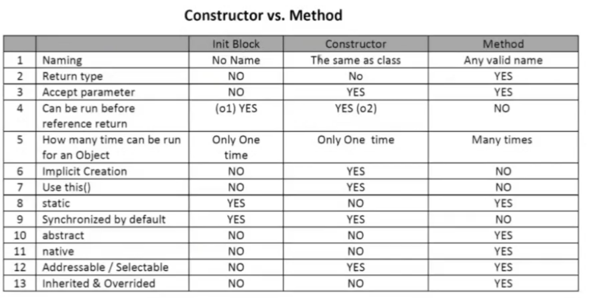

# Java Code Blocks

Structures which are used in java code are departed from each other using code blocks which in python is indentation. But There are some special blocks which the order of their execution matters. For example When we instantiate a class the constructor will be called, however there are other blocks that make it a little tricky.

## Blocks

Sometimes code blocks are inside a method. These run when the method is called. Other times, code blocks appear outside a method. These are called instance initializers.

```Java
public class Bird {
    public static void main(String[] args){
        {System.out.print("Feathers");}
    }
    {System.out.print("snowy")}
}
```

There are four code blocks in this example: a class definition, a method declaration, an inner block, and an instance initializer.

> Initializer blocks can not be inside of a method.

Initializer block is like this:

``` java
{

}
```

### Order of Initialization

* Fields and instance initializer blocks are run in the order in which they appear in the file
* The constructor runs after all fields and instance initializer blocks have run.

> Order matters for the fields and blocks of code. You can’t refer to a variable before it has been defined.

```Java
public class Chick {
    {System.out.print("name");} //doesn't compile
    private String name = "Foo";
}
```

This block is called after creation of object but, this is the first thing that executes after calling the super class constructor in the first line of constructor block. We use this block to write some code which should be executed in all the constructors in our code. The constructor block will look like this:

``` java
Class() {
// super class constructor
// initializer block
// constructor code
}
```

## Static Code Block

This block is just a block lookalike this:

``` java
static {
}
```

This block is executed whenever ClassLoader Loads the class file in memory. So it means it will only be called only once till it is available in metadata section of memory. Mostly we use this block to use our static variables.


