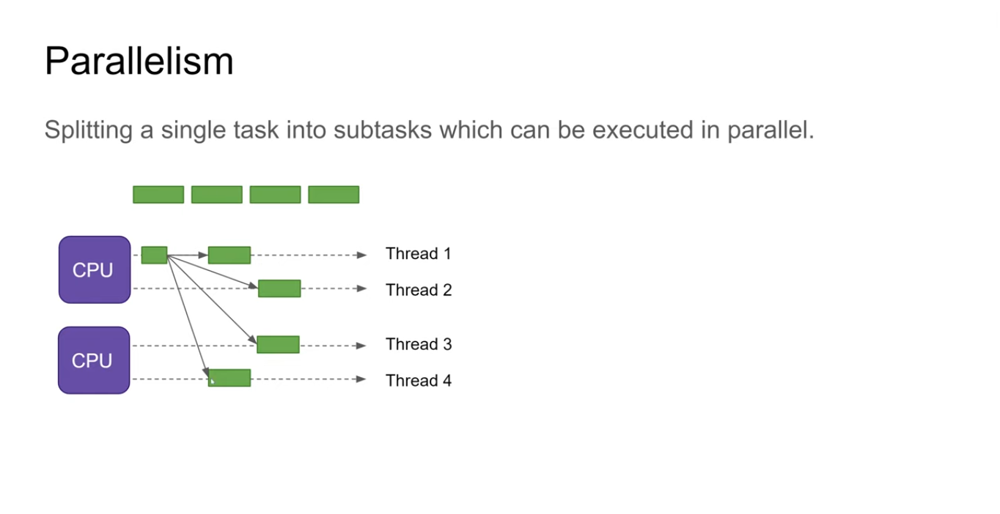

# Process & Threads

## Process

OS runs each of our application instances in an individual process. OS can run multiple processes at the same time

## Threads

We can also achieve concurrency in our process using threads. We call independent path of execution in virtual machine,
thread. Threads execute our code. There's a run() method which we put our code. Our thread starts with this method
and also, finishes with this method.

### Thread Creation

* Subclassing java.util.Thread
* implementing java.util.Runnable

### Thread Lifecycle

* New
* Runnable
* Running
* Waiting
* Dead

### Return result of run method

In order to achieve this by creating instance variables on the class where we are implementing `run()`. then we can
store result in run and do whatever we want with it.

We have a main thread in our app, and we can create additional threads for different tasks. for example, we can download
different images of files in same time using threads. Applications like this are called multi thread.

* We have `Thread.activeCount()` method that can show us what threads are running in our app. one of them is always the
  thread that is running garbage collector.
* `Runtime.getRuntime().availableProcessors()`shows us total threads that are available.

Each thread has an id and name. For creating one we can implement runnable interface or extend Thread class and then
instantiate the Thread class. and run the Thread.start() method.

We can pause a thread using `sleep()` method. In the example we create multiple threads from Download file they all
start at same time and finish at same time after 5 second, so they work concurrently.

Java vm has something called thread scheduler that estimates which thread should run and for how long, so it switches
tasks so fast that gives us illusion that tasks are handled concurrently.

### Thread.join()

Sometimes we need that some thread's job to be finished to do something else after that. for this we can use
Thread.join() method to let main thread know that this thread should be finished then do the other job.

```java
public class Demo {
    private static final Logger LOGGER = LoggerFactory.getLogger(Demo.class);

    public static void main(String[] args) throws InterruptedException {
        Runnable firstPrinter = () -> {

            LOGGER.debug("printer started: {}", Thread.currentThread().getName());

            try {
                Thread.sleep(5000);
            } catch (InterruptedException e) {
                e.printStackTrace();
                Thread.currentThread().interrupt();
            }

            LOGGER.debug("printer finished: {}", Thread.currentThread().getName());
        };
        Runnable secondPrinter = () -> {

            LOGGER.debug("printer started: {}", Thread.currentThread().getName());

            try {
                Thread.sleep(10000);
            } catch (InterruptedException e) {
                e.printStackTrace();
                Thread.currentThread().interrupt();
            }

            LOGGER.debug("printer finished: {}", Thread.currentThread().getName());
        };
        var thread1 = new Thread(firstPrinter, "First Printer");
        var thread2 = new Thread(secondPrinter, "Second Printer");
    /*
            Thread 2 however takes longer than thread 1, by turning it to a daemon thread, the program
            is finished after main thread execution. so thread 2 operation will never be completed.
    */
        thread2.setDaemon(true);
        thread1.start();
        thread2.start();
        /*
            This will force main thread to wait till it finishes its operation. If we remove it we can
            see that The Log command below executes meanwhile this thread is doing its job but, now It
            will get executed after thread 1's operation is done.
         */
        thread1.join();
        LOGGER.debug("Main program finished");
    }
}
```

### Thread.interrupt()

When we want to stop a thread we use interrupt method. This method actually doesn't stop the thread, it sends a request
to thread to stop. So, we need to handle a condition to that request to stop it.

### Race condition & Visibility problem

* Race condition: when multiple objects try to access a resource simultaneously to modify it, and finish their task it
  is called race condition.

> In the demo we have a DownloadStatus object which is shared with DownloadFile objects. Download file implementation
> shows that wants to download 10_000 bytes. so, in main we try to create 10 threads of it and start them. in second
> loop we join() them to ensure that each thread should finish their task. And, at last we print the downloaded bytes
> but instead of 100_000 bytes(10 threads * 10000 bytes each) we get wrong number.

* Visibility problem: In race condition when one object modifies the object, other objects should see the modified
  version.

* In this case we need Thread-safe Programs.

### Polling & Callback:

* Poll: In this solution we return a flag which indicates the program is in use. so we check in an infinite loop and
  whenever the item is ready we can do our job. This is a very bad approach.
* Callback: In this way the program doesn't check that the thread's job is finished or not otherwise, The thread tells
  the main thread that the job is finished.(Observer Design Pattern)

## Strategies:

* Confinement: instead of one status for all threads we can have multiple statuses for each thread.
  For demo, we instantiate DownloadStatus object so each DownloadFile class can have a DownloadStatus object. Then in
  main we added them to List so, we can access their status. We combined their status using Streams API.
* Immutability: We can have immutable classes that their state and data can not change after creation.
* Synchronization: Each thread can access resource concurrently. we do it by lock.
  One way to achieve this is to put a lock where we want others to access each one by one. ReentrantLock is one
  implementation of Lock interface.
  Another way to achieve this is to use synchronize keyword. we can use it two ways: 1- synchronize block 2-
  synchronize whole method
  we need to pass an object to synchronize block. usually this but we need to be cautious about it. if we have two
  synchronize blocks, and we pass this to them
  Each object has a built-in lock and each method here will conquer that lock so the methods also will be synchronized.
  This will be a big problem in big project. one way to do the right way is to create object fields and pass them to
  block.
  > alternatives to synchronization:
* Use local variables
* Primitive arguments are also safe because of call by value behavior.
* Using immutable objects

* Volatile: JVM caches structure of classes for threads in order to achieve better performance. so sometimes if another
  thread waits to see a change that other thread makes to particular file this change may not be visible to that because
  they are available in cache. With volatile keyword we can tell that this field is unstable and some threads may need
  to see
  the change other thread make. (we could also synchronize those methods, but it's a heavy job)

* Atomic Object
  In the race condition example we are working with integers. We have to synchronize all the methods that are dealing
  with it. But, we have Atomic object's
  concept which does the same without declaring all methods synchronized.
  We also have Adder classes. in case there are threads that modify fields frequently, we can use them.

* Partitioning: multiple threads can access an object but each can access only one segment of that object.
  If we have two threads that are going to access our collection, we can use Collections.synchronizeCollection()
  methods.
  We also have ConcurrentCollection implementations of Collection interface which will come handy if we are in a multi
  thread situation.

### wait() & notify()

In volatilizing package we see a while loop in thread2 this is a CPU waste because the thread is actively waiting
for the other one to finish. Instead, we can call wait() method. this puts the thread in standby so there is no
cpu waste, and we should wrap it with synchronize block with the object we need.(status) in that implementation we
should notify() the waiting thread, so it can run.

### Deadlock:

This occurs when two threads try to access a resource the same time and each hold lock of that resource and neither of
them is willing to release it, they will be in an infinite halt.
To prevent this we should avoid unnecessary synchronization. We should use other thread safety solutions in our first
priority.

### Thread scheduling:

When we have multiple threads to operate We need to schedule them and give them priority to get executed otherwise
the operation can go on forever and users may get disappointed, like web requests.
For priority, we can give a number between 0 and 10.

### Preemption:

There are two kinds of thread scheduling:

* Preemptive : this determines when a thread had its fair time, pauses it and hands the control to other thread.
* Cooperative: this waits for the running thread to pause itself so the scheduler can give the lock to other thread.

### Ways for a thread to give up control

* Blocking:
  Blocking occurs anytime a thread has to stop and wait for a resource it doesn't have. The most common task is blocking
  IO.
  Threads can also block when they enter a synchronized method or block. they wait to acquire the lock and if the lock
  is not available they will wait or get stopped.

* Yielding:
  A thread can explicitly give up control by invoking Thread.yield(). this signals vm that it can run another thread if
  one is ready to run.
  NOTE: this operation is better to be done on non synchronized methods or blocks. because yielding doesn't release any
  lock or something just announces that another thread can run.
  NOTE: best place to run this method is to execute it on the end of the loop.

* Sleeping:
  Unlike yielding sleep() method pauses the thread no matter any other one is ready to do their task or not. Thread
  that sleeps doesn't give up on any locks so if any thread wants to use the resource, they are screwed. So its better
  not to sleep a thread on synchronized objects.
  Other threads can wake up slept thread by invoking interrupt() method.

* Joining:
  Sometimes we have multiple threads that do multiple operations that are dependant to each other for example We have
  a thread that sorts array and another to determine min & max. finding min and max is way easier in sorted array, so
  we can declare in second array to do its job after the first sort thread has done its job. This is achieved by join()
  method.
  NOTE: nowadays, This joining functionality is easier with Executor and Future classes.

* Waiting on an object:
  A thread can wait on an object it has locked. While waiting, it releases the lock on the object and pauses until
  another thread notifies it. Its difference with joining is that waiting pauses an object until object reaches a
  certain state. But, joining pauses and waits until another thread execution is finished.
  Only one of this can take a thread out of wait state:
* The timeout expires
* Thread gets interrupted
* Other thread notifies it

* Interrupted:
  When calling this method an InterruptedException is thrown and target thread stops but the current tread regains the
  lock it was waiting for and continues executing the thread in catch block.
  NOTE: Thread may still be blocked for a while after interrupt() gets invoked.

* Finishing:
  The last state a thread may release control is to return.

## Thread Pools & Executors:

Creating and cleaning threads from memory has lots load for our applications in order to reuse threads we use
thread pools which is affordable by Executor class in java. we can submit tasks to this class and execute them.
Executing a pool returns a Future object which give us control on how to behave with the result of the tasks.

## Concurrency vs parallelism

concurrency means that an application is making progress on more than one task seemingly at the same time. However, CPUs
can only execute one task at a time and, they switch between them rapidly so, it seems we are doing multiple tasks
simultaneously.
These tasks are called threads and, switching between the is called a context switch.

Parallel execution on the other hand is processing more than one task at exact same time. It's applicable if we have two
separate CPUs.

Parallel Concurrent execution is making progress on more than one task seemingly at the same time on more than one CPU.
For example, we have two threads on CPU1 and Two threads on CPU2. Thread 1 & 2 on CPU1 can not run at the same time
similar to Thread 3 & 4 on CPU2. However, Thread 1 and Thread 3 can run parallel also true for thread 2 & 4.

Parallelism means splitting a single task into subtasks which can be executed in parallel.
