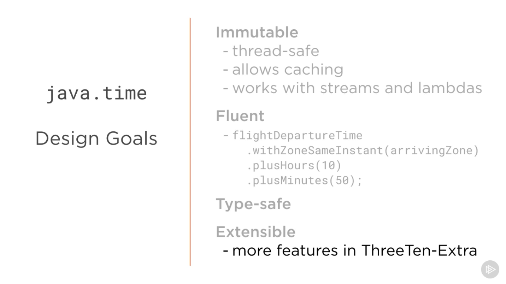
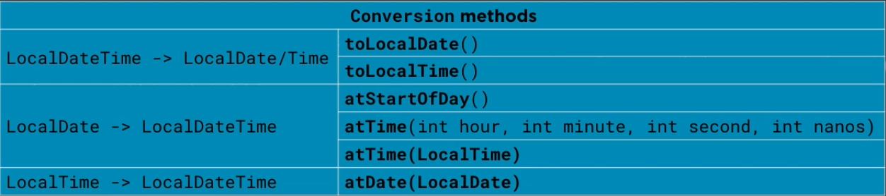

# Java 8 Date Time API

The new API has some improvement in the way it operates, and it's much clear amd extensible. The base package
is `java.time` and others are derived:

* chrono: representing calendar systems other than default.
* format: classes for formatting and parsing dates and times.
* temporal: extended API for library writers allowing interoperation between date and time classes, querying and
  adjustment. Fields TemporalField & ChronoField & TemporalUnit & ChronoUnit are defined here.
* zone: classes that support time zones, offsets from time zones and zone rules. Mostly we use ZonedDateTime, ZoneId and
  ZoneOffset.

## Method naming conventions

| **method** |    **Type**    |                                     **use**                                      |
|:----------:|:--------------:|:--------------------------------------------------------------------------------:|
|     of     | static factory |     create instant where factory is validating the input not converting them     |
|    from    | static factory |       Convert input parameter to target class which data loss might occur        |
|   parse    | static factory |                      parse String to produce a target class                      |
|   format   |    instance    |            Uses formatter to format temporal object to produce String            |
|    get     |    instance    |                Returns a part of the state of the target object.                 |
|     is     |    instance    |                     Queries the state of the target object.                      |
|    with    |    instance    | returns copy of target object with one element changed. This is immutable setter |
|    plus    |    instance    |               returns copy of target with an amount of time added                |
|     to     |    instance    |                       converts this object ot another type                       |
|   minus    |    instance    |                returns copy of target with an element subtracted                 |
|     at     |    instance    |                        combines this object with another                         |

## Core classes

|   **java.time**   |                            **meaning**                            |         **example**         |
|:-----------------:|:-----------------------------------------------------------------:|:---------------------------:|
|      Instant      |                nano second precise Instant of time                |          timestamp          |
|   ZonedDateTime   |           representing an instant with zone information           | start of a conference call  |
|     LocalDate     |                date without time zone information                 |          birthday           |
|     Duration      |                     Time between two instants                     | length of a conference call |
|      Period       |             amount of time in years, months and days              | length of a prison sentence |
| DateTimeFormatter | convert a String into java.time object called Temporal vise versa |     parse() & format()      |



## Standard Calendar

There are two basic ways to represent time. One way represents time in human terms, referred to as human time, such as
year, month, day, hour, minute and second. The other way, machine time, measures time continuously along a timeline from
an origin, called the epoch, in nanosecond resolution.

> The classes in the Date-Time API that capture and work with date or time values, such as Instant, LocalDateTime, and
> ZonedDateTime, are referred to as temporal-based classes

|   **Class**    |                          **content**                           |              **toString()**               |
|:--------------:|:--------------------------------------------------------------:|:-----------------------------------------:|
|    Instant     |                          Seconds (1)                           |         2013-08-20T15:16:26.355Z          |
|   LocalDate    |                        Year, Month, Day                        |                2013-08-20                 |
| LocalDateTime  |            Year, Month, Day, Hour, Minutes, Seconds            |          2013-08-20T08:16:26.937          |
| ZonedDateTime  | Year, Month, Day, Hour, Minutes, Seconds, Zone Offset, Zone ID | 2013-08-21T00:16:26.941+09:00[Asia/Tokyo] |
|   LocalTime    |                     Hour, Minutes, Seconds                     |               08:16:26.943                |
|    MonthDay    |                           Month, Day                           |                  --08-20                  |
|      Year      |                              Year                              |                   2013                    |
|   YearMonth    |                          Year, Month                           |                  2013-08                  |
|     Month      |                             Month                              |                  AUGUST                   |
| OffsetDateTime |     Year, Month, Day, Hour, Minutes, Seconds, Zone Offset      |       2013-08-20T08:16:26.954-07:00       |
|   OffsetTime   |              Hour, Minutes, Seconds, Zone Offset               |            08:16:26.957-07:00             |
|    Duration    |            Day (2), Hour (2), Minutes (2), Seconds             |             PT20H (20 hours)              |
|     Period     |                      Year, Month, Day (3)                      |              P10D (10 days)               |

> (1): Seconds are captured to nanosecond precision.
> (2): This class does not store this information, but has methods to provide time in these units.
> (3): When a Period is added to a ZonedDateTime, daylight saving time or other local time differences are observed.

## DayOfWeek and Month Enums

DaysOfWeek consists of constants representing Days of week. We can add TextStyle when we want to retrieve it. We can
also use adjustment methods.

```java
import java.time.DayOfWeek;
import java.time.format.TextStyle;
import java.util.Locale;

public class demo {
    public static void main(String[] args) {
        var sunday = DayOfWeek.SUNDAY.plus(3);
        System.out.println(sunday);
        Locale locale = Locale.getDefault();
        System.out.println(sunday.getDisplayName(TextStyle.FULL, locale));
        System.out.println(sunday.getDisplayName(TextStyle.NARROW, locale));
        System.out.println(sunday.getDisplayName(TextStyle.SHORT, locale));
    }
}
```

## Date

For representing the Date aspects without considering timezone or time itself.

The Month enum is similar to this and has some utility methods like `maxLength()` for maximum days in month.

### LocalDate

LocalDate is a class that represents the date form of an instant without time in ISO calendar.
It has several methods for creation:

We have variations of `of()`:

* of(int year, int month, int dayOfMonth)
* of(int year, Month month, int dayOfMonth)
* ofEpochDay(long epochDay)
* ofYearDay(int year, int dayOfYear)
* now(), now(ZoneId), now(Clock clock)

LocalDate class has some accessor classes too:

* getDayOfMonth()
* getDayOfWeek()
* getDayOfYear()
* getHour()
* getMinute()
* getMonth()
* getMonthValue()
* getNano()
* getSecond()
* getYear()
* get(TemporalField) -> This is an interface which provides ChronosField like AM/PM of day.
* getLong(TemporalField)

LocalDate class also has some adjustment methods:

* plusDays(long)
* plusMonths(long)
* plusWeeks(long)
* plusYears(long)
* minusDays(long)
* minusMonths(long),...
* plus(long, TemporalUnit), minus(long, TemporalUnit) -> we pass enum ChronosUnit to it.
* plus(TemporalAmount), minus(TemporalAmount) -> Either period or a duration
* withDayOfMonth(int), withDayOfYear(int), withMonth(), withYear() -> creates another instance from another instance.

```java
import java.time.DayOfWeek;
import java.time.LocalDate;
import java.time.Month;
import java.time.temporal.TemporalAdjusters;
import java.time.temporal.TemporalField;

public class Demo {
    public static void main(String[] args) {
        var date = LocalDate.of(2000, Month.APRIL, 4);
        var nextWed = date.with(TemporalAdjusters.next(DayOfWeek.FRIDAY));
    }
}
```

### YearMonth

Represents month of a specific year. We can use `lengthOfMonth()` to get number of days.

```java
import java.time.Month;
import java.time.YearMonth;

public class Demo {
    public static void main(String[] args) {
        System.out.println(YearMonth.now());
        System.out.println(YearMonth.of(2012, Month.FEBRUARY));  // -> 2012-02
    }
}
```

### MonthDay

Class to represent a day of a month like new year day. `isValidYear()` determines if year is leap or not.

### Year

Represents a year. `isLeap()` determines if year is a leap year.

### LocalTime

This class only deals with time. represents human-based time of day such as movie-time.

factory methods:

* of(hour, minute)
* of(hour, minute, second)
* of(hour, minute, second, nanoOfSecond)
* ofNanoOfDay(nanoOfDay)
* ofSecondOfDay(secondOfDay)
* now()
* now(Clock)
* now(ZoneId)

### LocalDateTime

Deals with both date and time without timezone.

factory methods:

* of(year, month, day, hour, minute)
* of(LocalDate, LocalTime)
* now(), now(Clock), now(ZoneId)
* ofInstant(Instant, ZoneId)

adjustment methods are the same as above.

Comparison methods:

* isAfter(ChronoLocalDateTime<?>)
* isBefore(ChronoLocalDateTime<?>))
* isEqual(ChronoLocalDateTime<?>))
* compareTo(ChronoLocalDateTime<?>))

```java
import java.time.Instant;
import java.time.LocalDateTime;
import java.time.ZoneId;

public class Demo {
    public static void main(String[] args) {
        LocalDateTime.now();
        var d1 = LocalDateTime.of(1998, 4, 3, 16, 30);
        LocalDateTime.ofInstant(Instant.now(), ZoneId.systemDefault());
        var d2 = LocalDateTime.now().plusMonths(6);
    }
}
```

### Timezone specific classes

Timezone represents a region of earth time which is identified by a format like `region/city` and an offset from UTC.

#### ZoneId class

specifies a timezone identifier and provides rules for converting between an Instant and a `localDateTime`.

> "Asia/Tehran"

#### ZoneOffset class

specifies timezone offset from UTC time.

factory methods:

* of(String) -> ZoneOffset.of("Z"), ZoneOffset.of("+3"), ZoneOffset.of("+03:30")
* ofHours(int)
* ofHoursMinutes(int, int)
* ofHoursMinutesSeconds(int, int, int)
* ofTotalSeconds(int)
* from(TemporalAccessor)

#### ZoneDDateTime

handles date and time with corresponding timezone with a timezone offset from UTC.

```java
public class Demo {
    public static void main(String[] args) {
        DateTimeFormatter format = DateTimeFormatter.ofPattern("MMM d yyyy  hh:mm a");

// Leaving from San Francisco on July 20, 2013, at 7:30 p.m.
        LocalDateTime leaving = LocalDateTime.of(2013, Month.JULY, 20, 19, 30);
        ZoneId leavingZone = ZoneId.of("America/Los_Angeles");
        ZonedDateTime departure = ZonedDateTime.of(leaving, leavingZone);

        try {
            String out1 = departure.format(format);
            System.out.printf("LEAVING:  %s (%s)%n", out1, leavingZone);
        } catch (DateTimeException exc) {
            System.out.printf("%s can't be formatted!%n", departure);
            throw exc;
        }

// Flight is 10 hours and 50 minutes, or 650 minutes
        ZoneId arrivingZone = ZoneId.of("Asia/Tokyo");
        ZonedDateTime arrival = departure.withZoneSameInstant(arrivingZone)
                .plusMinutes(650);

        try {
            String out2 = arrival.format(format);
            System.out.printf("ARRIVING: %s (%s)%n", out2, arrivingZone);
        } catch (DateTimeException exc) {
            System.out.printf("%s can't be formatted!%n", arrival);
            throw exc;
        }

        if (arrivingZone.getRules().isDaylightSavings(arrival.toInstant())) {
            System.out.printf("  (%s daylight saving time will be in effect.)%n",
                    arrivingZone);
        } else {
            System.out.printf("  (%s standard time will be in effect.)%n",
                    arrivingZone);
        }
    }
}
```

#### OffsetDateTime

handles date and time with timezone offset from UTC without ZoneID.

```java
public class Demo {
    public static void main(String[] args) {
        // Find the last Thursday in July 2013.
        LocalDateTime localDate = LocalDateTime.of(2013, Month.JULY, 20, 19, 30);
        ZoneOffset offset = ZoneOffset.of("-08:00");

        OffsetDateTime offsetDate = OffsetDateTime.of(localDate, offset);
        OffsetDateTime lastThursday =
                offsetDate.with(TemporalAdjusters.lastInMonth(DayOfWeek.THURSDAY));
        System.out.printf("The last Thursday in July 2013 is the %sth.%n",
                lastThursday.getDayOfMonth());
    }
}
```

#### OffsetTime

handles time with timezone offset from UTC without zoneID.

> When we care about 1 hour gap daylight we need to use ZonedDateTime.

### Instant

represents the start of a nanosecond on the timeline. This class is useful for generating a time stamp to represent
machine time.
A value returned from the Instant class counts time beginning from the first second of January 1,
1970 (1970-01-01T00:00:00Z) also called the EPOCH. An instant that occurs before the epoch has a negative value, and an
instant that occurs after the epoch has a positive value.

> 2013-05-30T23:38:23.085Z

We can add or subtract time using plus() and minus() methods.

`Instant oneHourLater = Instant.now().plus(1, ChronoUnit.HOURS);`

There are also methods for comparing two instants.

* isAfter()
* isBefore()
* until() -> how much time exists between two instants.

`long secondsFromEpoch = Instant.ofEpochSecond(0L).until(Instant.now(), ChronoUnit.SECONDS);`

> The Instant class does not work with human units of time, such as years, months, or days. If you want to perform
> calculations in those units, you can convert an Instant to another class

```java
public class Demo {
    public static void main(String[] args) {
        Instant timestamp;
        LocalDateTime ldt = LocalDateTime.ofInstant(timestamp, ZoneId.systemDefault());
        System.out.printf("%s %d %d at %d:%d%n", ldt.getMonth(), ldt.getDayOfMonth(),
                ldt.getYear(), ldt.getHour(), ldt.getMinute());
    }
}
```

> Either a ZonedDateTime or an OffsetDateTime object can be converted to an Instant object, as each maps to an exact
> moment on the timeline. However, the reverse is not true. To convert an Instant object to a ZonedDateTime or an
> OffsetDateTime object requires supplying time zone, or time zone offset, information.

### Duration

A Duration is most suitable in situations that measure machine-based time, such as code that uses an Instant object.
A Duration object is measured in seconds or nanoseconds and does not use date-based constructs such as years, months,
and days, though the class provides methods that convert to days, hours, and minutes. A Duration can have a negative
value, if it is created with an end point that occurs before the start point.

```java
public class Demo {
    public static void main(String[] args) {
        Instant t1 = "...";
        Instant t2 = "...";

        long ns = Duration.between(t1, t2).toNanos();

        Instant start = "...";
        Duration gap = Duration.ofSeconds(10);
        Instant later = start.plus(gap);
    }
}
```

> A Duration is not connected to the timeline, in that it does not track time zones or daylight saving time.

factory methods:

* ofDays(long)
* ofHours(long)
* ofMinutes(long)
* ofSeconds(long)
* ofMillis(long)
* ofNanos(long)
* of(long, TemporalUnit)
* between(Temporal, Temporal) -> Temporal is the root level of `java.time` that most of the classes are derived by it.
* from(TemporalAmount) -> most common way to create a between and period

> Between will fail for units that don't support seconds like LocalDate Also, if we try to use it on different temporal
> it will try to cast the second one to first one which result in error.

Adjustment methods:

* plusDays(long)
* plusHours(long)
* plusMinutes(long)
* plusSeconds(long)
* plusMillis(long)
* plusNanos(long) -> minus() work the same
* plus(Duration), minus(Duration)
* plus(long, TemporalUnit)

### Period

To define an amount of time with date-based values (years, months, days), use the Period class. The Period class
provides various get methods, such as getMonths(), getDays(), and getYears(), so that you can extract the amount of
time from the period.

```java
public class Demo {
    public static void main(String[] args) {
        LocalDate today = LocalDate.now();
        LocalDate birthday = LocalDate.of(1960, Month.JANUARY, 1);

        Period p = Period.between(birthday, today);
        long p2 = ChronoUnit.DAYS.between(birthday, today);
        System.out.println("You are " + p.getYears() + " years, " + p.getMonths() +
                " months, and " + p.getDays() +
                " days old. (" + p2 + " days total)");

        LocalDate birthday = LocalDate.of(1960, Month.JANUARY, 1);

        LocalDate nextBDay = birthday.withYear(today.getYear());

// If your birthday has occurred this year already, add 1 to the year.
        if (nextBDay.isBefore(today) || nextBDay.isEqual(today)) {
            nextBDay = nextBDay.plusYears(1);
        }

        Period p = Period.between(today, nextBDay);
        long p2 = ChronoUnit.DAYS.between(today, nextBDay);
        System.out.println("There are " + p.getMonths() + " months, and " +
                p.getDays() + " days until your next birthday. (" +
                p2 + " total)");
    }
}
```

> You are 53 years, 4 months, and 29 days old. (19508 days total)
> There are 7 months, and 2 days until your next birthday. (216 total)

## DateTimeFormatter

This class aids with converting String into Temporal object using `parse(String)` function. It can also format
TemporalAccessor objects in a custom string format using `format(TemporalAccessor)`. We can also convert `java.time`
objects into standard ISO with `ISO_DATE_TIME`.
Factory method `ofLocalizedTime(FormatStyle)` can parse any String into specific FormatStyle.
WE can also use `ofPattern(String pattern)` and apply it to zoneDateTime and get output.

```java
public class DemoParse {
    public static void main(String[] args) {
        String input = "...";
        try {
            DateTimeFormatter formatter =
                    DateTimeFormatter.ofPattern("MMM d yyyy");
            LocalDate date = LocalDate.parse(input, formatter);
            System.out.printf("%s%n", date);
        } catch (DateTimeParseException exc) {
            System.out.printf("%s is not parsable!%n", input);
            throw exc;      // Rethrow the exception.
        }
// 'date' has been successfully parsed
    }
}
```

```java
public class DemoFormat {
    public static void main(String[] args) {
        DateTimeFormatter format = DateTimeFormatter.ofPattern("MMM d yyyy  hh:mm a");

// Leaving from San Francisco on July 20, 2013, at 7:30 p.m.
        LocalDateTime leaving = LocalDateTime.of(2013, Month.JULY, 20, 19, 30);
        ZoneId leavingZone = ZoneId.of("America/Los_Angeles");
        ZonedDateTime departure = ZonedDateTime.of(leaving, leavingZone);

        try {
            String out1 = departure.format(format);
            System.out.printf("LEAVING:  %s (%s)%n", out1, leavingZone);
        } catch (DateTimeException exc) {
            System.out.printf("%s can't be formatted!%n", departure);
            throw exc;
        }

// Flight is 10 hours and 50 minutes, or 650 minutes
        ZoneId arrivingZone = ZoneId.of("Asia/Tokyo");
        ZonedDateTime arrival = departure.withZoneSameInstant(arrivingZone)
                .plusMinutes(650);

        try {
            String out2 = arrival.format(format);
            System.out.printf("ARRIVING: %s (%s)%n", out2, arrivingZone);
        } catch (DateTimeException exc) {
            System.out.printf("%s can't be formatted!%n", arrival);
            throw exc;
        }

        if (arrivingZone.getRules().isDaylightSavings(arrival.toInstant()))
            System.out.printf("  (%s daylight saving time will be in effect.)%n",
                    arrivingZone);
        else
            System.out.printf("  (%s standard time will be in effect.)%n",
                    arrivingZone);
    }
}
```

### Clock

The current date and time depends on the time-zone and, for globalized applications, a Clock is necessary to ensure that
the date/time is created with the correct time-zone. So, although the use of the Clock class is optional, this feature
allows you to test your code for other time zones, or by using a fixed clock, where time does not change.

* Clock.offset(Clock, Duration) -> returns a clock that is offset by the specified Duration.
* Clock.systemUTC() -> returns a clock representing the Greenwich/UTC time zone.
* Clock.fixed(Instant, ZoneId) -> always returns the same Instant. For this clock, time stands still.

> LEAVING:  Jul 20 2013 07:30 PM (America/Los_Angeles)
> ARRIVING: Jul 21 2013 10:20 PM (Asia/Tokyo)

## Temporal package

The `java.time.temporal` package provides a collection of interfaces, classes, and enums that support date and time code
and, in particular, date and time calculations.

The details are discussed here : [Temporal package](https://dev.java/learn/date-time/temporal/)

## Interoperation

We can convert `java.util` date classes to new API and vise versa.

* `Date.from(Instant)` can convert an Instant to a date and, also `date.toInstant()` to convert it to Instant object.
* `Calendar.toInstant()`
* `timeZone.toZoneId()`
* `TimeZone.getTimeZone(zoneId)`

> `java.sql.Date` has methods to interconverting to LocalDate and also, TimeStamp to LocalDateTime and Instant

[legacy code adaptation](https://dev.java/learn/date-time/legacy-code/)

### Conversion

[Non-ISO Date Conversion](https://dev.java/learn/date-time/non-iso-conversion/)

