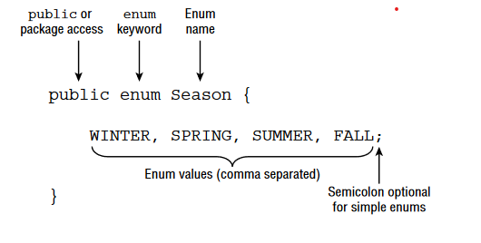

# Enumeration Types

it is common to have a type that can only have a finite set of values, such as days of the week, seasons of the year, primary colors, and so on. An enumeration, or enum for short, is like a fixed set of constants.

## Benefits

Using an enum is much better than using a bunch of constants because it provides type-safe checking. Which means we can pass invalid values to constants and find out in runtime however, in case of Enums this is impossible since we'll get compiler errors.

## Declaration



## Features

* We can use enum fields using Enum's name following `.` notation.
* They can be compared using `==` or `equals()` method, because they are final static and will only be initialized once inside JVM.
* We can't extend an enum.
* We have some predefined methods
  * `values()`: returns an array of the values
  * `name()`: returns the name of the field
  * `ordinal()`: each field has a corresponding int value with the order of the declaration.

> We can retrieve an enum from a string value by using `valueOf()` method.

```Java
Season s = Season.valueOf("SUMMER"); // SUMMER
Season t = Season.valueOf("summer"); // IllegalArgumentException
```

The second one doesn't work because we enum names are all UPPERCASE.

## Using Enums in switch Statements

We can use enums directly in switch statements. we can not use it in our case statements using `.` notation.
Also, we can not use int values for our case statements since we can not compare the enums using int values.

```Java
Season summer = Season.SUMMER;
var message = switch(summer) {
    case Season.WINTER -> "Get out the sled!"; // DOES NOT COMPILE
    case 0 - > "Time for the pool!"; // DOES NOT COMPILE
    default - > "Is it summer yet?";
};
```

## Adding Constructors, Fields, and Methods

```Java
public enum Season {
    WINTER("Low"), SPRING("Medium"), SUMMER("High"), FALL("Medium");
    private final String expectedVisitors;
    private Season(String expectedVisitors) {
        this.expectedVisitors = expectedVisitors;
    }
    public void printExpectedVisitors() {
        System.out.println(expectedVisitors);
    } 
}
```

We need the `;` since we have more fields than the values.

The parantheses are constructor calls. The first time we ask for any of the enum values, Java constructs all of the enum values. After that, Java just returns the already constructed enum values.

```Java
public enum OnlyOne {
    ONCE(true);
    private OnlyOne(boolean b) {
        System.out.print("constructing,");
    }
}

public class PrintTheOne {
    public static void main(String[] args) {
        System.out.print("begin,");
        OnlyOne firstCall = OnlyOne.ONCE; // Prints constructing,
        OnlyOne secondCall = OnlyOne.ONCE; // Doesn't print anything
        System.out.print("end");
    }
}
```

> Although it is possible to create an enum with instance variables that can be modified, it is a very poor practice to do so since they are shared within the JVM. When designing an enum, the values should be immutable.

We can add methods too, if we define an abstract method in enum, we need to implement it for each value. Therefore we can create a simple method and override it for any value we want instead of all of them.
Enums can also implement an interface.

```Java
public enum Season {
    WINTER {
        public String getHours() { return "10am-3pm"; }
    },
    SPRING {
        public String getHours() { return "9am-5pm"; }
    },
    SUMMER {
        public String getHours() { return "9am-7pm"; }
    },
    FALL {
        public String getHours() { return "9am-5pm"; }
    };
    public abstract String getHours();
}
```

```Java
public enum Season {
    WINTER {
    public String getHours() { return "10am-3pm"; }
    },
    SUMMER {
    public String getHours() { return "9am-7pm"; }
    },
    SPRING, FALL;
    public String getHours() { return "9am-5pm"; }
}
```

> Whether the enum is simple or complex, the list of values always comes first.
