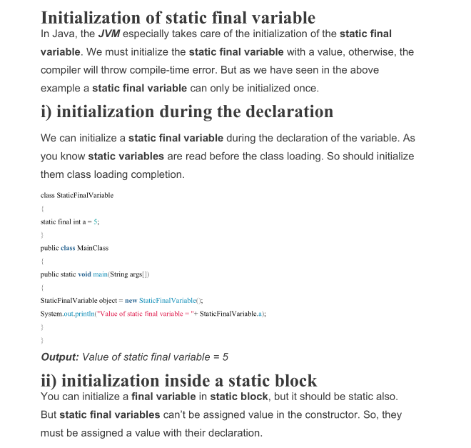

# Final Keyword

In order to limit our variables, methods and classes we use final keyword. Using final with a variable makes it a
constant. Using it with method prevents it to get overridden. Using it with class prevents it to get inherited.

## Final Parameters

In order for us to force that address of object in a parameter of a method can't change, we can declare it final.
