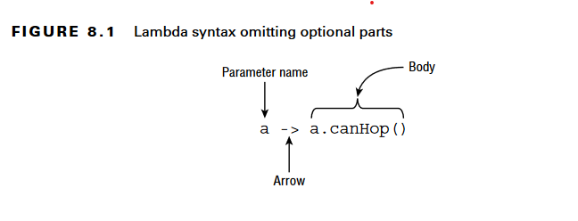
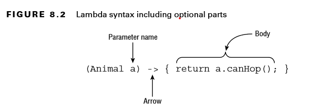
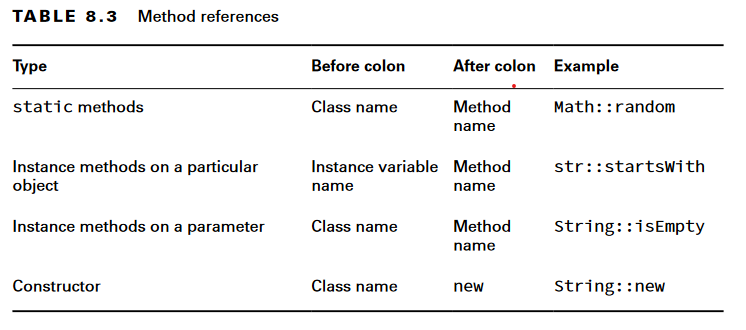

# Lambda Expressions

Functional programming is a way of writing code more declaratively. You specify what you want to do rather than dealing with the state of objects. You focus more on expressions than loops. Functional programming uses lambda expressions to write code.

## Problem Lambdas solve

```Java
public record Animal(String species, boolean canHop, boolean canSwim) { }
```

```Java
public interface CheckTrait {
    boolean test(Animal a);
}
```

```Java
public class CheckIfHopper implements CheckTrait {
    public boolean test(Animal a) {
        return a.canHop();
    }
}
```

```Java
import java.util.*;
public class TraditionalSearch {
    public static void main(String[] args) {
        // list of animals
        var animals = new ArrayList<Animal>();
        animals.add(new Animal("fish", false, true));
        animals.add(new Animal("kangaroo", true, false));
        animals.add(new Animal("rabbit", true, false));
        animals.add(new Animal("turtle", false, true));

        // pass class that does check
        print(animals, new CheckIfHopper());
    }
    private static void print(List<Animal> animals, CheckTrait cker) {
        for (Animal animal : animals) {

        // General check
            if (checker.test(animal))
                System.out.print(animal + " ");
        }
        System.out.println();
    }
}
```

In this case if want to extend a functionality and add a functionality to check whether the animal canSwim() or not We need to create another class that implements the interface.
With the help of lambda we can make use of **Deferred execution**. which means that code is specified now but will run later. In this case, “later” is inside the `print()` method body, as opposed to when it is passed to the method.

All we have to do is call the print() method in main like this:

```Java
print(animals, a -> a.canHop());
print(animals, a -> a.canSwim());
print(animals, a -> !a.canSwim());
```

## Lambda Syntax

Lambda Expressions work with a functional interface(an interface with only a single abstract method.)
Declaration of print() method have CheckTrait as second parameter, in case of `a -> a.canHop()` Java assumes we are passing a CheckTrait implementation, so it looks up there and assumes `a` is an Animal as declared in `test(Animal a)` and the return type is a boolean.

Concise form:

* A single parameter specified with the name a
* The arrow operator (- >) to separate the parameter and body
* A body that calls a single method and returns the result of that method



Verbose form:

* A single parameter specified with the name a and stating that the type is Animal
* The arrow operator (- >) to separate the parameter and body
* A body that has one or more lines of code, including a semicolon and a return statement



Examples of valid lambdas that return boolean:

* () -> true
* x -> x.startsWith("test")
* (String x) -> x.startsWith("test")
* (x, y) -> { return x.startsWith("test"); }
* (String x, String y) -> x.startsWith("test")

> We can't assign lambdas to var because of the fact that Java infers information about lambdas form the context and in case of var we have not enough information for Java compiler to infer the lambdas.

## Method References

Method references are another way to make the code easier to read, such as simply mentioning the name of the method.

```Java
public interface LearnToSpeak {
    void speak(String sound);
}
```

```Java
public class DuckHelper {
    public static void teacher(String name, LearnToSpeak trainer) {
        // Exercise patience (omitted)
        trainer.speak(name);
    }
}
```

```Java
public class Duckling {
    public static void makeSound(String sound) {
        LearnToSpeak learner = s -> System.out.println(s);
        DuckHelper.teacher(sound, learner);
    }
}
```

To use method reference we can simply replace the lambda with `LearnToSpeak learner = System.out::println;`
The :: operator tells Java to call the println() method later.

There are four formats for method references:

* static methods
* Instance methods on a particular object
* Instance methods on a parameter to be determined at runtime
* Constructors

### Calling static Methods

Like we have functional interface that converts a double to a long:

```Java
interface Converter {
    long round(double num);
}
```

We can implement this using Math class:

```Java
Converter methodRef = Math::round;
Converter lambda = x -> Math.round(x);
System.out.println(methodRef.round(100.1)); // 100
```

### Calling Instance Methods on a Particular Object

```Java
interface StringStart {
    boolean beginningCheck(String prefix);
}
```

We want to make a lambda using String.startswith() method.

```Java
var str = "Zoo";
StringStart methodRef = str::startsWith;
StringStart lambda = s -> str.startsWith(s);
System.out.println(methodRef.beginningCheck("A")); // false
```

### Calling Instance Methods on a Parameter

This time, we are going to call the same instance method that doesn’t take any parameters. The trick is that we will do so without knowing the instance in advance. We need a different functional interface this time since it needs to know about the String

```Java
interface StringParameterChecker {
    boolean check(String text);
}
```

```Java
StringParameterChecker methodRef = String::isEmpty;
StringParameterChecker lambda = s -> s.isEmpty();
System.out.println(methodRef.check("Zoo")); // false
```

> The methodRef looks like static method but, it isn't. Java knows that isEmpty() is an instance method that does not take any parameters. Java uses the parameter supplied at runtime as the instance on which the method is called.

```Java
interface StringTwoParameterChecker {
    boolean check(String text, String prefix);
}
```

```Java
StringTwoParameterChecker methodRef = String::startsWith;
StringTwoParameterChecker lambda = (s, p) -> s.startsWith(p);
System.out.println(methodRef.check("Zoo", "A")); // false
```

> This may look like a static method, but it is really a method reference declaring that the instance of the object will be specified later.

### Calling Constructors

A constructor reference is a special type of method reference that uses new instead of a method and instantiates an object.

```Java
interface EmptyStringCreator {
    String create();
}
```

```Java
EmptyStringCreator methodRef = String::new;
EmptyStringCreator lambda = () -> new String();
var myString = methodRef.create();
System.out.println(myString.equals("Snake")); // false
```

```Java
interface StringCopier {
    String copy(String value);
}
```

```Java
StringCopier methodRef = String::new;
StringCopier lambda = x -> new String(x);
var myString = methodRef.copy("Zebra");
System.out.println(myString.equals("Zebra")); // true
```

> This means you can’t always determine which method can be called by looking at the method reference. Instead, you have to look at the context to see what parameters are used and if there is a return type. In this example, Java sees that we are passing a String parameter and calls the constructor of String that takes such a parameter.



## Builtin Functional Interfaces
