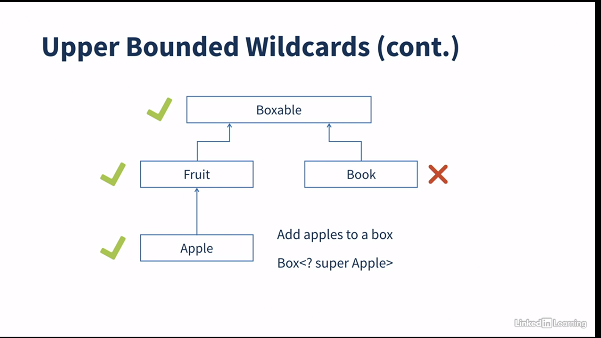

# Generics

## Concept

Generics in java provides a way to define parameterized types means, Enables types to be parameters for
classes/interfaces. It implements strict type safety checks at compile time.

E, T K, V these are type parameters. These are placeholders on what type the Generic Type is going to work with.
When we pass concrete classes to generic types like List<String>, String will be a type arguments.

The <> operator allows to type inference the type argument From one side when initializing a generic type.

### Rules

Primitives can not be passed as type arguments. The boxing and unboxing between Wrappers and Primitives will be done
automatically.

naming conventions for type parameters

* E -> Element: used in all collection classes
* T -> Type:
* K -> Key:
* V -> Value:
* N -> Number:
* S U V -> more than one parameter

### Problem without generics

When we define generalized types or types that have raw types. We mostly encounter two problems:

* Explicit casting will be needed trying to parse the object
* If the type is not the one we're trying to fetch runtime can not cast exception will be thrown.

```java
import java.util.List;

public class WithoutGeneric {
    public static void main(String[] args) {
        List items = new ArrayList(); // List of raw types
        items.add("book");
        items.add(212);

        String s = (String) items.get(0);
        String f = items.get(1); // throws runtime exception
    }
}
```

### Magic with Generic Types

Nowadays with generics we can define types with custom parameterized types for example a String arraylist or List of
Products without defining ProductList class explicitly because in JDK `java.util.List` is a generic type.

```java
import java.util.List;

public class withGeneric {
    public static void main(String[] args) {
        List<String> items = new ArrayList<>();
        items.add("books");
        items.add(22); // compile time error

        String item = items.get(0);
    }
}
```

## Generic methods

Inside generic types methods can be defined using generic parameters to generalize the class. but we can have generic
methods inside non-generic class and, also they can be applied to descendant classes constructors.

For Non-generic classes we need to declare the type parameter before return type in method signature in order to use
generic types correctly.

```java
import java.util.List;

public class NonGenericType {
    public static <T> int getSize(List<T> items) {
        return items.size();
    }
}
```

## Boundary types

WE can also restrict our Generic classes by boundary types.
`extends` can be used to limit the type to the superclass and all it's descendants. We can also use `&` to define
the types that implement multiple interfaces. (One class and multiple interfaces)
In this combination class should be mentioned first.

```java
import java.util.Comparator;

public class GenericTypeWithBoundary<T extends Number & Cloneable & Comparable<T>> {
}

```

## Generic class Hierarchies

Same as all non-generic classes and all inheritance rules apply on them.

* subclass must pass type parameters to superclass
* Generic subclass type can extend a non-generic type
* Subclass can have more type parameters

But the type argument hierarchies is not this straightforward and, requires exact match in type argument. For example,
we can't pass List<Double> to the List<Number> and casting is not possible too.

All these restrictions are relaxed with wildcards.

## Compile time notes

### Type Erasure

Compiled code has no generic type information. Generics only provide Safety checks at compile time and info is not
available in bytecode.
Java compiler replaces unbounded type parameters with object type.
This is done because

* maintain legacy code
* no new classes are created for parameterized types
* to ensure no runtime overhead

We can see generic metadata in our .class files.

### Bridge method

When we create a generic method in bytecode level type parameters will be objected.

## ? wildcard

This operator points to any unknown types. they can be applied to type of parameter, fields, local variables and return
types.
This operator can not be used in:

* generic type instantiation
* generic method invocation
* super types

There are three ways to use wildcards:

* Unbounded: specified using only `?` operator and used when we don't want any reference to point to our parameter.

```java
public class Unbound {
    public static int compare(Comparator<?> comparator) {
        return 1;
    }
} 
```

* Upper bounded: We said hierarchy for type argument not going to work if they are not exactly the same. Upper bound
  solves this problem when we use `extends` with `?` operator.

```java
public class UpperBound {
    public static int compare(Box<? extends Fruite> fruitBox) {
        return fruitBox.size;
    }
} 
```

* Lower bounded: This will include any classes that are in the super hierarchy of the type it's implemented via super
  keyword
  

Java crates a virtual class named CAPTURE#1, and it's like the object class. when ? extends a class we can only read
values from it. but for writing it we should use super keyword.

## Type parameter restrictions

* We can not instantiate them : `T t = new T()`
* We can not create static type
* `instanceof` doesn't work because erasure will change the type unless we have unbound wildcards.
* Can not create Arrays of parameterized types
* method overloading with same erasure
* Can't create Generic subclass of throwable.
* Can't use type parameter inside catch clause. however, throws clause with type parameter works fine.
  `public class GenericClass<T extends Throwable>{}`