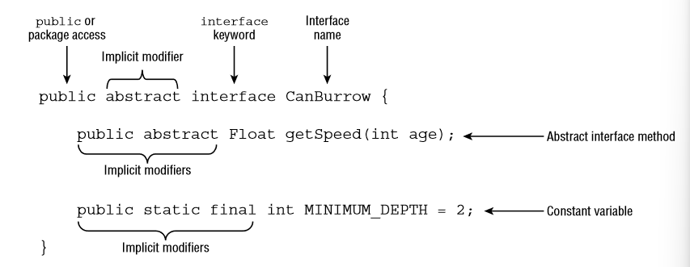
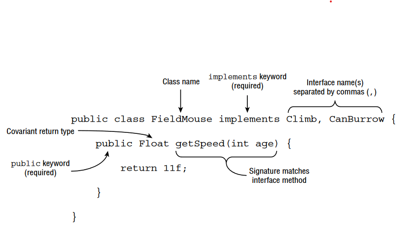
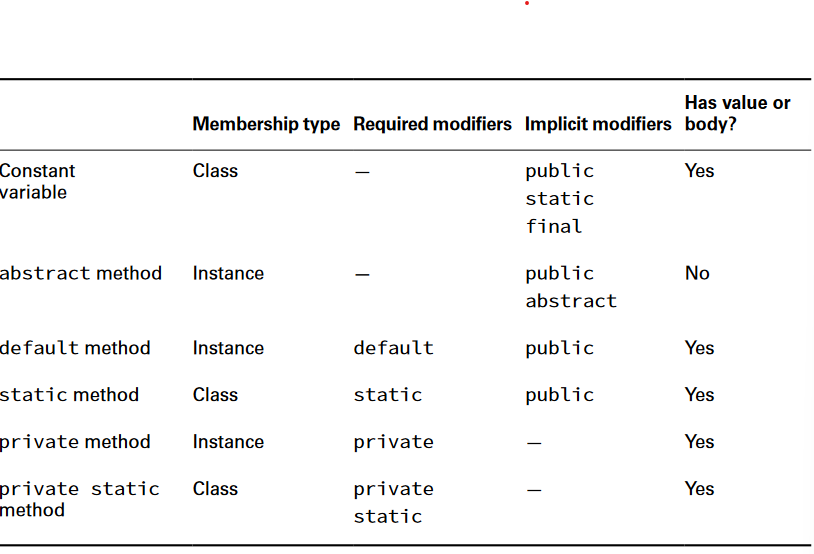
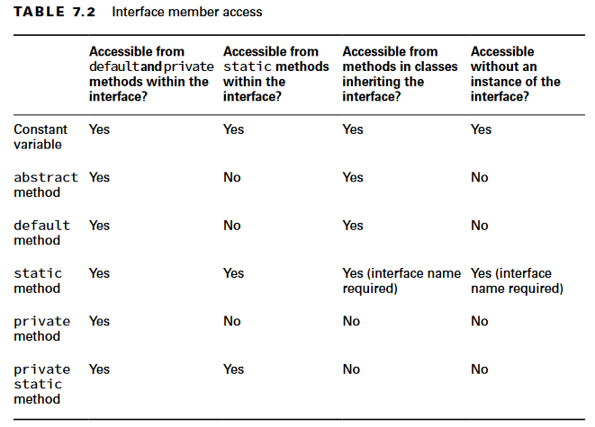

# Interfaces in Java

An interface is an abstract data type that declares a list of abstract methods that any class implementing the interface must provide.

## Declaration



> An implicit modifier is a modifier that the compiler automatically inserts into the code.



## Extending an Interface

Like a class, an interface can extend another interface using the extends keyword. However unlike classes, intefaces can extend multiple interfaces.

> Extending two interfaces is permitted because interfaces are not initialized as part of a class hierarchy. Unlike abstract classes, they do not contain constructors and are not part of instance initialization. Interfaces simply define a set of rules and methods that a class implementing them must follow.

## Inheriting an Interface

Like an abstract class, when a concrete class inherits an interface, all of the inherited abstract methods must be implemented.

Java supports inheriting two abstract methods that have compatible method declarations.

```Java
public interface Herbivore { public void eatPlants(); }
public interface Omnivore { public void eatPlants(); }
public class Bear implements Herbivore, Omnivore {
    public void eatPlants() {
        System.out.println("Eating plants");
    } 
}
```

> By compatible, we mean a method can be written that properly overrides both inherited methods

## Implicit Modifiers for interfaces

* Interfaces are implicitly abstract
* Interface variables are implicitly public, static, and final.
* Interface methods without a body are implicitly abstract.
* Interface methods without the private modifier are implicitly public.

## Differences between Interfaces and Abstract Classes

* Asbstract classes don't have implicit modifiers, and won't compile if we don't write the abstract keyword.
* While implementing an abstract method of a abstract class which has package access level, we can implement it with package access level inside concrete class too, however since we have Implicit modifiers in interfaces the default is public and concrete class can't implement it with package access level.

## Declare Concrete Interface Methods

Intefaces have grown.



The membership type determines how it is able to be accessed. A method with a membership type of class is shared among all instances of the interface, whereas a method with a membership type of instance is associated with a particular instance of the interface.

> Though we have private access, We don't have protected and package access level. protected because interfaces are not extended by classes and package level because of backward compatibility so it doesn't break old implementations of programs

## Writing a default Interface Method

A default method is a method defined in an interface with the default keyword and includes a method body. It may be optionally overridden by a class implementing the interface.

One use of default methods is for backward compatibility. You can add a new default method to an interface without the need to modify all of the existing classes that implement the interface. The older classes will just use the default implementation of the method defined in the interface.

```Java
public interface IsColdBlooded {
    boolean hasScales();
    default double getTemperature() {
        return 10.0;
    } 
}

public class Snake implements IsColdBlooded {
    public boolean hasScales() { // Required override
        return true;
    }
    public double getTemperature() { // Optional override
        return 12;
    }
}
```

> The Snake class can decide on using the default implementation of `getTemperature()` or implement it.

### Rules for defining default interface methods

* A default method may be declared only within an interface.
* A default method must be marked with the default keyword and include a method body.
* A default method is implicitly public.
* A default method cannot be marked abstract, final, or static.
* A default method may be overridden by a class that implements the interface.
* If a class inherits two or more default methods with the same method signature, then the class must override the method.

#### Inheriting Duplicate default Methods

```Java
public interface Walk {
    public default int getSpeed() { return 5; }
}

public interface Run {
    public default int getSpeed() { return 10; }
}

public class Cat implements Walk, Run {} // DOES NOT COMPILE
```

We can fix it by implementing it:

```Java
public class Cat implements Walk, Run {
    public int getSpeed() { return 1; }
}
```

If we want to access the hidden default method of one of the interfaceses we can use:

```Java
public class Cat implements Walk, Run {
    public int getSpeed() {
        return 1;
    }
    public int getWalkSpeed() {
        return Walk.super.getSpeed();
    } 
}
```

> This is an area where a default method exhibits properties of both a static and instance method. We use the interface name to indicate which method we want to call, but we use the super keyword to show that we are following instance inheritance, not class inheritance. Note that calling `Walk.getSpeed()` or `Walk.this.getSpeed()` would not have worked.

## Declaring static Interface Methods

* A static method must be marked with the static keyword and include a method body.
* A static method without an access modifier is implicitly public.
* A static method cannot be marked abstract or final.
* A static method is not inherited and cannot be accessed in a class implementing the interface without a reference to the interface name.

## Reusing Code with private Interface Methods

We can reuse some code in our interfaces by declaring static and private static methods.

### Private Interface Method Definition Rules

1. A private interface method must be marked with the private modifier and include a method body.
2. A private static interface method may be called by any method within the interface definition.
3. A private interface method may only be called by default and other private non-static methods within the interface definition.

## Calling abstract Methods

It turns out default and private non-static methods can access abstract methods declared in the interface. This is the primary reason we associate these methods with instance membership.

```Java
public interface ZooRenovation {
    public String projectName();
    abstract String status();
    default void printStatus() {
    System.out.print("The " + projectName() + " project " +     status());
    } 
}
```

## Interface Members access


