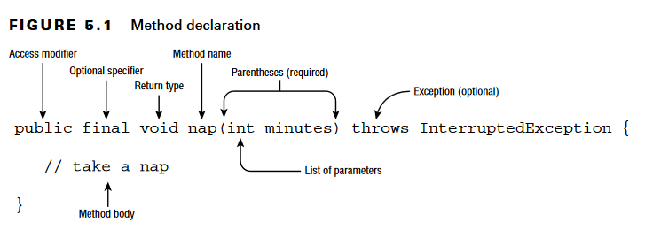
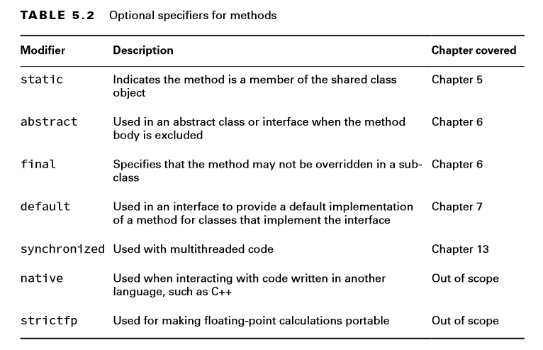
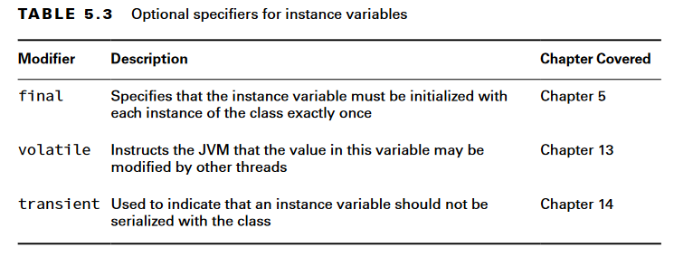

# Methods

## Designing methods

This is called a method declaration, which specifies all the information needed to call the method. The combination of method name & parameters list is called method signature which provides instructions for how callers can reference this method.

> Return type, method name, parameters list(at least empty paranthesis), method signature and method body(except for abstract methods) are required.

### Access Modifiers

An access modifier determines what classes a method can be accessed from.

ّFour access modifiers are available:

* **Private**: The private modifier means the method can be called only from within the same class.
* **Package access**: With package access, the method can be called only from a class in the same package. This one is tricky because there is no keyword. You simply omit the access modifier.
* **Protected**: The protected modifier means the method can be called only from a class in the same package or a subclass.
* **Public**: means the method can be called from anywhere.

### Optional Specifiers

We number of specifiers and we can have multiple of them in method declaration.

### Return Type

The return type must be specified after access modifiers and optional specifiers before the name. It has to be an actual JavaType or void if We don't return a value inside the method.

## Local Variables & Instance Variables

local variables are those defined with a method or block, while instance variables are those that are defined as a member of a class.

> all local variable references are destroyed after the block is executed, but the objects they point to may still be accessible.

### Local Variable Modifiers

Only `final` is applicable on local variables. We can also declare that variable using `var`. In case of primitives the value can not change at all however in case of references the variable can not be set to point to a different instance. for example a final List, The list is modifieable however, we can't set the variable to point to a different list.

> marking a local variable final is often a good practice. For example, you may have a complex method in which a variable is referenced dozens of times. It would be really bad if someone came in and reassigned the variable in the middle of the method.

#### Effectively final

To see if a variable is effectively final, we can add final keyword to see if the code still compiles or not.

> method and constructor parameters are local variables that have been pre-initialized. In the context of local variables, the same rules around final and effectively final apply. This is especially important in “Lambdas and Functional Interfaces,” since local classes and lambda expressions declared within a method can only reference local variables that are final or effectively final.

### Instance Variable Modifiers

instance variables can use access modifiers

> The compiler does not apply a default value to final variables, though. A final instance or final static variable must receive a value when it is declared or as part of initialization.

## Varargs

a method may use a varargs parameter (variable argument) as if it is an array.
We must follow rules for applying varags:

* A method can have at most one varargs parameter.
* If a method contains a varargs parameter, it must be the last parameter in the list.

### Calling Methods with Varargs

You can pass in an array, or you can list the elements of the array and let Java create it for you.

> You can even omit the varargs values in the method call, and Java will create an array of length zero for you.
> We can also access them like we access arrays.
