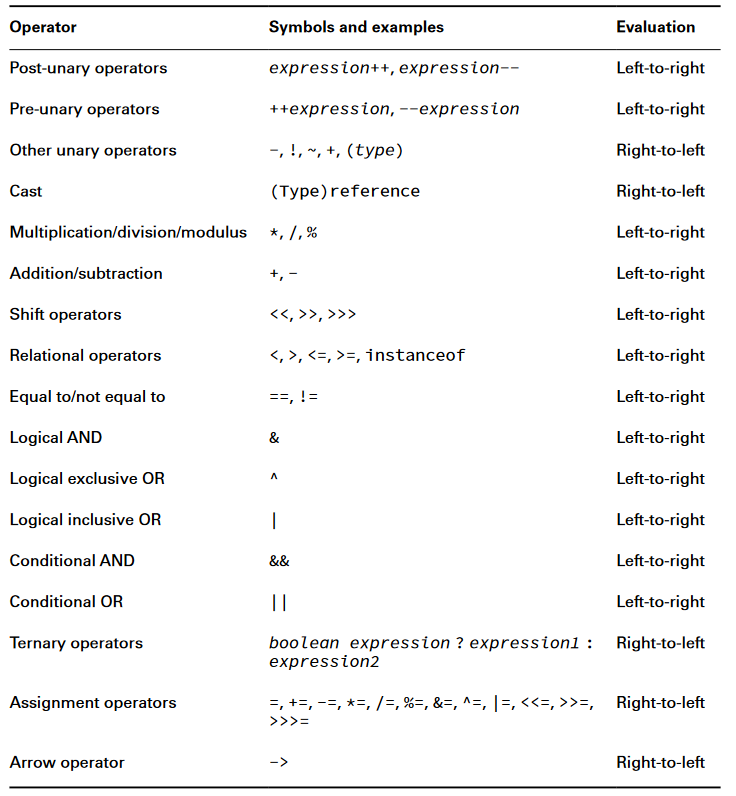
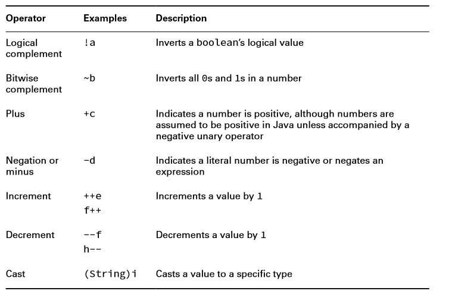
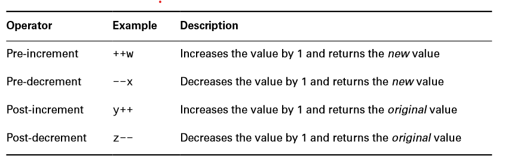
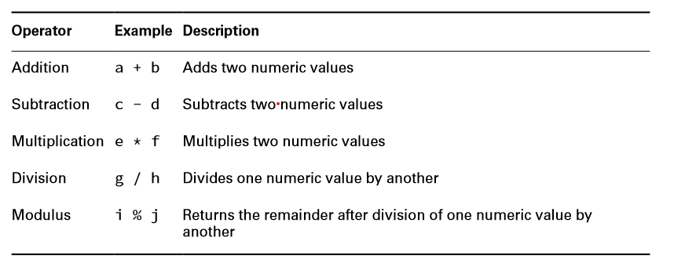
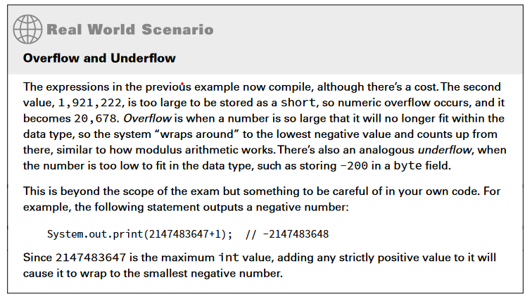
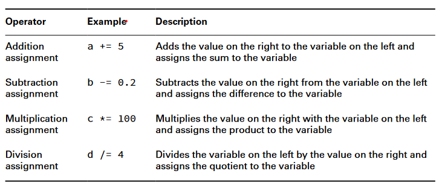
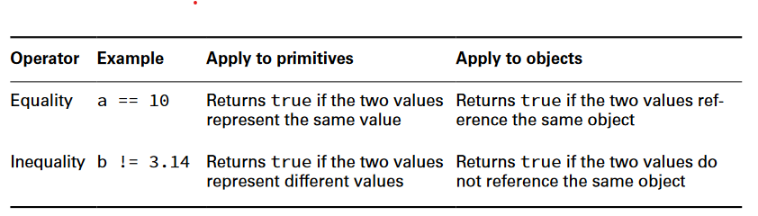
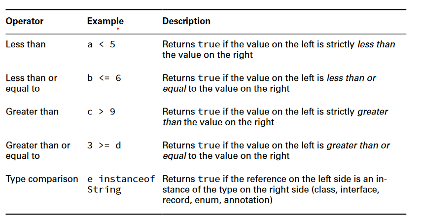
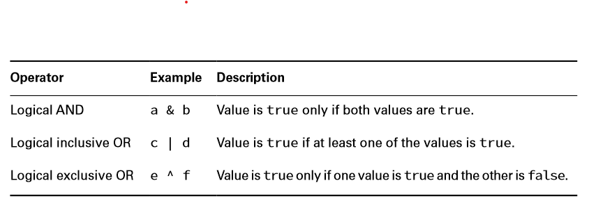
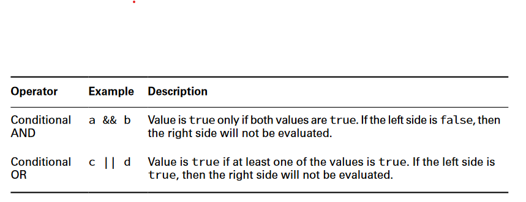

# Operators

A Java operator is a special symbol that can be applied to a set of variables, values, or literals, referred to as operands and that returns a result.

> ava supports three flavors of operators: unary, binary, and ternary.

## Operator Precedence



### Unary Operators



> Unlike in some other programming languages, in Java, 1 and true are not related in any way, just as 0 and false are not related

### Increment and Decrement Operators



### Binary Operators

#### Arithmatic



> All of the arithmetic operators may be applied to any Java primitives, with the exception of boolean. Furthermore, only the addition operators + and += may be applied to String values, which results in String concatenation.
> When using modulus operator with integers, the floor of the result will be evaluated. `4.99 => 4.0`

#### Numeric Promotion

rules that Java will follow when applying operators to data types:

1. If two values have different data types, Java will automatically promote one of the values to the larger of the two data types
2. If one of the values is integral and the other is floating-point, Java will automatically promote the integral value to the floating-point value’s data type.
3. Smaller data types, namely, byte, short, and char, are first promoted to int any time they’re used with a Java binary arithmetic operator with a variable (as opposed to a value), even if neither of the operands is int.
4. After all promotion has occurred and the operands have the same data type, the resulting value will have the same data type as its promoted operands.

#### Assignment Operator

An assignment operator is a binary operator that modifies, or assigns, the variable on the left side of the operator with the result of the value on the right side of the equation. Unlike most other Java operators, the assignment operator is evaluated from right to left.

> Java will automatically promote from smaller to larger data types, as you saw in the previous section on arithmetic operators, but it will throw a compiler exception if it detects that you are trying to convert from larger to smaller data types without casting.

##### Casting Values

Casting is a unary operation where one data type is explicitly interpreted as another data type.
Casting is not required for converting to a larger data type however, narrowing data type requires casting or compiler throws an Exception.

```Java
int fur = (int)5;
int hair = (short) 2;
String type = (String) "Bird";
short tail = (short)(4 + 10);
```



##### Casting Values vs. Variables

The compiler doesn’t require casting when working with literal values that fit into the data type. When working with variables, though, there is ambiguity about how to proceed, so the compiler reports an error.

#### Compound Assignment Operators



> Using compound assignment operators we can avoid variable assignment errors.

```Java
long goat = 10;
int sheep = 5;
sheep = sheep * goat; // DOES NOT COMPILE

long goat = 10;
int sheep = 5;
sheep *= goat;  // COMPILES SUCCESSFULY
```

> The compound operator will first cast sheep to a long, apply the multiplication of two long values, and then cast the result to an int.

#### Return Value of Assignment Operators

he result of an assignment is an expression in and of itself equal to the value of the assignment.

`long coyote = (wolf=3);`
First, it sets the value of the variable wolf to be 3. Second, it returns a value of the assignment, which is also 3.

### Equality Operators



> In some languages, comparing null with any other value is always false, although this is not the case in Java.

### Relational Operators



#### instanceof Operator

 It is useful for determining whether an arbitrary object is a member of a particular class or interface at runtime.

```Java
public void openZoo(Number time) {
if (time instanceof Integer)
System.out.print((Integer)time + " O'clock");
else
System.out.print(time);
}
```

> It is common to use casting with instanceof when working with objects that can be various different types, since casting gives you access to fields available only in the more specific classes. It is considered a good coding practice to use the instanceof operator prior to casting from one object to a narrower type.
> calling instanceof on the null literal or a null reference always returns false

### Logical Operators



### Conditional Operators(short-circuit operators)



nearly identical to the logical operators, & and |, except that the right side of the expression may never be evaluated if the final result can be determined by the left side of the expression.

#### Avoiding a NullPointerException

A more common example of where conditional operators are used is checking for null objects before performing an operation.

```java
if(duck!=null & duck.getAge()<5) { // Could throw a NullPointerException
// Do something
}

if(duck!=null && duck.getAge()<5) {
// Do something
}
```

### Ternary Operator

This operator `? :` is used for making decisions.
The first operand must be a boolean expression, and the second and third operands can
be any expression that returns a value.

```java
int food1 = owl < 4 ? owl > 2 ? 3 : 4 : 5;
int food2 = (owl < 4 ? ((owl > 2) ? 3 : 4) : 5);
```
