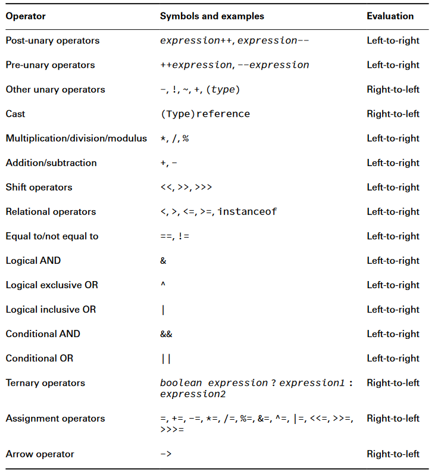
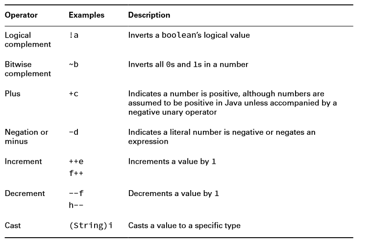
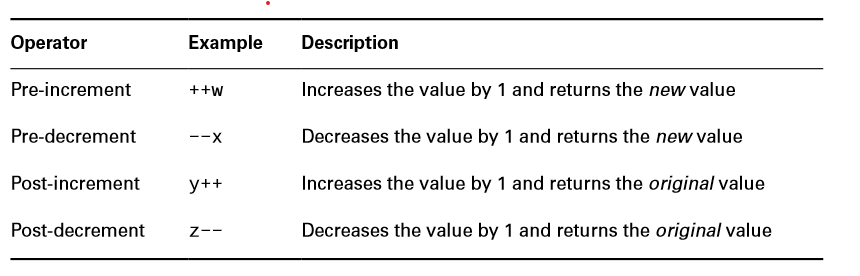
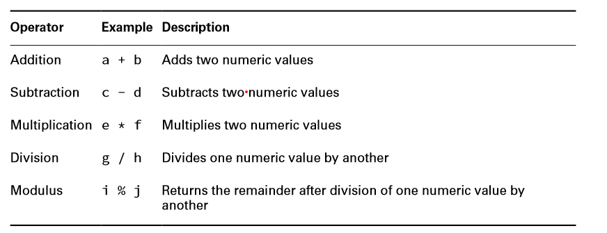

# Operators

A Java operator is a special symbol that can be applied to a set of variables, values, or literals, referred to as operands and that returns a result.

> ava supports three flavors of operators: unary, binary, and ternary.

## Operator Precedence

### Unary Operators

> Unlike in some other programming languages, in Java, 1 and true are not related in any way, just as 0 and false are not related

### Increment and Decrement Operators

### Binary Operators

#### Arithmatic

> All of the arithmetic operators may be applied to any Java primitives, with the exception of boolean. Furthermore, only the addition operators + and += may be applied to String values, which results in String concatenation.
> When using modulus operator with integers, the floor of the result will be evaluated. `4.99 => 4.0`

#### Numeric Promotion
