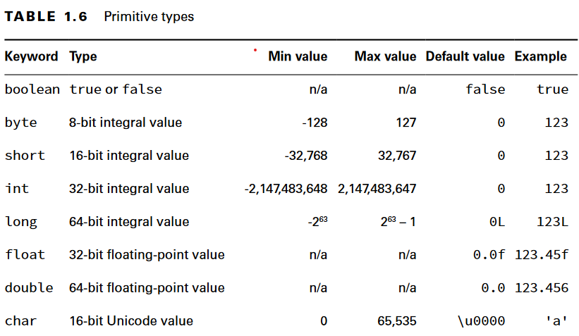

# Primitive Types

Java has eight built- in data types, referred to as the Java primitive types. a primitive is not an object in Java nor does it represent an object. A primitive is just a single value in memory, such as a number or character

> Short and char are similar in case of bit size and type. The primary difference is that short is signed, which means it splits its range across the positive and negative integers. Alternatively, char is unsigned, which means its range is strictly positive, including 0.

## Literals

By default numeric values are considered int literals.
We can use other base other than decimals:

* binary: 0b10
* octal: 017
* hex: 0Xff

> In order to read better we can add unerscore anywhere other than beginning of a literal, the end of a literal, right before a decimal point, or right after a decimal point.

## overflow vs round-off error

overflow is when we assign bigger value than the data type size.
round-off error is when we compute result of decimal numbers however a fault occurs hence, we need to use BigDecimals for this case.

> In case of round-off error we can compare the values with a standard like: `Math.abs(x - 1) < 0.0001`
