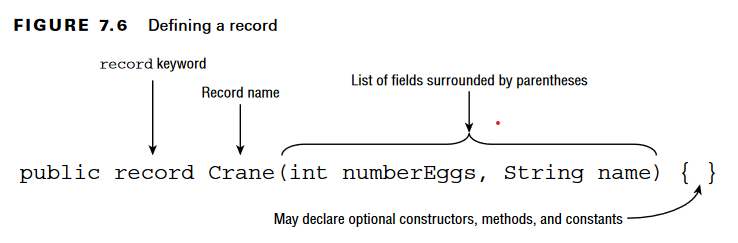
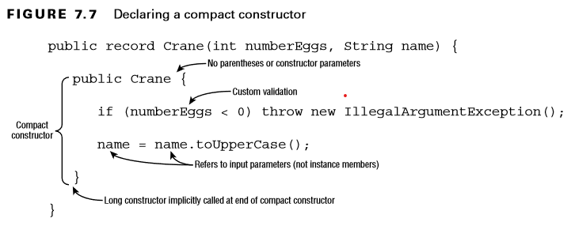

# Records

Records are added to Java in order to fix the problem of creating immutable POJO classes so, we don't need to deal with lots of boilerplate code. Most of the features like immutability, hashcode, equals, accessors are generated at compile time.

## Definition



Creates an immutable class with two fields, Canonical constructor for initializing values, `toString()`, `hashCode()` and `equals()` methods. It can also implement serializable. This class extends `java.lang.Record` so we can't extend any other class.
We can also, define records inline, like a field.

## Attributes

We can add as many attributes as we want. compiler creates accessors to them for us however, we can provide our own
code.

## Things we cannot add to Records

* You cannot declare any instance field in a record. You cannot add any instance field that would not correspond to a component.
* You cannot define any field initializer.
* You cannot add any instance initializer.
* You can create static fields with initializers and static initializers.

## Canonical constructor(Long constructor)

The compiler also creates a constructor for you, called the canonical constructor. This constructor takes the components of your record as arguments and copies their values to the fields of the record class.

There are situations where you need to override this default behavior. Let us examine two use cases:

* You need to validate the state of your record
* You need to make a defensive copy of a mutable component.

```Java
public record Crane(int numberEggs, String name) {
    public Crane(int numberEggs, String name) {
        if (numberEggs < 0) throw new IllegalArgumentException();
        this.numberEggs = numberEggs;
        this.name = name;
    }
}
```

### Compact Constructor

A compact constructor is a special type of constructor used for records to process validation and transformations succinctly. It takes no parameters and implicitly sets all fields.



> Java will execute the full constructor after the compact constructor.

```java
public record Range(int start, int end) {

    public Range {
        if (end <= start) {
            throw new IllegalArgumentException("End cannot be lesser than start");
        }
    }
}

```

The compact canonical constructor does not need to declare its block of parameters.

> Note that if you choose this syntax, you cannot directly assign the record's fields, for example with `this.start` = start; But you can assign new values to the constructor parameters, which leads to the same result because the compiler-generated code will then assign these new values to the fields.

### Using the Canonical Constructor

If you prefer the non-compact form, for example because you prefer not to reassign parameters, you can define the canonical constructor yourself, as in the following example.

```java
public record Range(int start, int end) {

    public Range(int start, int end) {
        if (end <= start) {
            throw new IllegalArgumentException("End cannot be lesser than start");
        }
        this.start = Math.max(start, 0);
        if (end > 100) {
            this.end = 10;
        } else {
            this.end = end;
        }
    }
}

```

> It is recommended to stick with the compact form of the constructor.

### Define overloaded constructors

You can also add any constructor to a record, as long as this constructor calls the canonical constructor of your record. The syntax is the same as the classic syntax that calls a constructor with another constructor. As for any class, the call to `this()` must be the first statement of your constructor.

```java
public record State(String name, String capitalCity, List<String> cities) {

    public State {
        // List.copyOf returns an unmodifiable copy,
        // so the list assigned to `cities` can't change anymore
        cities = List.copyOf(cities);
    }

    public State(String name, String capitalCity) {
        this(name, capitalCity, List.of());
    }

    public State(String name, String capitalCity, String... cities) {
        this(name, capitalCity, List.of(cities));
    }

    // We need this custom accessor because the default one doesn't provide immutable list.
    public List<String> cities() {
        return List.copyOf(cities);
    }
}

```

## Serializing records

Records can be serialized and deserialized if your record class implements Serializable. There are restrictions though.

* None of the systems you can use to replace the default serialization process are available for records. Creating a `writeObject()` and `readObject()` method has no effect, nor implementing Externalizable.
* Records can be used as proxy objects to serialize other objects. A `readResolve()` method can return a record. Adding a `writeReplace()` in a record is also possible.
* Deserializing a record always call the canonical constructor. So all the validation rules you may add in this constructor will be enforced when deserializing a record.

## Understanding Record Immutability

records don’t have setters. Every field is inherently final and cannot be modified after it has been written in the constructor. In order to “modify” a record, you have to make a new object and copy all of the data you want to preserve.

```Java
var cousin = new Crane(3, "Jenny");
var friend = new Crane(cousin.numberEggs(), "Janeice");
```

> Just as interfaces are implicitly abstract, records are also implicitly `final` like enums and can implement a regular or a sealed interface.
