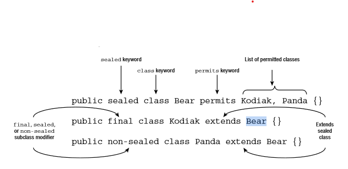
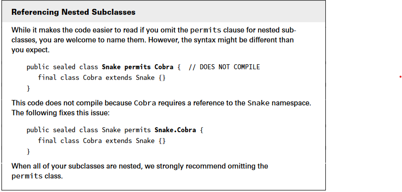
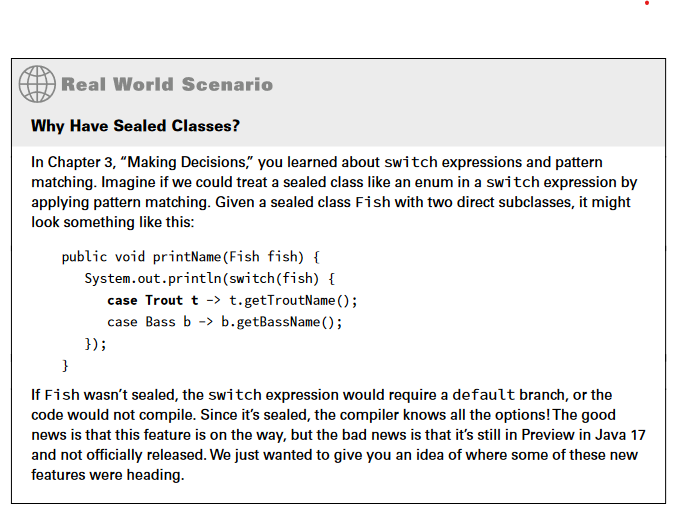

# Sealed Classes

A sealed class is a class that restricts which other classes may directly extend it.

## Overview

Sealed classes are like an addon on inheritance in java. Using this feature we can provide some restrictions on our inheritance.

## How to use

We can declare a sealed class using sealed keyword. This will require us to mention the subclass and also the subtype should extend it and declare if it's final, non-sealed or sealed class.

* **sealed**: sealed: Indicates that a class or interface may only be extended/implemented by named classes or interfaces
* **permits**: Used with the sealed keyword to list the classes and interfaces allowed. If both class and subclass are defined inside a file, This clause can be ommited.
* **non-sealed**: Applied to a class or interface that extends a sealed class, indicating that it can be extended by unspecified classes

> Sealed classes are commonly declared with the `abstract` modifier, although this is certainly not required. also, subclasses are alos declared with `final`

### Compiling sealed classes

For compiling sealed classes, both sealed class and subclasses need to be declared in same package otherwise they won't compile.

> With the help of named modules we can make this work!

## Specifying the Subclass Modifier

Every class that directly extends a sealed class must specify one of the `final`, `sealed` or `non-sealed` modifiers.

* `final`: The subclass can not have further inherence
* `sealed`: subclass can declare it's own subclasses. subclasses of this class will be indirectly subclass of the parent class.
* `non-sealed`: The non- sealed modifier is used to open a sealed parent class to potentially unknown subclasses

## Sealing Interfaces

The idea is analogous to classes, and many of the same rules apply.
One distinct feature of a sealed interface is that the permits list can apply to a class that implements the interface or an interface that extends the interface.

> Interfaces are implicitly abstract so, They can not be marked `final` and can only be `sealed` or `non-sealed`

