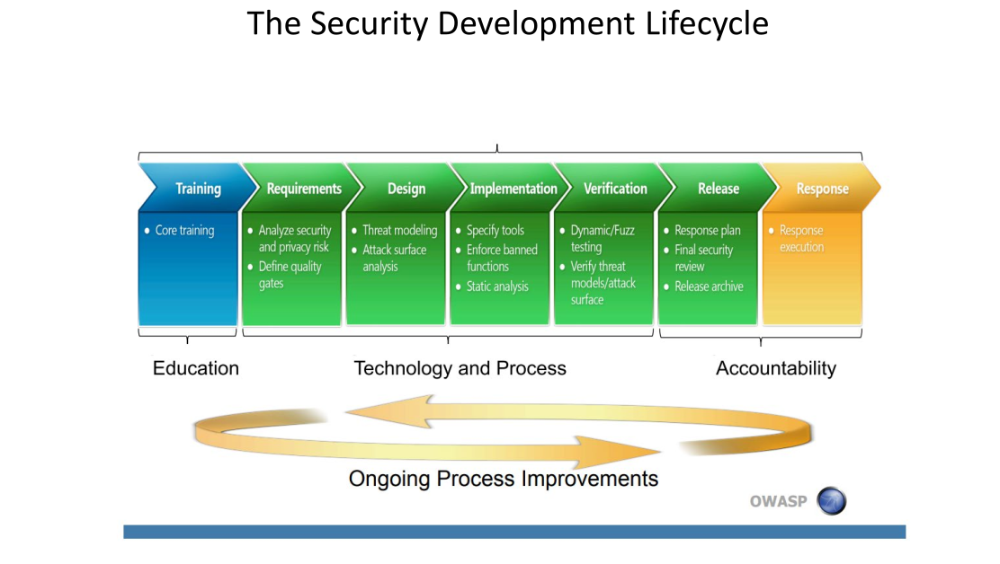
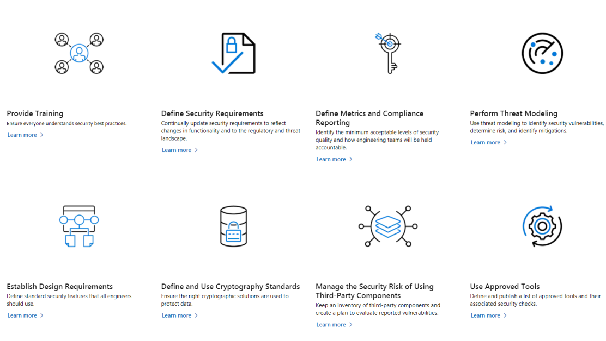
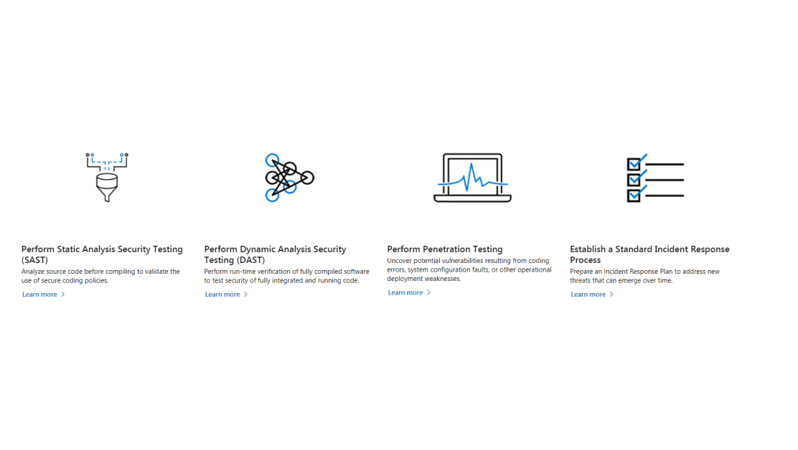
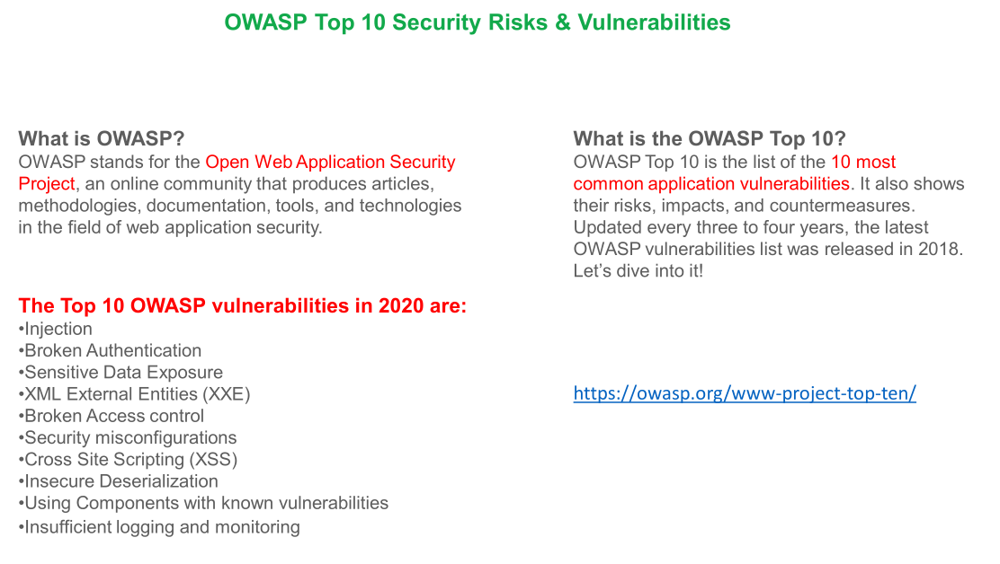

# OWASP TOP 10

## Security software development life cycle

When we don't consider security issues during our development cycle, The bad result will emerge on both technical and
business sides. We have a Security life cycle which starts from requirement gathering step and goes on till the end of
the software development life cycle.

1. First the development team needs a training
2. In Requirements phase, also on top of business requirements we need to specify security risks and define quality
   gates for our application
3. In Design phase, We need to perform threat modeling, which is to analyze the security threats that might happen in
   our architecture.
4. In implementation phase, We can use plugins, linters to see if our code has security breaches or not. OWASP liner,
   SonarLint are tools which provide hints for us and perform static analysis during our coding.
5. In Verification phase, when we have deployed our application and, we want to test our application on runtime and make
   sure it's secure. Here we need Dynamic/ Fuzz testing.
6. In Release phase, We need to plan to resolve all issues.

After analyzing, we give an incident report from the classification of issues.

> We should always consider security from the beginning of development.

## Top 10 OWASP Security risks & vulnerabilities

OWASP is open web application software project is a nonprofit created by security GURUs. They have defined lease things
to do to secure applications no matter what language we use. Here we are going to discuss top 10 most critical use-cases
for securing our web application in Java.

OWASP rules are general concepts and are regardless of other industry's data policies. For example GDPR is europe
specific data policies.

