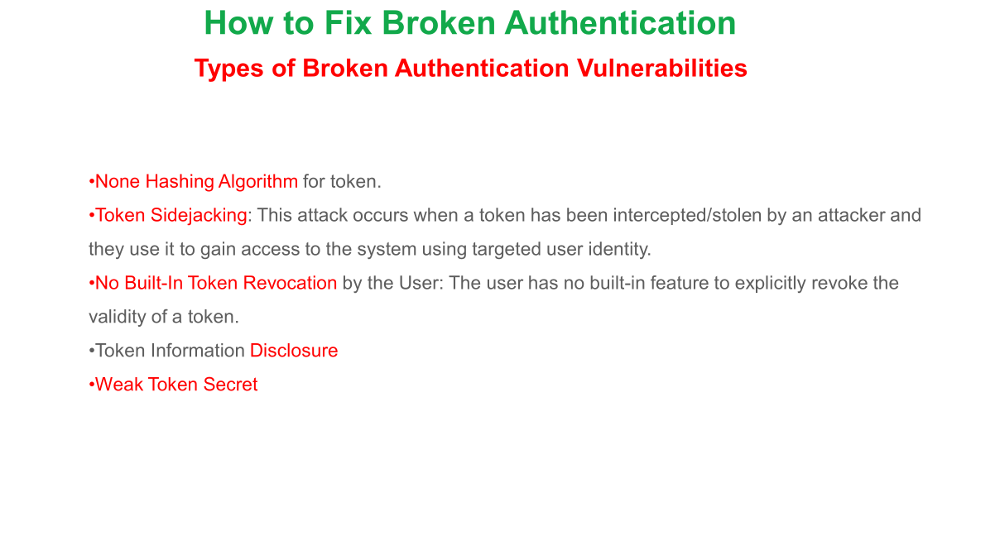

# Authorization & Identification Failures

> The first thing to do is to always make sure we don't include sensitive data like userId through our requests with
> cookie or session ID.

> After a successful login we need to rotate the session-ID and get a new Session-ID.
> In case of stateless(token based) we need to consider token side-jacking. We usually use jwt token, We should encrypt
> it using JWE/JWS. libraries to use:

* nimbus-jose
* jose4j

> For password, we always need to consider to choose a unique one.

In order to persist password in a resource we need to apply hashing algorithms to provide the necessary privacy and
security.

> Also, We need to 2-factor authentication. It doesn't matter if we use one time password or hardware security password.

### IMA

For Authentication Authorization, we can have authentication in every module we write. But also we can connect to
Identity and Access management platform. It is recommended to use this method. Tools we can use:

* KeyCloak/WSO2
* Identity server

These IAM connects to a data source or Database and, we connect to this IAM.
These IAMs also support different mechanisms like LDAP OAUTH2.

In OAUTH2 we get two tokens:

* Access Token
* Refresh Token

We don't need new login if we have valid access token. Or the app can use refresh token to get new access token.

> PDF files are better sources.
