# Injection

when someone tries to send an unexpected invalid data to our application and tries to damage it.

### SQL Injection

> We need to validate the parameter we want to use in our query using parse methods or regular expressions.

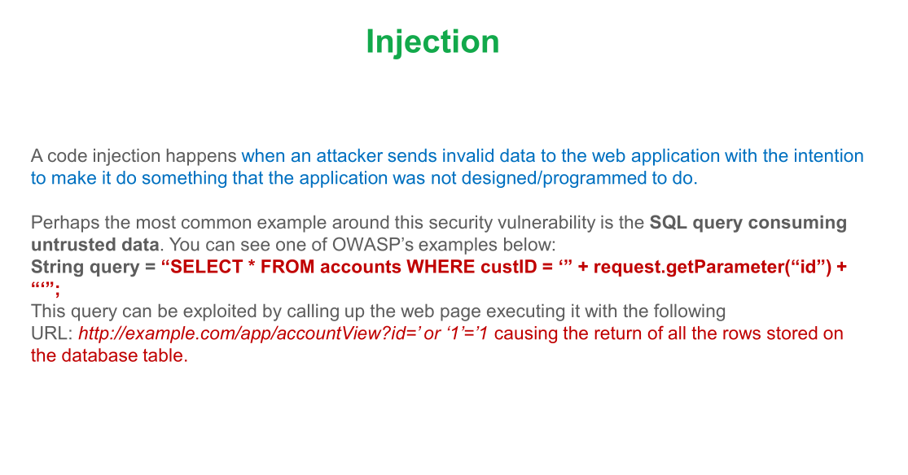

> We should always use preparedStatements instead of statements in order to parameterize our queries.

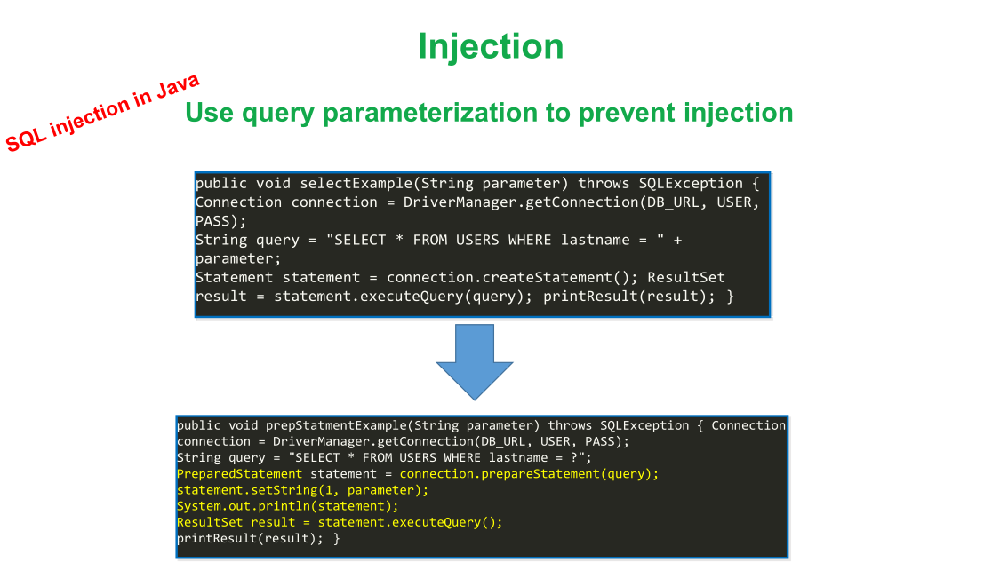
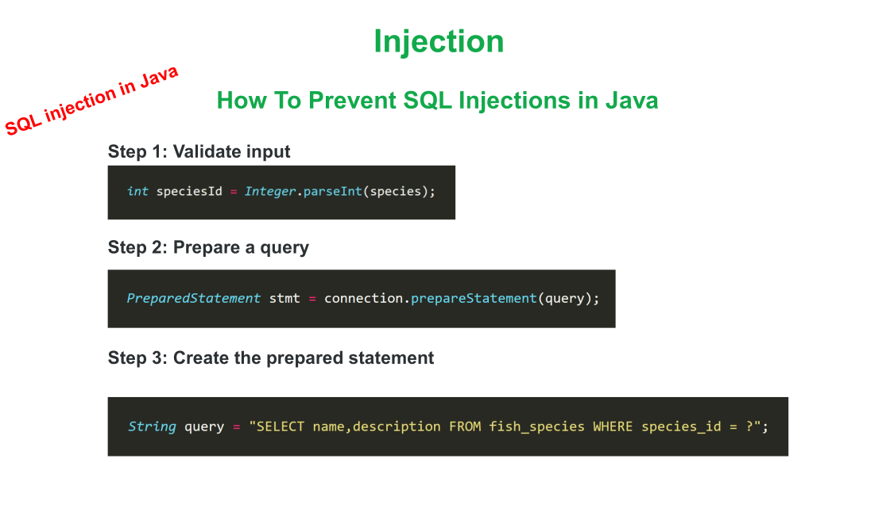  
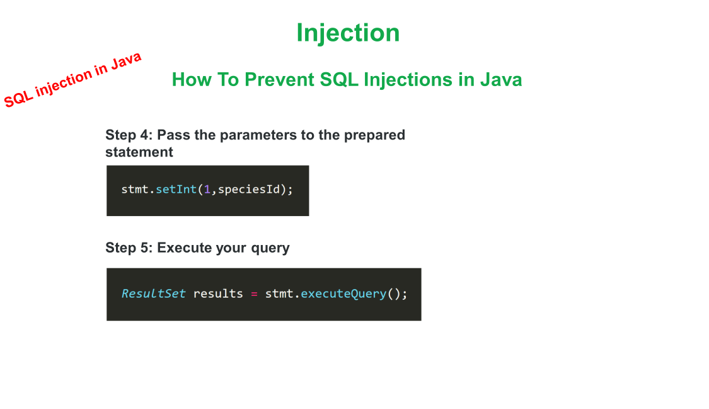

> When using JPA specification frameworks we need to use parameterized queries which are defined using `=: varName` This
> will automatically handle injection. HOWEVER, we still need to validate argument we are going to use for query using
> regex or parse.

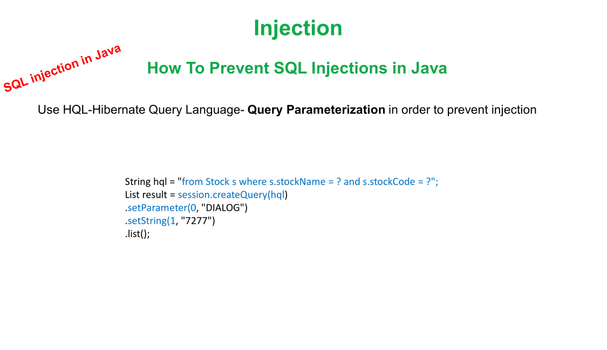

> A recommended way to create queries is to use Criteria API which makes our code declarative and also lets us limit
> structure of our query.

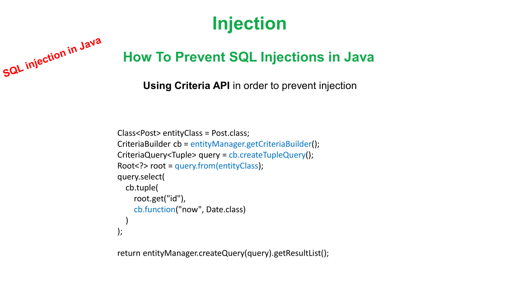

> Alongside validation, It's always recommended to limit our data inputs, which is called *_Data Sanitization_*.
> There are two ways to achieve this:

* A whitelist of data that can be used as input
* A blacklist of data that can't be used as input

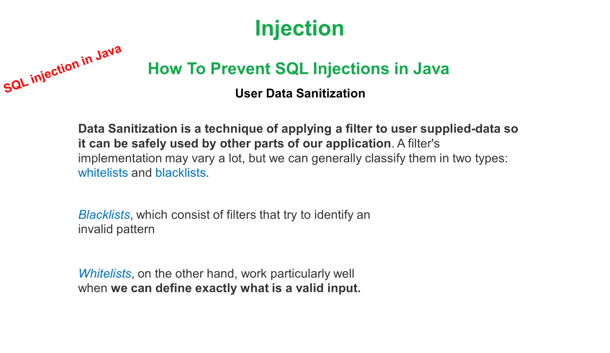
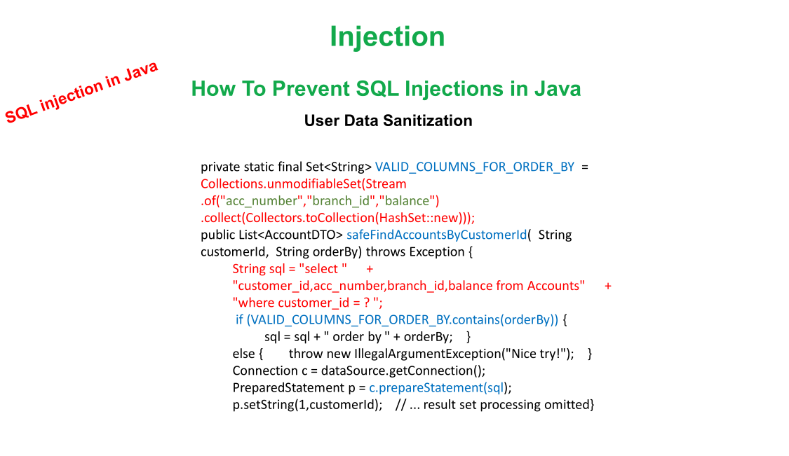
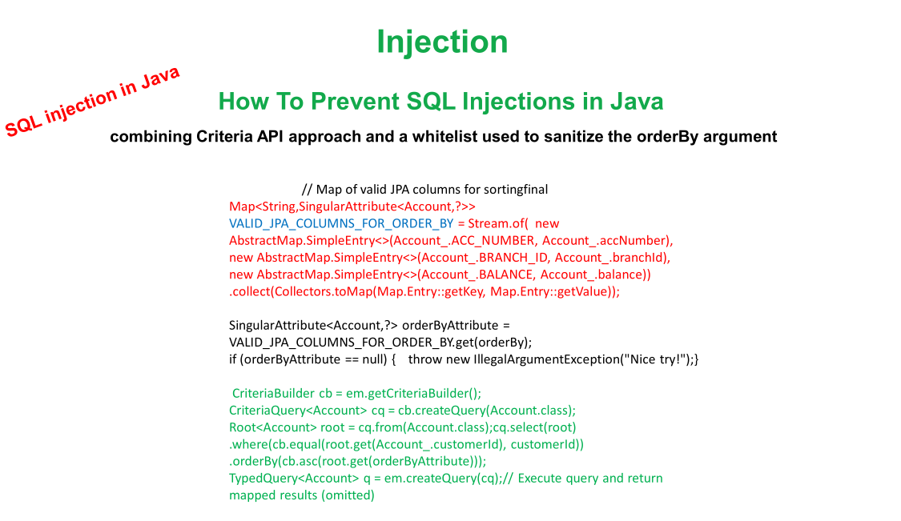

### Operating System Injection

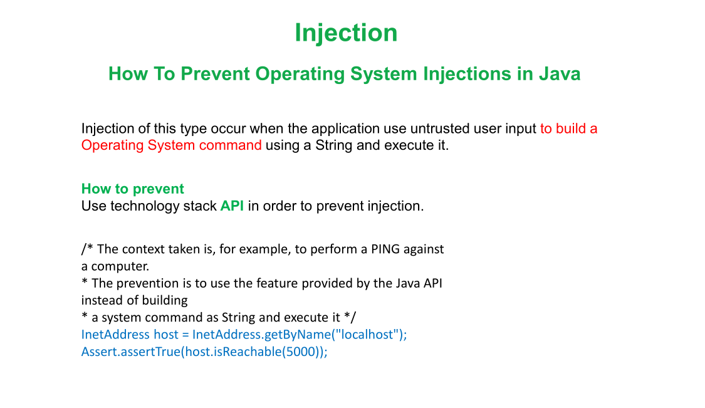
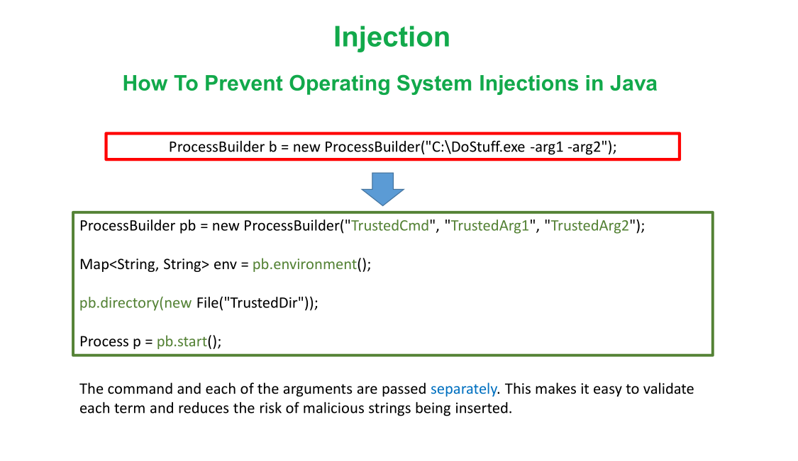

> It's always recommended to encode binary data when we want to transfer them.

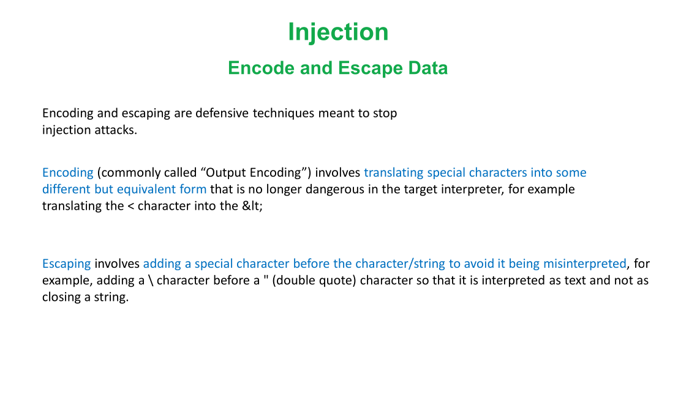

> We can also prevent this using OWASP ESAPI which provides encoders and commands for creating OS commands.

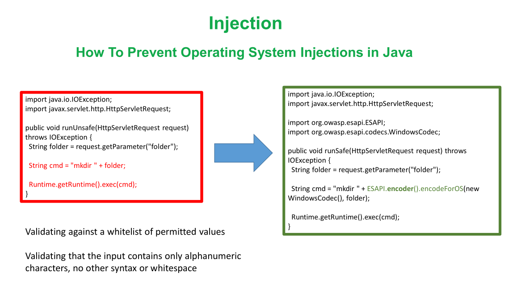

### XPath injection in XML

Xpath is used to search elements in XML files. invalid values can be injected in this. We can prevent this using Xpath
Variable Resolver.

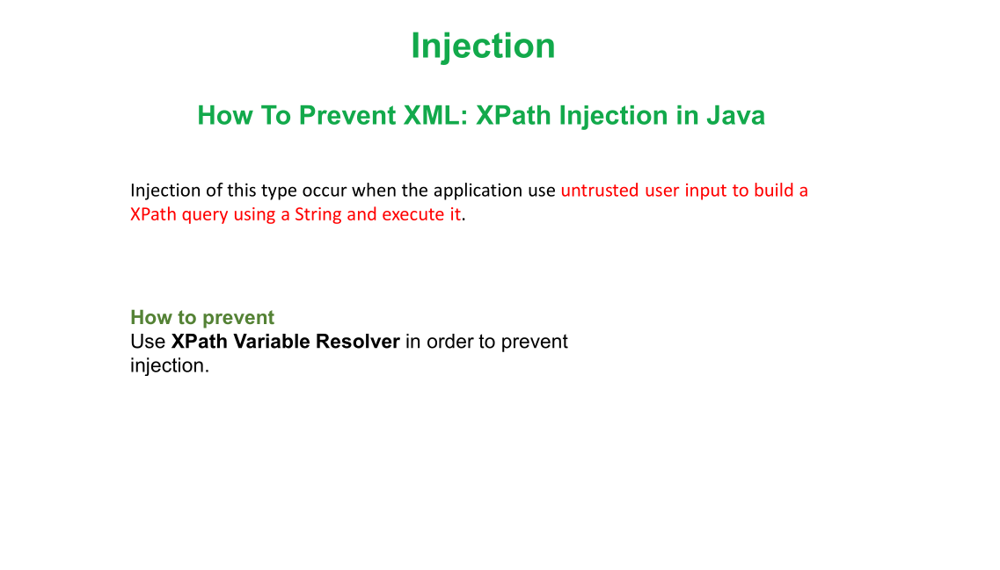
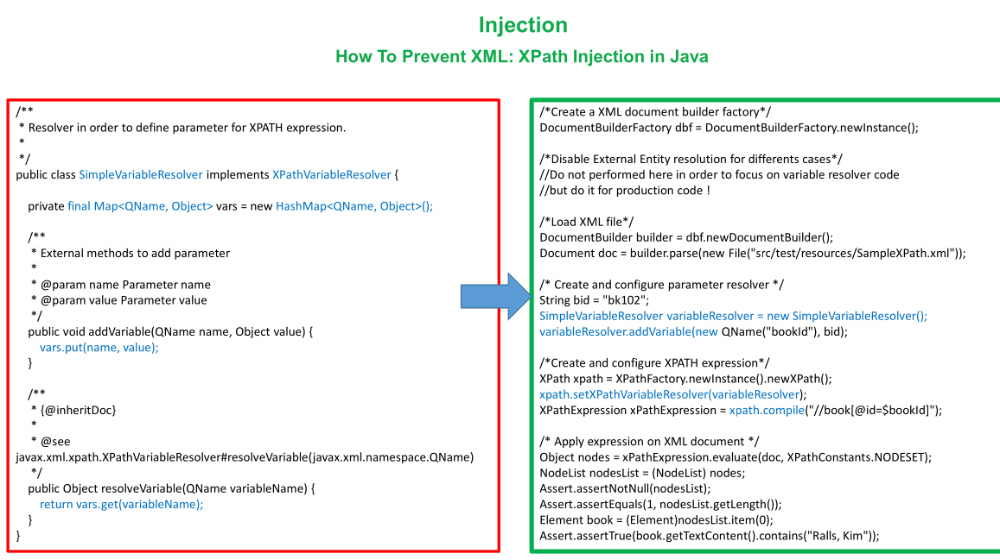

### Log Injection

Happens when we have untrusted value in our logging system. For example attacker tries to enter a log to our system.
injecting Carriage Return or LF and then adding untrusted message.

to prevent this we can simply limit input value and ban CRLF characters.

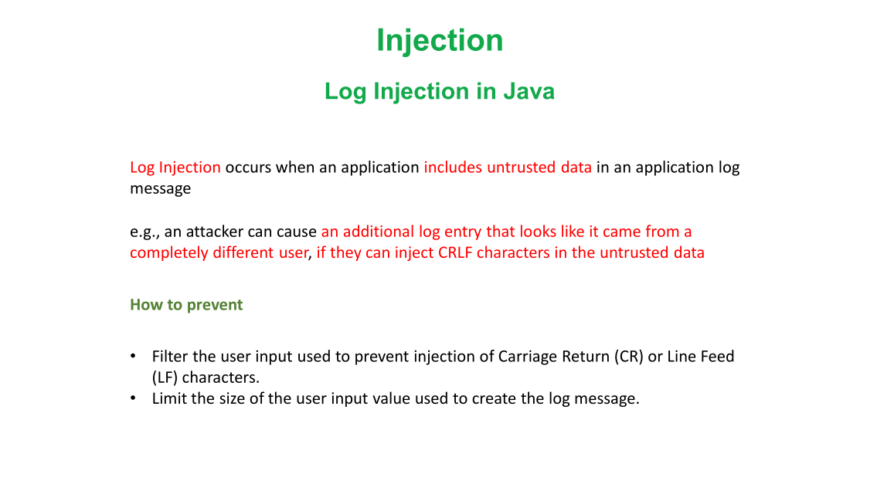
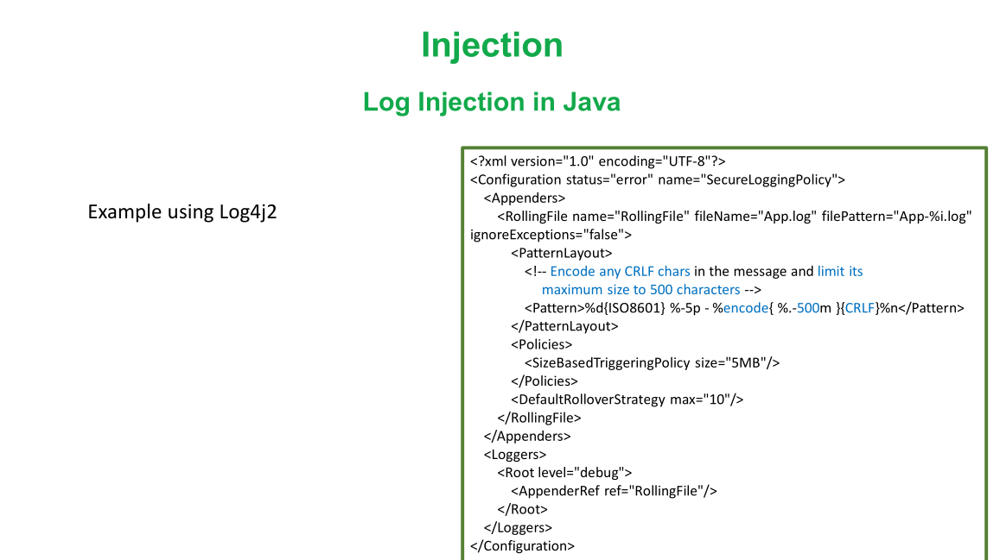
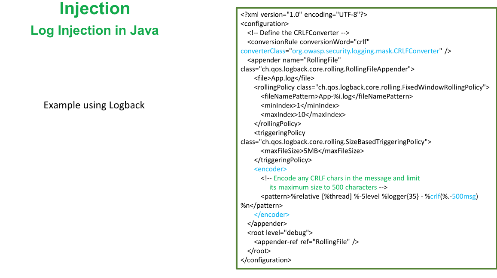