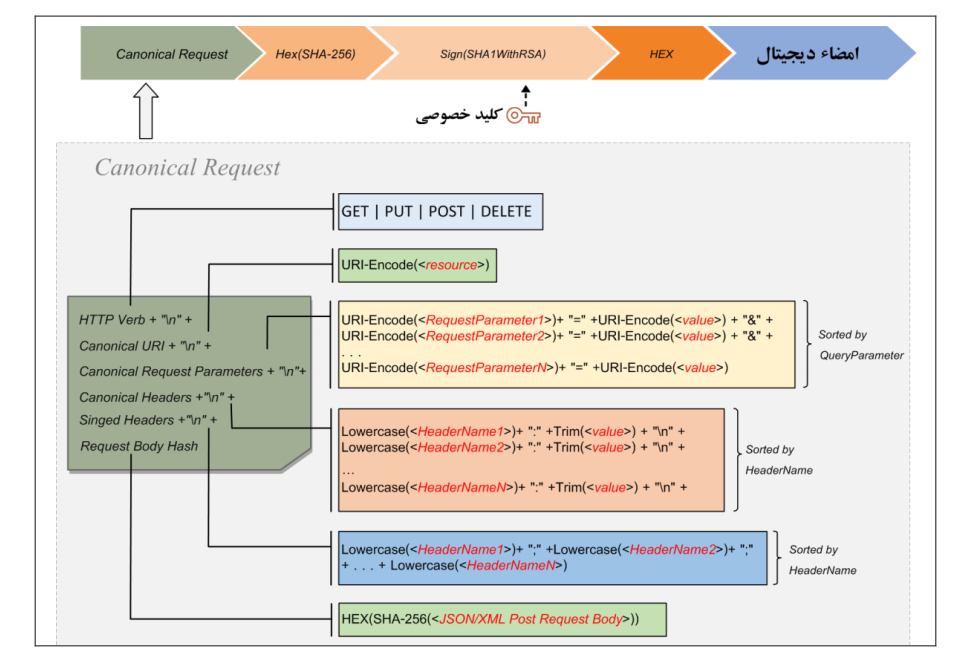
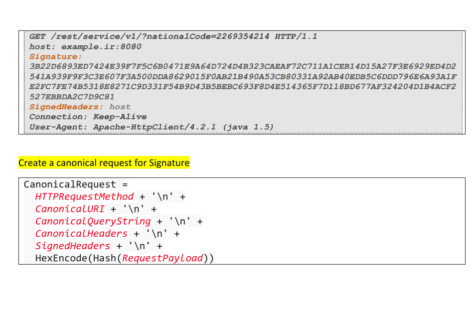

# Digital Signature

## Concept

We use digital signature to achieve undeniability. The request we send should have a signature in header and, we send
it, the server should verify it.

## Create signature of request

In order to do this we need to adopt canonical request properties to our request.

### Canonical request characteristic

### Create Digital signature

* first we adopt above characteristic
* we hex the hashed result of canonical request
* we sign the hex result
* we hex the signature and this is the digital signature

