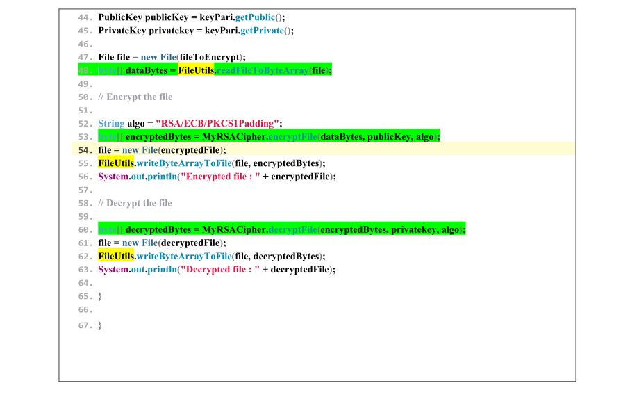

# Apache Commons File encryption

> The difference with cipher stream and file encryption is that cipher stream ciphers whole file data, but here we can
> only encrypt what we want.

> Performance is better here but cipher streams apply more security.
