# Serialization & Deserialization vulnerabilities

## Concept

Whenever we need to save a Java object on external resources we serialize the object and whenever we try to read that
object from binary format we deserialize it. To deserialize we use `ObjectInputStream` class. In order to prevent
deserializing untrusted objects we need to define a whitelist of trusted Objects.

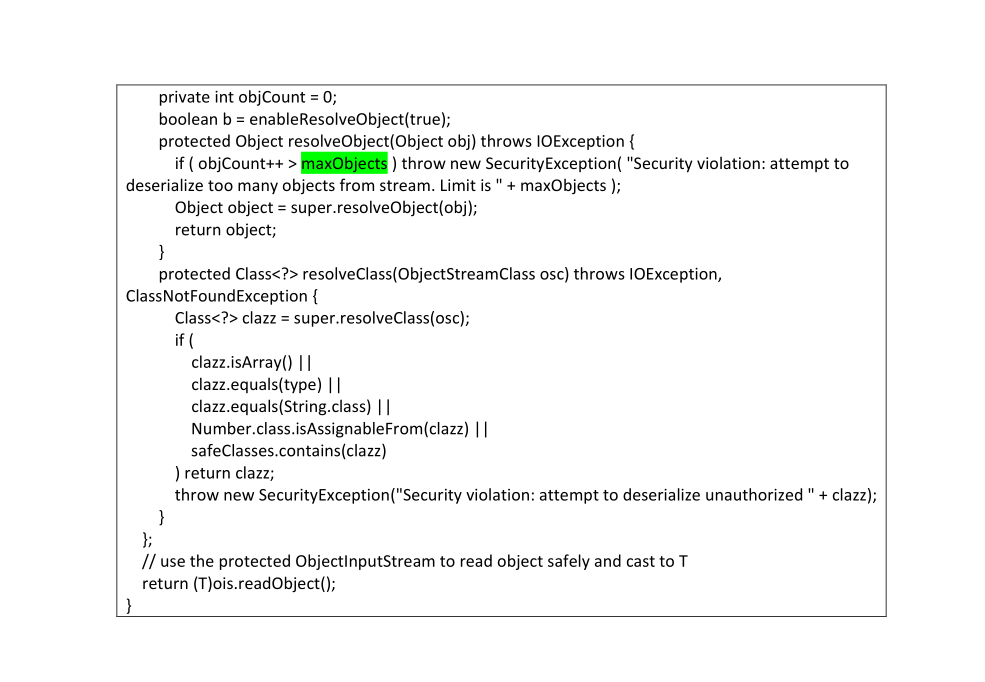

### XXE

When we want to access external entity from XML file a security risk will rise. In this case JSON is better to use.

### Deserialize Objects

When we're trying to deserialize an untrusted object we have to use whitelist method to verify the object we read.

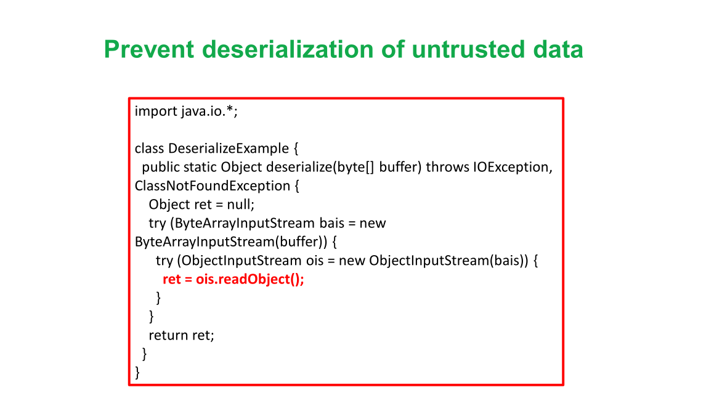

### Breaking singleton pattern

We use singleton in order to make sure we only create one instance for a class. But we can break this pattern by
serialize and deserializing an object or using java reflection API.

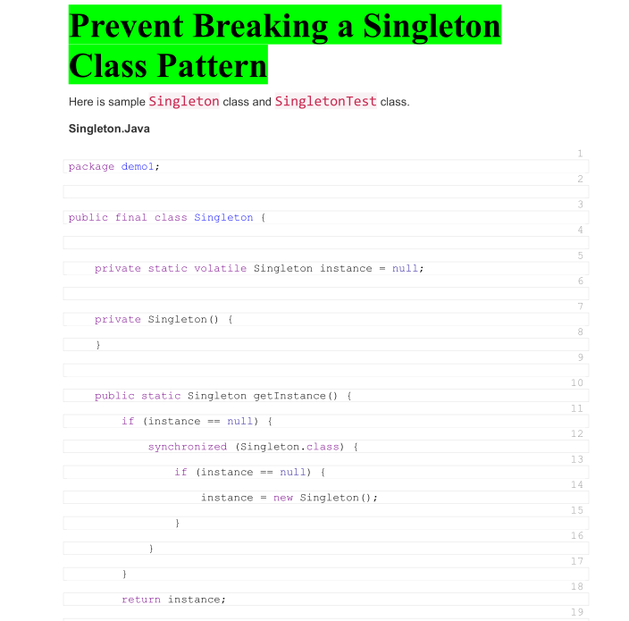
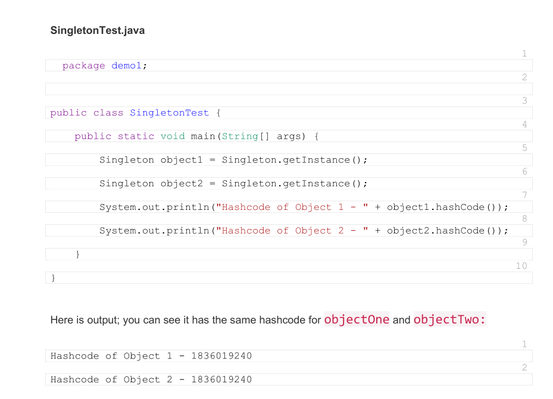
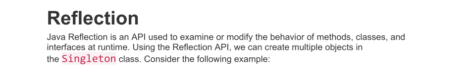
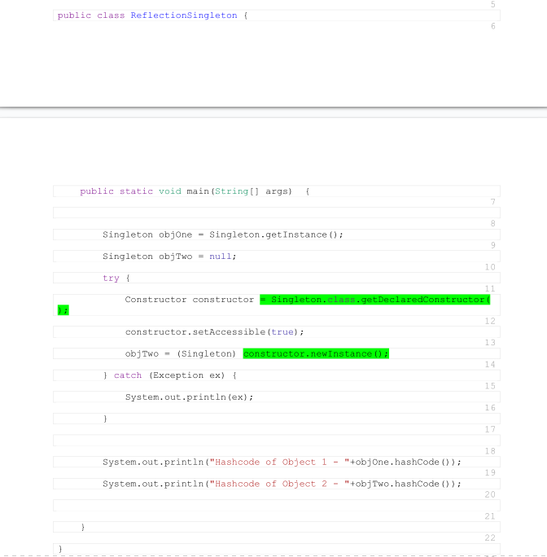
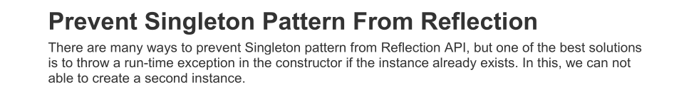
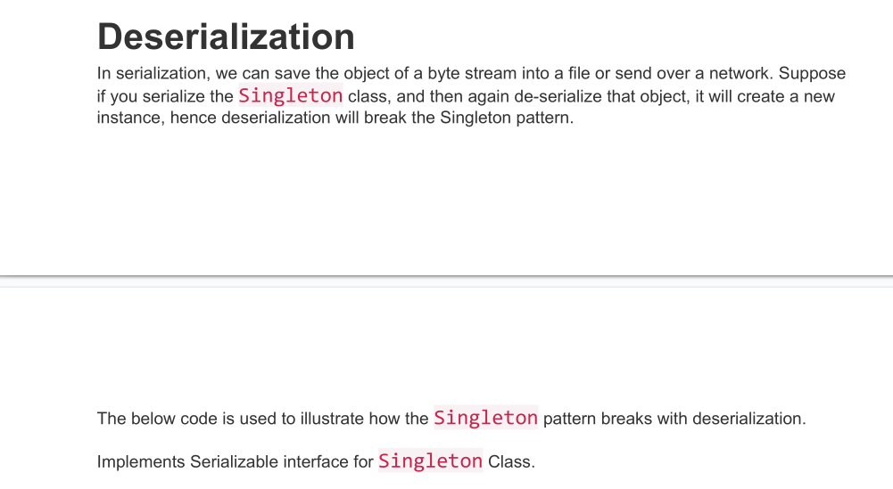
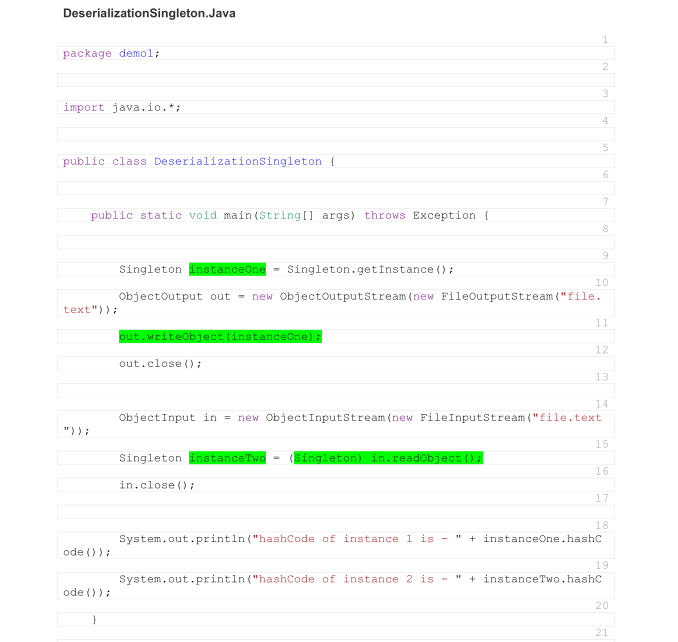
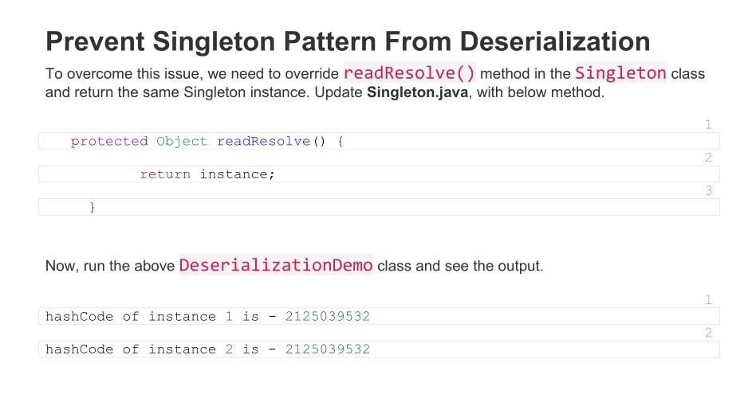
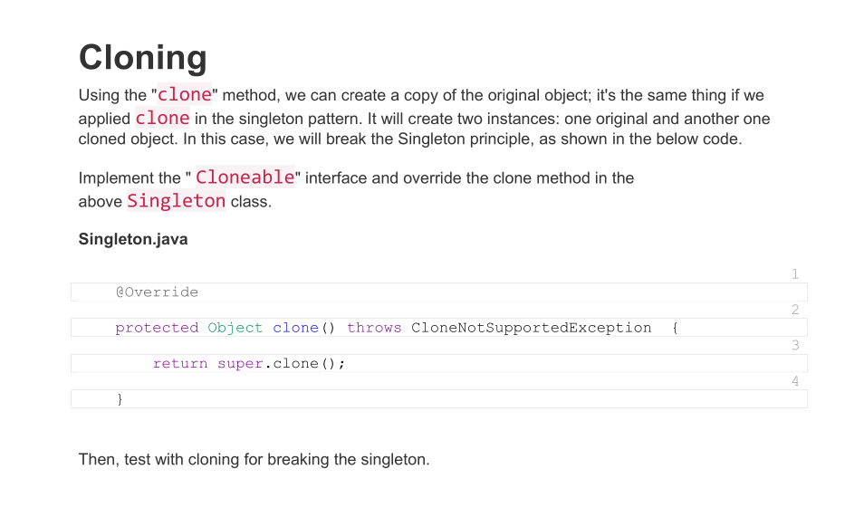
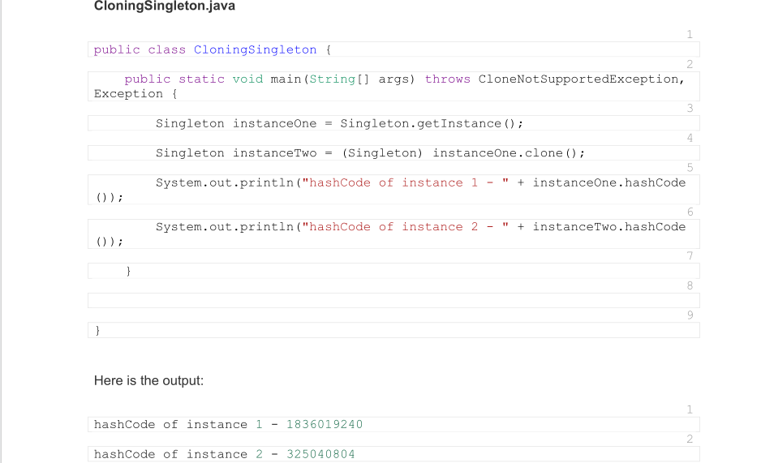

