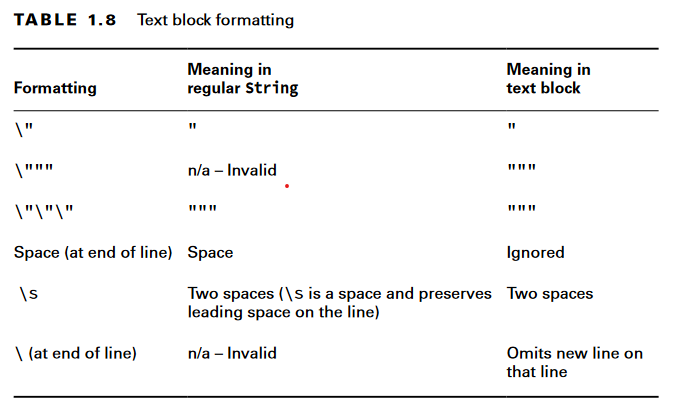

# Text Blocks

Java has text blocks, also known as multiline strings Which are useful when we want string values with lots of escape characters.

## Usage

A text block starts and ends with three double quotes (""") and the contents don’t need to be escaped.

> Text blocks require a line break after the opening """
> If we put closing """ on another line it reserves a new line.

## incidental and essential whitespace

Essential whitespace is part of your String and is important to you.
Incidental whitespace just happens to be there to make the code easier to read. You can reformat your code and change the amount of incidental whitespace without any impact on your String value.

## Text Block formatting

