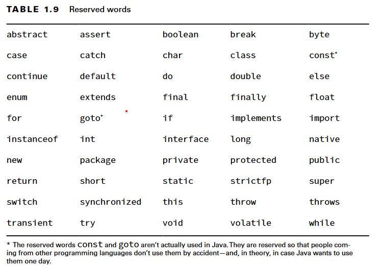

# Variables

A variable is a name for a piece of memory that stores data. When declaring you need to state the variable type along with giving it a name. To initialize a variable just type the variable name followed by an equal sign, followed by the desired value.

## Identifiers

Four rules:

* Identifiers must begin with a letter, a currency symbol, or a _ symbol
* Identifiers can include numbers but not start with them
* A single underscore _ is not allowed as an identifier
* You cannot use the same name as a Java reserved word.

## Conventions

Class and interface names are also written in
camel case, with the first letter uppercase. Java generally uses uppercase snake case for constants and enum values

## Declaring multiple variables

You can declare many variables
in the same declaration as long as they are all of the same type.
You can also initialize any or
all of those values inline.

## Initializing Variables

Before use, we need to set a value for a variable. Some types of variables get this value set automatically, and others require the programmer to specify it.

### Local variables

A local variable is a variable defined within a constructor, method, or initializer block.

> The final keyword can be applied to local variables and is equivalent to declaring constants.
> final applied to reference types we can modify the content, or data, The compiler error isn’t until when we try to change the value of the reference.

#### Uninitialized Local Variables

local variables don't have default value so, compiler reports an error if you try to read an uninitialized value.

### Passing Constructor and Method Parameters

These parameters are like local variables that have been pre initialized.

### Defining Instance and Class Variables

An instance variable, often called a field, is a value defined within a specific instance of an object.

Each instance of the class would have its own value for the variable it has.

> Two instances could have the same value for name, but changing the value for one does not modify the other
> Class variable is refered to static fields.

Instance and class variables do not require you to initialize them. As soon as you declare these variables, they are given a default value.

### Type inference with var

You have the option of using the keyword var instead of the type when declaring local variables under certain conditions.
the compiler to determine the type for you by looking at the value

> var is still a specific type defined at compile time. It does not change type at runtime.

`var n = null`: The compiler is being asked to infer the type of null. This could be any reference type. The only choice the compiler could make is Object.

> While a var cannot be initialized with a null value without a type, it can be reassigned a null value after it is declared, provided that the underlying data type is a reference type.
> var is not a reserved word and allowed to be used as an identifier. It is considered a reserved type name. A reserved type name means it cannot be used to define a type, such as a class, interface, or enum.
