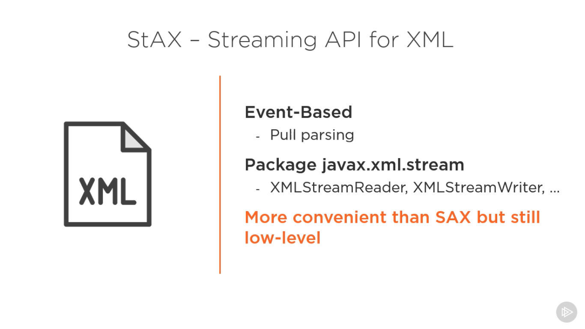
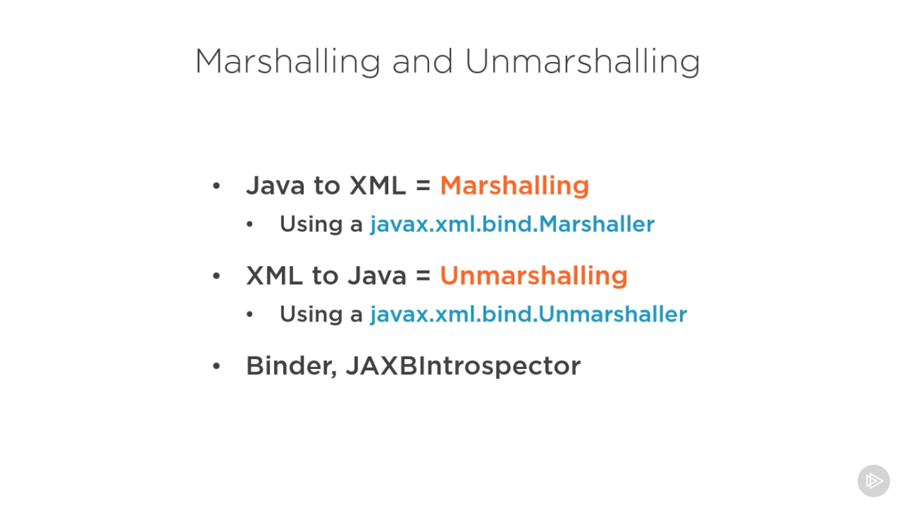
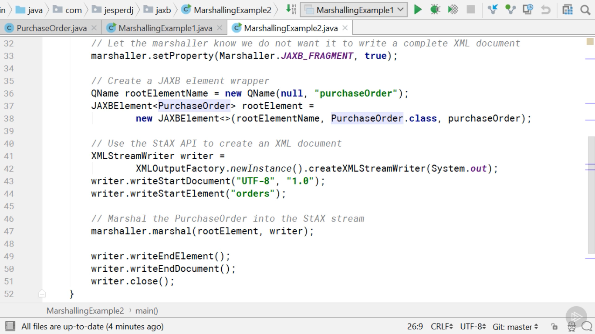
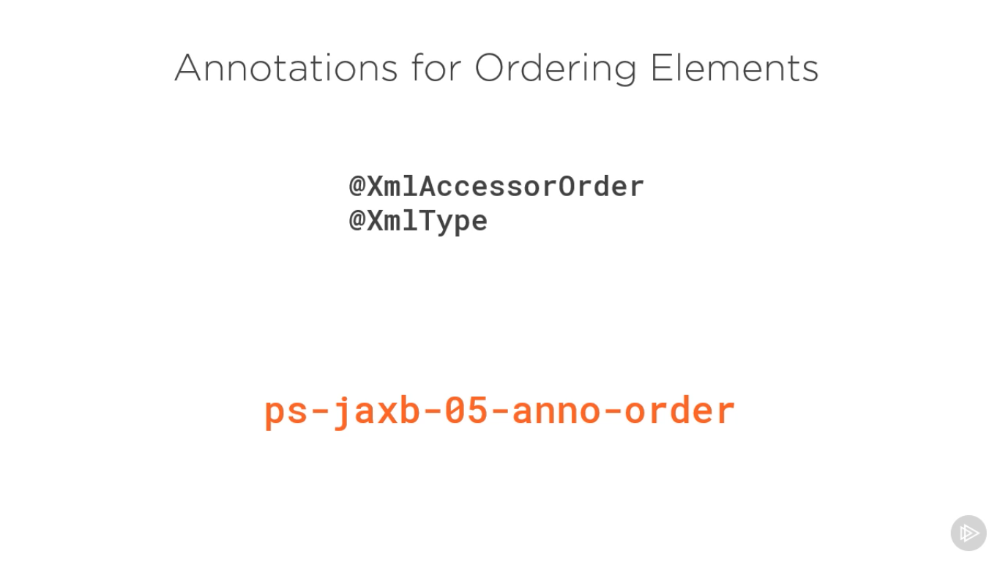
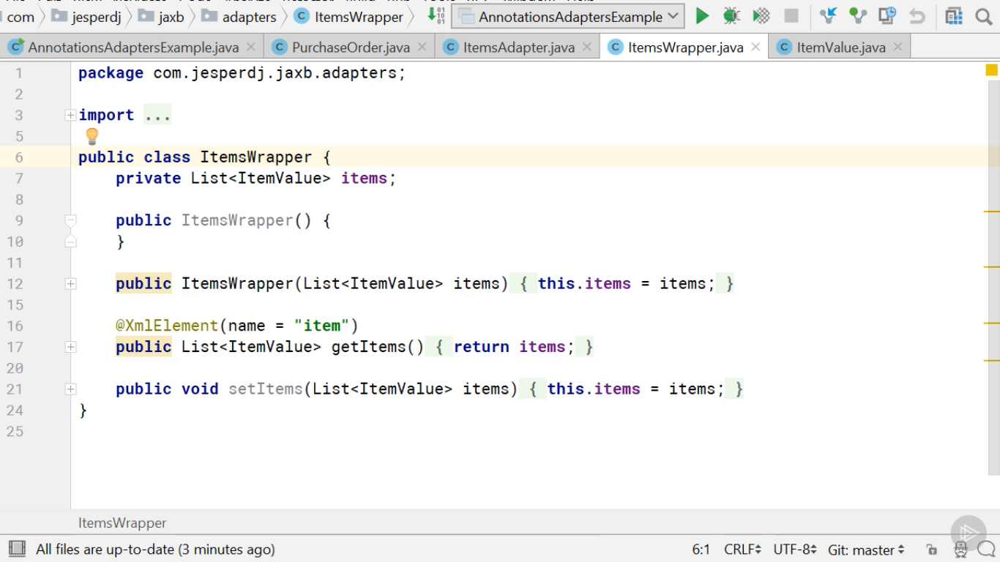
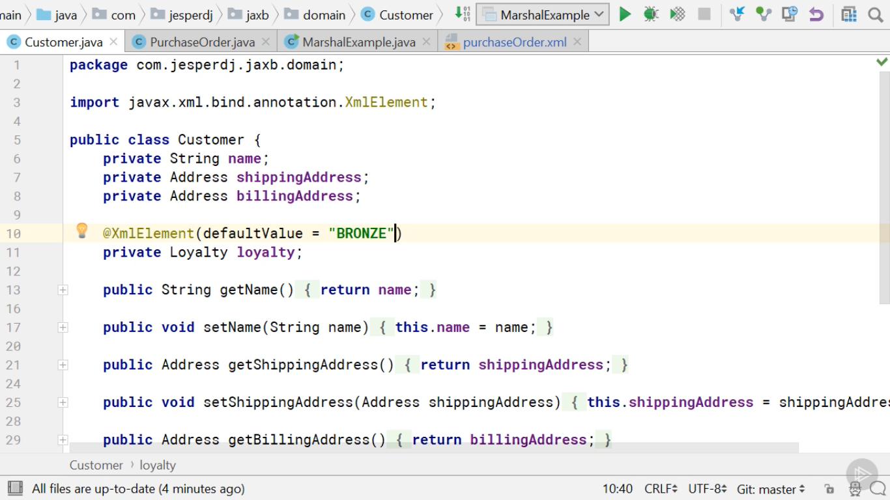

# XML - Extensible Markup Language

## Concept

XML is a standard data format which is used to store and exchange data in applications. JAX-B is one of the Java XML
APIs.

## JAXB

Java Architecture for XML Binding. We use JAXB for binding XML data to a Java POJO. There are several APIs for
processing XML:

* DOM
* SAX
* StAX
* JAXB

## XML & Namespace

namespace is like packages in java which keep a bunch of related tag names together. start tag can have a special
attribute name xmlns and the value will be the name of the namespace.

XML unlike HTML doesn't have fixed set of tags. You just define custom tags that are meaningful in the context of your
application. The XML Schema defines the data model for xml. Schema has different languages

* DTD
* XSD
* W3C

In order to define a schema we use w3 namespace and also use xs prefix. We can define useful things at root level like
elements, attributes, simpleType and complexType. Complex type are types that contain other nested elements.

## JAXB API

### Marshalling java objects to XML

### JAXB annotation

JAXB gives us annotations to control the binding of data to Java POJOs.

The way JAXB models the Domain from Java insight using Class fields. Fields are wrapper & primitive and, it
can access them through getters and setters like java beans. We can also, customize JAXB to access fields directly. Some
annotations are applicable both on getters/setters and fields.

Domain model from XML is done by element, attribute, simpleType(primitive) and complexType(wrapper) declaration

### Order of elements

If we don't specify the order annotations, JAXB will order the fields as it please.

### Mapping to simpleTypes

### Mapping Enums to SimpleTypes

### Mapping collections and Arrays

> This is not efficient, best practice is the method below

> This works on arrays and sets but, maps should be customized with adapters.

### Custom mapping with Adapters

### Generating XSD form Java code

### Generating named & anonymous types

> If we pass empty string anonymous root element will be created.

### Making elements and attributes required

### Specifying default values for elements adn attributes

### Making elements Nillable

### Distinguishing between absent and nillable

