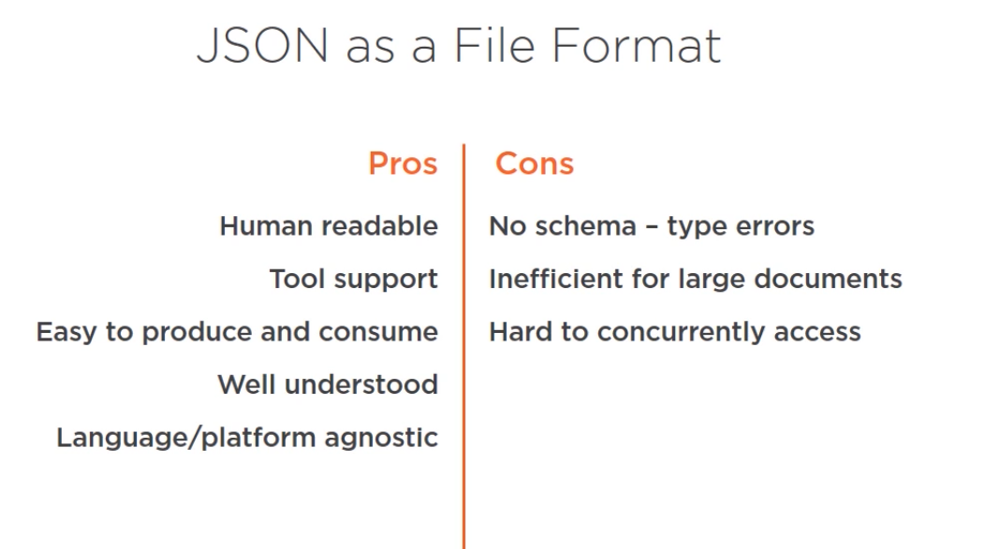

# JavaScript Object Notation

## Concept

A language independent, human-readable data interchange format.

## Use cases

### Communicating with the Browser

JSON is easily parsed into javascript inside browser and all the data that transfers between browser and server is
wrapped in JSON format.
This communication is done using:

* Remote procedure calls over HTTP
* server sent events
* Websocket

### Communicating between services

Data exchange between different services can be done using json format.

### Data storage

We can store data as JSON, The best practice is to store configurations using JSON format.



## Structure of JSON

JSON structure starts with {} and inside it, we define the fields that define our data. We can model fields, Objects and
Collections inside it. everything is comma-separated.

```json
{
  "name": "dogigiri",
  "age": 21,
  "car": {
    "model": "Ford"
  },
  "numbers": [
    {
      "number": 1
    },
    {
      "number": 2
    }
  ]
}
```