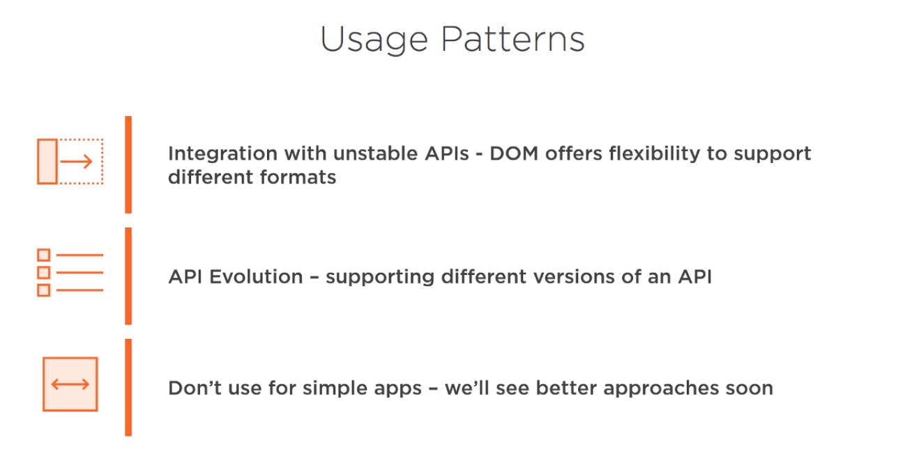

# Jackson Library

## Producing JSON

There are several ways to produce a JSON from java objects:

* Manual manufacture -> String concatenation or format
* Generator API -> lightweight API to generate a JSON file but lots of maintenance. Jackson is used for this
* Binding API -> Automatic serialization of POJOs & JSON

```java
import com.fasterxml.jackson.core.JsonFactory;
import com.fasterxml.jackson.core.JsonGenerator;
import com.fasterxml.jackson.core.util.MinimalPrettyPrinter;

public class GeneratorApiDemo {
    public static void main(String[] args) {
        JsonFactory factory = new JsonFactory();
        JsonGenerator generator = factory.createGenerator(System.out);
        generator.setPrettyPrinter(new MinimalPrettyPrinter());

        generator.writeStartObject();
        generator.writeStringField("name", objectField);
        generator.writeEndObject();

        generator.flush();
    }
}
```

> Arrays and other stuff can be build too. This way is less error-prone from string format way.

```java
import com.fasterxml.jackson.databind.ObjectMapper;

public class BindingApiDemo {
    public static void main(String[] args) {
        ObjectMapper objectMapper = new ObjectMapper();
        ObjectWriter objectWriter = objectMapper.writerWithDefaultPrettyPrinter();
        String json = objectWriter.writeValueAsString(javaObject);
        System.out.println(json);
    }
}
```

> We can also, write it using different streams other than a String object.


## Consuming JSON

### DOM API(Tree style API)

Document Object Model is for describing logical structure of JSON document, represents parsed JSON document as an object
graph. Defines how to access and manipulate the document.

We can read the json Tree structure using `readTree()` method which gives us JsonNode object. This represents a single
node within the hierarchy. We can set prettyPrint on it.
The great advantage is that if there is an error in json structure we get JsonParse Exception.
We can access all fields with `fields()` method which returns an iterator.

```java
import com.fasterxml.jackson.core.JsonParser;
import com.fasterxml.jackson.databind.JsonNode;
import com.fasterxml.jackson.databind.ObjectMapper;

import java.util.Iterator;
import java.util.Map;

public class JacksonDemo {
    public static void main(String[] args) {
        ObjectMapper objectMapper = new ObjectMapper();
        JsonNode jsonNode = objectMapper.readTree("file.json");
        sout(jsonNode.toPrettyString());

        Iterator<Map.Entry<String, JsonNode>> fields = jsonNode.fields();
        while (fields.hasNext()) {
            String fieldName = sout(fields.next().getKey());
            String value = sout(fields.next().getValue());
        }
    }
}
```

We can use `get()` from JsonNode to retrieve value of a property or provide index to access the objects inside them.



### Binding API

Using this API we just bind Json object into a simple Java POJO. This is done by `readValue()` method which takes
source of JSON and target POJO as arguments. The fields identifiers should be exactly the same. Jackson will set
values using reflection if we don't have setter methods.

```java
import com.fasterxml.jackson.databind.ObjectMapper;

public class BindDemo {
    public static void main(String[] args) {
        ObjectMapper objectMapper = new ObjectMapper();
        Pojo pojo = objectMapper.readValue("source", Pojo.class);
        System.out.println(pojo);
    }
}
```

In case of Immutable objects we don't have setters and fields are final. We can create a constructor and mark it with
`@JsonCreator` and each parameter must be corresponded to `@JsonProperty`.
In case we want to change variable name in application we can rename it with `@JsonProperty("name")` on getter or
setter or field.
WE can also ignore certain fields from serializing into JSON by `@JsonIgnore` on setter or getter.


> Jackson has already written modules for date fields.


### Streaming API

We use streaming API Mostly because of performance because binding and DOM load the whole JSON in memory but streaming
gets each token individually.

In order to use this API we instantiate JsonFactory object. Then we `createParser()` from a resource. This is closable.
parser has `nextToken()` for advancing step by step.


## Json Information Architecture

We prefer Explicit schemas to implicit schemas.

* Implicit: Producer & Consumer assume the structure of the message
* Explicit: Schema is documented and ideally enforced with class generation


> In order to minimize the impact of pain the streaming API is the most independent method to JSON schema.


