# Project Lombok

Lombok is an island near Java island. This project helps us get rid of boilerplate code we write for Pojo classes.
***

## Introduction

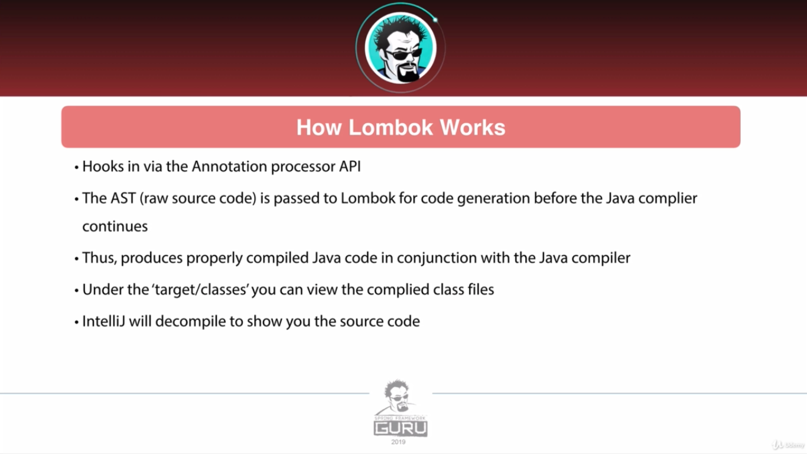
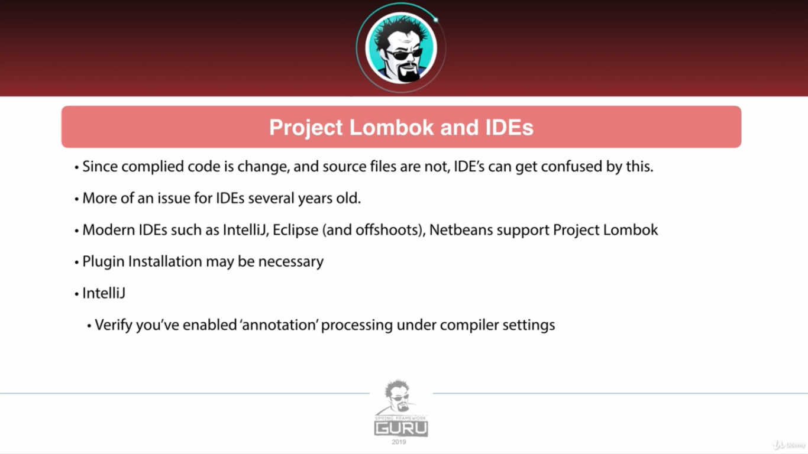
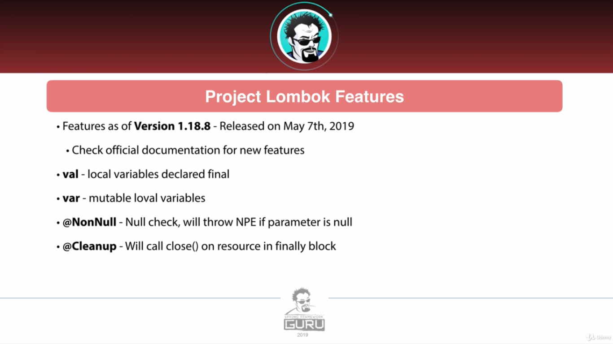
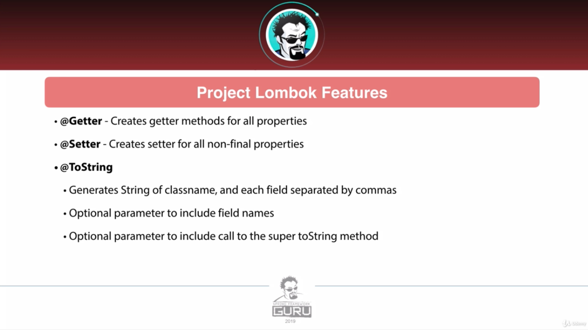
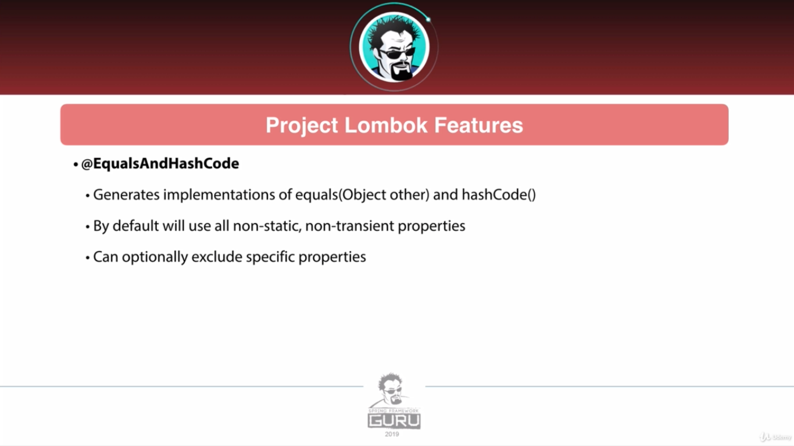
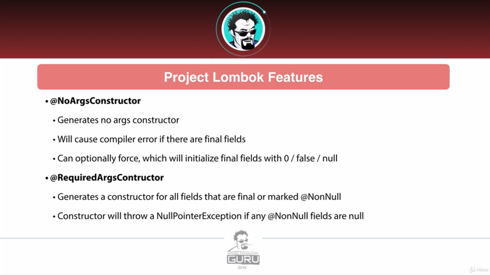
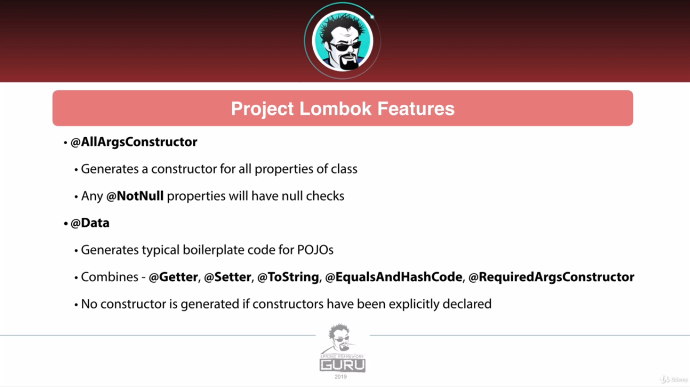
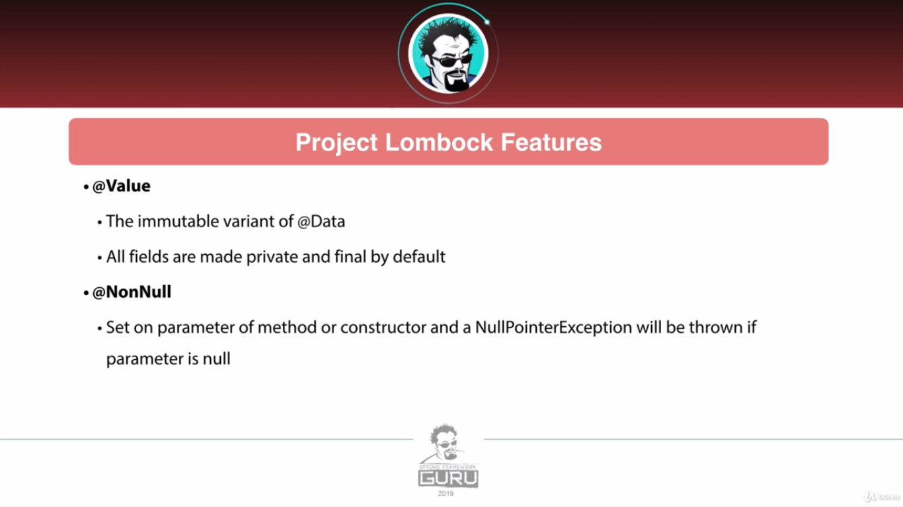
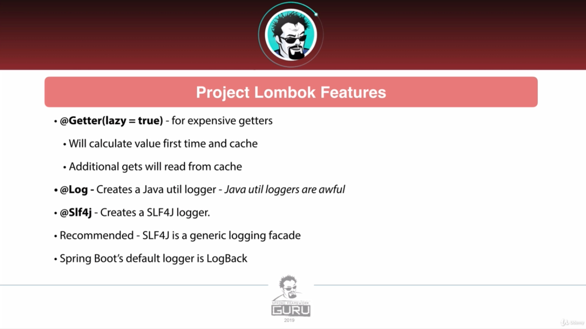

## Lombok annotations to avoid in entity classes specially with JPA

We mostly need to avoid using `@Data`, `@EqualsAndHashCode`, `@ToString`. For toString we need to exclude our
collections to avoid getting a lazy fetch type exception.

### Getters & Setters

```java
import lombok.AccessLevel;
import lombok.Getter;
import lombok.Setter;
import lombok.experimental.Accessors;

import java.util.List;

@Getter
@Setter
@Accessors(chain = true, fluent = true)
public class Demo {
    @Getter(AccessLevel.MODULE)
    private String foo;
    private String bar;
    @Getter(lazy = true)
    private final List<String> data = new List<>();
}
```

> We can customize Access-level of fields. With lazy argument we just initialize the field When we call the setter. We
> can also chain setters with chain argument and remove set prefix from method names with fluent attribute.

### ToString

```java
import lombok.ToString;

@ToString(includeFieldNames = false, callSuper = true)
public class Demo extends SuperDemo {
    @ToString.Include
    private String foo;
    @ToString.Exclude
    private String bar;
}
```

```java
import lombok.ToString;

@ToString(onlyExplicitlyIncluded = true)
public class SuperDemo {

}
```

> If we have inheritance we can use `callSuper = true` to include the superclass toString.

### Equals 7 Hashcode

```java
public class Demo {
    private String foo;
    private String bar;
}
```

> We have include & Exclude and, a similar callSuper attribute like toString.

### Constructors

We have `@AllArgsConstructor`, `@NoArgsConstructor` and `@RequiredArgsConstructor`. The required one generates
constructor initializing the final and variables marked with @NonNull.

### Builder

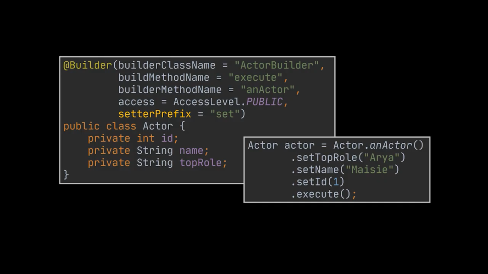
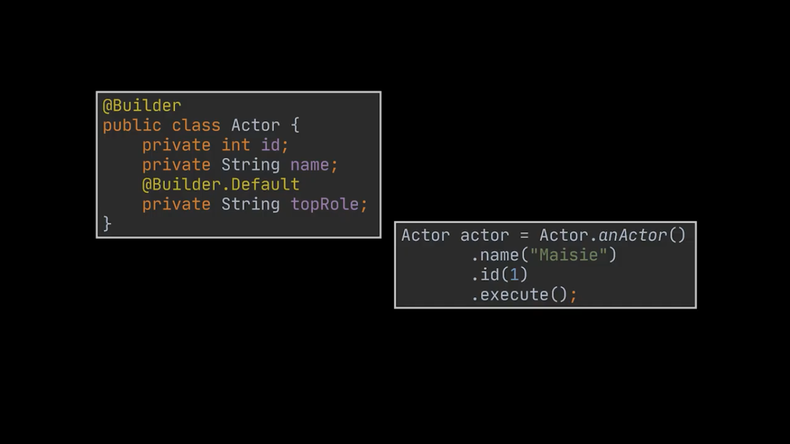
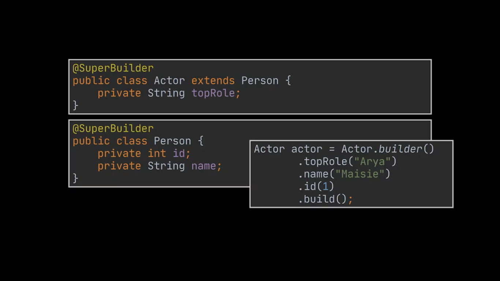

### Resource management

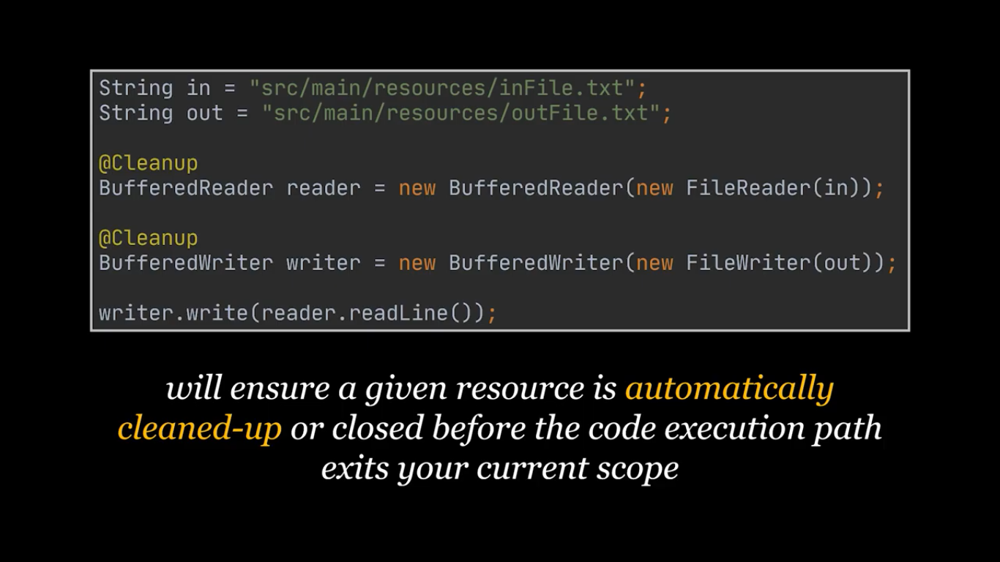

### Log

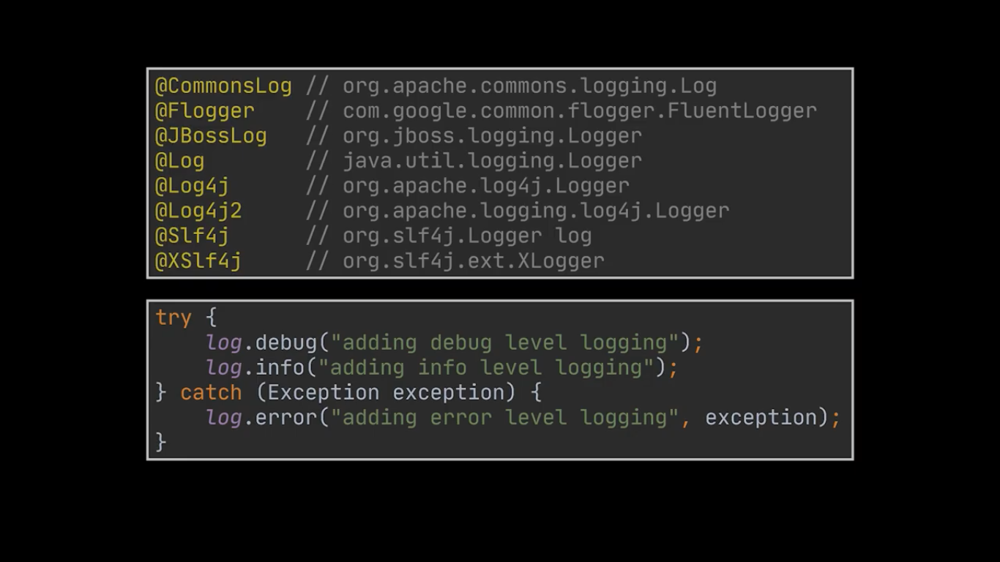
