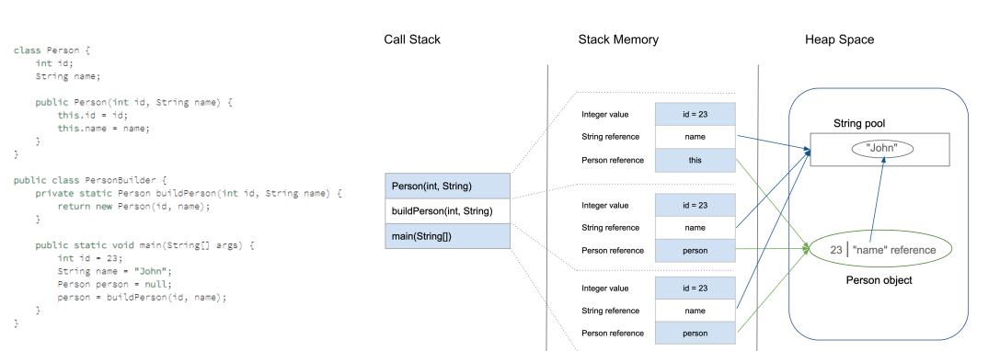
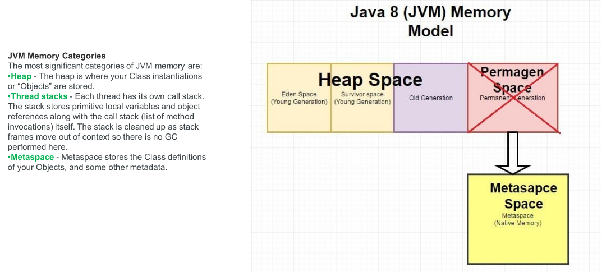
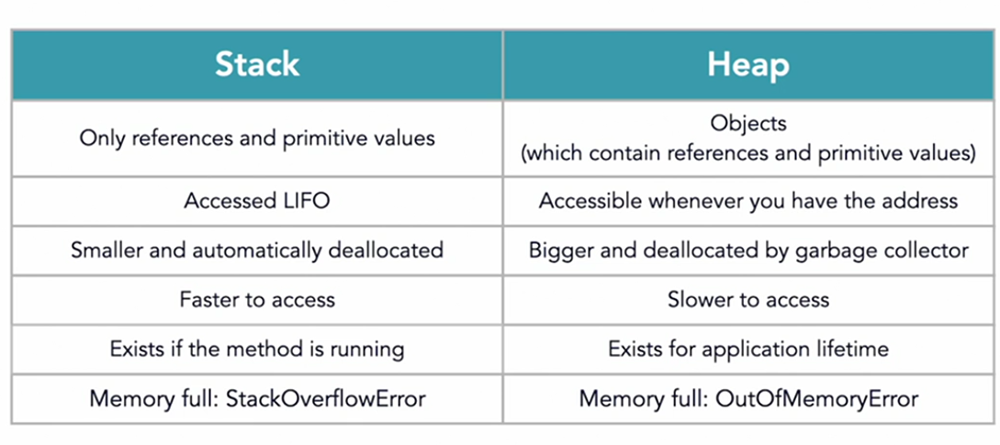
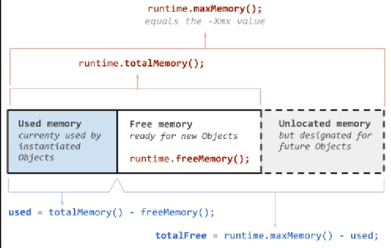

# Memory Management in Java

## Concept

In order to run Java programs JVM takes part of hardware memory from OS and manages it to run Java programs. All data allocation and deallocation like Instances, values, constants, field and method data, codes, native methods and order of execution is managed by JVM itself.

Java memory has different parts

* Stack
* Heap
* Class area(metaspace) -> outside JVM
* Native method stack memory
* Counter register for execution order

### Stack memory

There's stack for each thread in program. Stack is the memory which is used for executing methods. with each call one block for that method will be created which contains primitive types & Object references(_The actual Object reference will be created on heap_).
Stack has a LIFO structure, Each task get executed in order, and after it is done its completely gone from the stack area and no longer accessible.

> Using Stack is low cost however, One thing that might go wrong in stack is stackoverflow which may occur when we run a recursion function that lead to almost infinite instructions and may cause stack overflow.

### Heap memory

Heap is used to store heavy reference types(Java _Objects_). These objects contain primitive and references to other objects and are accessible all over the application. Unlike stack memory heap is not cleaned if the object job is done.
When reference is null and can not be accessible from anywhere Garbage Collector(GC) will be activated to deallocate that object from heap area.




### Heap vs Stack



### Metaspace

First it was permgen which was part of heap and, now it's out of JVM memory. It contains class definitions which are loaded by ClassLoader.

### Pass by value

In java when we pass primitive variables as arguments in method, a copy of that variable is created on the stack which leaves the original variable unaffected.

```java
public class PassByValue {
    public static void main(String[] args) {
        var original = 5;
        calculate(original);
        System.out.println(original); // 5 is printed on console no matter what is done in calculate method.
    }
}
```

### Pass by Reference

When we pass wrapper objects as arguments we actually pass the reference by value. So, another reference is created to that object. So if we modify it inside the method, the original one will be effected. Java doesn't support pass by reference directly however, passing references by value may mimic this behavior.

```java
public class PassByReference {
    public static void main(String[] args) {
        var jose = new Customer();
        changeName(jose);
        System.out.println(jose.getName()); // the modified name will be printed.
    }
}
```

### Final Object as Attributes

When we declare an object final, we can't make the reference to point to another object inside heap memory however, we can still mutate the object inside heap unless we define all of its attributes final and make it read only.

> We can create constants by using final keyword. If we use it on reference types, That reference can never change.

## Runtime Class

We can access some Runtime hardware statistics using this class. for example

* `Runtime.getRuntime().availableProcessors()` would return available CPU cores
* `Runtime.getRuntime().freeMemory()` shows free heap memory
* `Runtime.getRuntime().maxMemory()` shows max memory set for heap
* `Runtime.getRuntime().totalMemory()` Shows total memory it uses on heap memory
* Used memory is computed by `totalMemory() - freeMemory()`



> We can set custom values for these settings by passing appropriate parameters when using java command to run the
> program.

## Escaping references

We use encapsulation to bind and hide data inside the class instances. If we have a wrapper type property inside the class we may create a getter for it, so this will return the current reference of the attribute and everyone can manipulate it from outside the scope. This is called escaping reference.

```java
public class Example {
    private Map map;

    public Map getMap() {
        return map; // escaping reference
    }
}
```

> One way to solve this issue is to return new object of that type(making it immutable). For iteration purposes we can also use iterator pattern.
> **However**, in case of collections The most elegant way for doing that is to return an immutable type of collection like, `UnmodifiableMap` class.
> For other objects we can provide a constructor which creates an objects from another instance of the type and, we can return new type of the object whenever we want.
> To provide readonly feature We can create an interface that provides only getter methods and return this interface instead.

## Garbage Collection

Object references in stack that don't point to anywhere are eligible for garbage collection. We can access the gc by `System.gc()` or Runtime instance. but it doesn't ensure gc will clean the reference. We also have finalized() which is called right before the object is getting cleaned by gc. _This method is not suitable for closing resources._

### Memory Leak

When objects are not freed by GC, memory leak is happening. Each object which is not reachable by its reference is
eligible for collecting.

> GC suspends other threads trying to get its job done. Most pauses on application are for this thread.

#### Soft Leak

when an object is referenced on stack but, it will never be used again.

### Generational GC

* Uses Mark & Sweep algorithm: GC doesn't remove references directly, it first marks them and after a while moves them to another block of memory.
* Generational Garbage Collection: heap has several stages named eden, survival 0, survival 1 and old generation.
  Objects that get created are in eden and if they survive they grow to old generation.

> We also have minor gc and major gc, each responsible for eden and old generations. Old gen is slower, because there are lots of objects.
> error related to heap is called Out of memory which only kills the vm.
> If we provide our own class loader which is not correctly implemented, and may load a class into metaspace more than once. The server will get down since Metaspace is not inside JVM.

## Tuning JVM

* `-Xmx:` set the maximum heap size (default is 256 mb)
* `-Xms:` set the starting heap size
* `-Xmn:` set the size of eden generation(overall sizes must be greater than this)
* `-XX:MaxMetaspaceSize` set the size of metaspace
* `-XX:MaxPermSize` set the size of permgen prior to java 8
* `-XX:PrintCommandLineFlags`
* `-verbose:gc` print in console when object is collected.
* `-XX:HeapDumpOnOutOfMemory` creates a heap dump file

In order to use other types of collectors:

* -XX:+UseSerialGC -> use serial gc which uses single thread for garbage collection and is suitable for single processor
  systems and apps that work with fewer data
* -XX:+UseParallelGc -> uses multi thread collector which is suitable for multiprocessor system
* MostConcurrent which gives us two options that are closest to realtime garbage collection that don't pause application
  * -XX:+UseConcMarkSweepGC
  * -XX:+UseG1GC

> We can see other options with `java -XX:+PrintCommandLineFlags`
