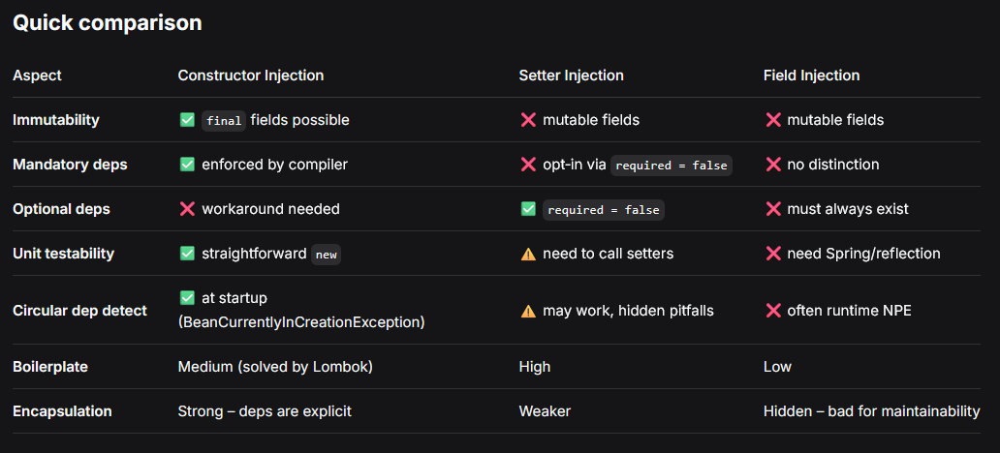

# Dependency Injection

***

## Concept

Injecting a dependant object by another Object is called dependency injection.
It means we don't explicitly `new` the object(initialize), a some sort of third
party object handles the initialization and pass the dependency to us.

## Types of DI

* By class properties - least preferred
  * Can be public or private properties
  * Using private properties is EVIL.
* By setters
* By constructor(most preferred)

NOTE: Property injection on private fields is EVIL because Spring needs to use reflection
to inject the dependency if the class is immutable(no setters). However, using constructor
solves this problem because injects the value in the time of initialization and also the
class can remain immutable.

NOTE: Final fields is also best practice.

[**Property Injection is EVIL by: Mario
Junior*](https://www.linkedin.com/pulse/avoid-private-field-dependency-injection-here-why-m%C3%A1rio-j%C3%BAnior/)

## Concrete Classes vs Interfaces

* Interfaces is preferred because it gives us the runtime polymorphism ability.
* We can have multiple implementations like Java DataSource.
* Interface Segregation of SOLID principle.

## Inversion of Control

Is a technique to allow dependencies inject at runtime.

## Using DI with Spring

First we need to provide our dependency classes and mark them with one of spring stereotypes.
Then we need to specify them in the dependent class and use one of the methods specified above
with `@Authowired`.

We have three different types of Autowiring:

* field injection
* setter injection
* constructor injection



### @Bean approach

In @Bean approach we can simply wire two beans together by calling the method of target @Bean we want in the setter of the current Bean.
Or we can define the dependent Bean inside parameters and spring will automatically wire these bean together.

```java
@Configuration
@ComponentScan(basePackages = {"com.dogigiri"})
public class VehicleConfiguration {
    @Bean
    String name() {
        return "Dogigiri";
    }

    @Bean(name = "audiVehicle")
    public Vehicle vehicle1() {
        return new Vehicle("Audi");
    }

    @Bean("hondaVehicle")
    @Primary
    public Vehicle vehicle2() {
        return new Vehicle("Honda");
    }

    @Bean(value = "ferrariVehicle")
    public Vehicle vehicle3() {
        return new Vehicle("Ferrari");
    }

    @Bean
    public Person person() {
        var person = new Person();
        person.setName("Foo");
        person.setVehicle(vehicle3());
        return person;
    }
}
```

```java
@Configuration
@ComponentScan(basePackages = {"com.dogigiri"})
public class VehicleConfiguration {
    @Bean
    String name() {
        return "Dogigiri";
    }

    @Bean(name = "audiVehicle")
    public Vehicle vehicle1() {
        return new Vehicle("Audi");
    }

    @Bean("hondaVehicle")
    @Primary
    public Vehicle vehicle2() {
        return new Vehicle("Honda");
    }

    @Bean(value = "ferrariVehicle")
    public Vehicle vehicle3() {
        return new Vehicle("Ferrari");
    }

    @Bean
    public Person person(Vehicle vehicle) {
        var person = new Person();
        person.setName("Foo");
        person.setVehicle(vehicle);
        return person;
    }
}
```

## @Qualifiers

If we have multiple implementations of dependency interface, spring can't figure out
by default which dependency to inject so, We use `@Qualifier(name="dependencyName")`.
NOTE: in constructor injection we need to use this as an argument but, in the others we can do it above `@Authowired`.

```java
public class test {

    public Class(@Qualifier("dependencyClass") DependencyClass deClass) {
        this.deClass = deClass;
    }
}
```

## @Primary

When we have multiple implementations but, we want one of them to be the default bean so if we don't mention `@Qualifer`
That been get injected, we can use `@Primary`. We specify it on top the dependency Class declaration.

```java
    @Bean("hondaVehicle")
    @Primary
    public Vehicle vehicle2() {
        return new Vehicle("Honda");
    }

    @Bean(value = "ferrariVehicle")
    public Vehicle vehicle3() {
        return new Vehicle("Ferrari");
    }

    // now there will be no ambiguity
    var secondVehicle = context.getBean(Vehicle.class);
    log.info("the vehicle name is: {}", secondVehicle.getName());
```

## Spring Profiles

Profiles allow us to have certain beans that have a specific configuration.
NOTE: we can have multiple beans with one qualifying name and, we can make a
difference between them using this profile. All we have to do is to specify
the active profile in application.properties otherwise, there will be a conflict.
for example, we can have two database configurations and active them by their
profile.
</br>
There's a default profile so that if there's no active profile this is activated.
All we have to do is to pass another argument to `@Profile({"profileName", "default"})`.
