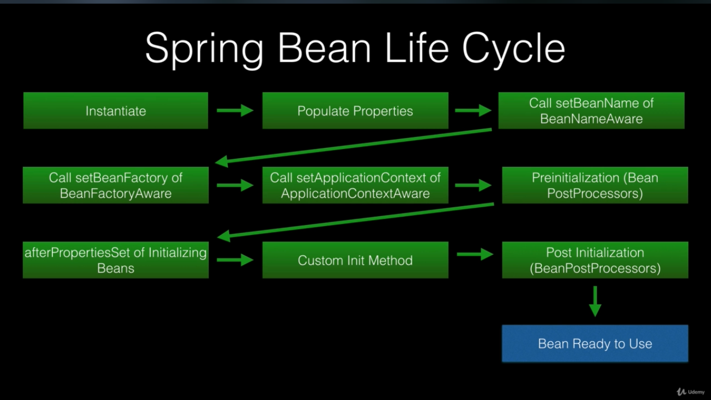
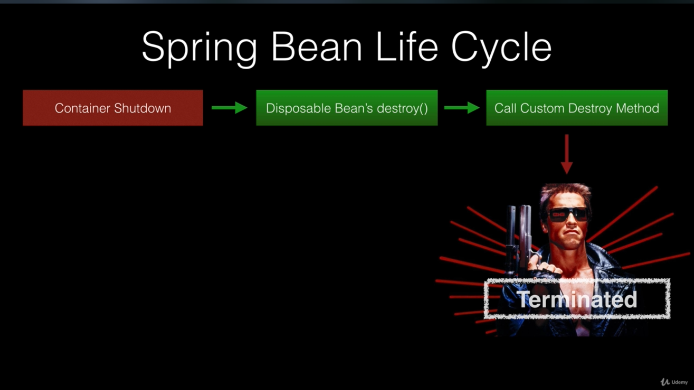
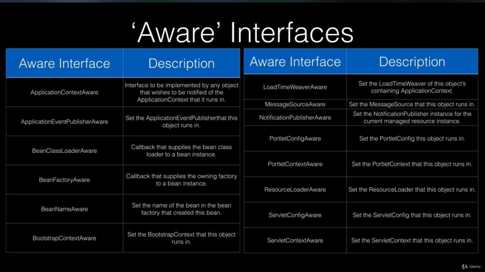

# The Spring Context

This is also called Application Context or Spring IoC container
Best brief explanation with code samples: 
[**Baeldung spring container**](https://www.baeldung.com/spring-application-context)
***

## Spring Container

container is a predefined program or component, and it's responsible for creating the object, holding them in memory and
also injecting them into another object as required.

## Application Context interfaces

The Spring IoC container is responsible for managing the objects of an application.
It uses dependency injection to achieve inversion of control.
The interfaces BeanFactory and ApplicationContext represent the Spring IoC container.
Here, BeanFactory is the root interface for accessing the Spring container.
 It provides more enterprise-specific functionalities.
The important features of ApplicationContext are resolving messages,
supporting internationalization, publishing events, and application-layer specific contexts.
This is why we use it as the default Spring container.

> Spring Application Container initializes bean with Eager behavior by default. On The other hand Bean Factory is lazy.
> Spring Container bean configuration can be changed to use lazy behavior for expensive objects.

## Bean

a bean is an object that the Spring container instantiates, assembles, and manages.
In order to configure beans we can use Java-based configuration, annotation-based configuration
and XML configuration.

Beans are defined with name and ID property and can be accessed via them. different names(aliases) can be assigned to a
bean.

> If we declare two beans from a same Class, and the scope is singleton, two objects will be created for that class.
> This means the spring container scope for beans is actually multi-ton pattern. We can also call a method from spring
> container that returns definition types which will return a Map which is actually basic of multi-ton pattern.

## Types of Application Context

* AnnotationConfigApplicationContext
* AnnotationConfigWebApplicationContext
* XmlWebApplicationContext
* FileSystemXMLApplicationContext
* ClassPathXmlApplicationContext
* SpringApplication in spring boot applications.

## Spring bean lifecycle

Spring has two interfaces we can implement for callback events

* InitializingBean.afterPropertiesSet()
    * Called after properties are set.
* DisposableBean.destroy()
    * Called during bean destruction in shutdown.

Spring also has two annotations we can use to hook into the bean lifecycle.

* @PostConstruct annotated methods will be called after bean is constructed but, before its returned to requested object
* @PreDestroy is called just before the bean is destroyed by the container.

Bean PostProcessors

* We can manage our beans inside spring context lifecycle and, interact with them as they are being processed.
* implement BeanPostProcessor interface.
    * postProcessBeforeInitialization: called before bean initialization method
    * postProcessAfterInitialization: called after bean initialization.
    * both get the bean object as argument.

Aware interfaces

* has 14 Aware interfaces, these are used to access the spring framework infrastructure. widely used within the
  framework.
  

