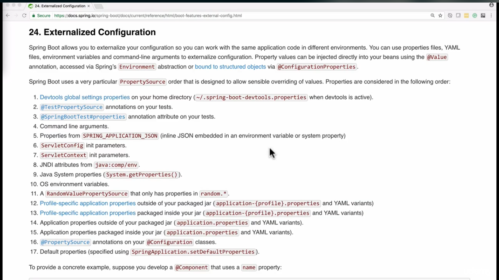

## External Properties Configurations

***

### Why?

Most of the time we want to read configuration from properties file isolated from Classes.
<br>
We define our properties files inside resources' folder. Then we can add a PropertySourcesPlaceHolderConfigure bean
inside configuration class, then provide values to properties we want, using spEL.
</br>*Properties File*

### Spring Expression Language

```properties
ds.mysql.username=root
ds.mysql.password=root
ds.mysql.url=root
```

*Configuration Class*

```java

import org.springframework.beans.factory.annotation.Value;
import org.springframework.context.annotation.Bean;
import org.springframework.context.annotation.PropertySource;
import org.springframework.context.support.PropertySourcesPlaceholderConfigurer;

@org.springframework.context.annotation.Configuration
@PropertySource("classpath:/pathToProperties")
public class FooConfiguration {
    @Value("${ds.mysql.username}")
    private String username;
    @Value("${ds.mysql.password}")
    private String password;
    @Value("${ds.mysql.url}")
    private String url;

    @Bean
    public PropertySourcesPlaceholderConfigurer propertySourcesPlaceholderConfigurer() {
        return new PropertySourcesPlaceholderConfigurer();
    }
}
```

> We can Create a bean of the object that wraps these properties and use it.

### Access variables inside properties files

We can access properties file inside configuration class using `@PropertySource(fileName)` annotation. Then we can
access The variables using `@Value` annotation with EL syntax.

> In order to use values inside properties file or yaml file we use `${var}}`. however, we can use `#{var}` to extract
> a bean's attribute.

### Spring environment variable

We can define environment variables in OS or just edit the run/debug configurations.
and set variables.
These variables override the properties variables. if we set another name,
and we want to override properties variable we can simply `@Autowire` `Environment`
and use `getProperty()` to set the value inside variable.

### Multiple Property Files

We can use multiple properties files by<br>
`@PropertySources({
@PropertySource(),
@PropertySource()
});`

> We can write these properties on application.properties file and still get them without
> creating `PropertySourcesPlaceholderConfigurer` bean or `@PropertySource`



### YAML

Using YAML properties is much newer and cooler!

### Spring Boot Profile Properties

We can declare properties files based on profiles.
"application.fa.properties"
In YAML we can split documents by "---"
This is much convenient.
