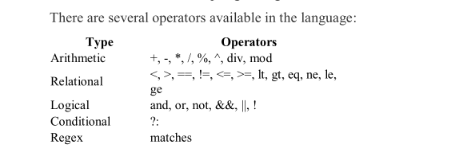

# Spring Expression Language

We can fetch properties inside of properties files or spring beans and manipulate them using SpEL.

## Operators



SpEL expressions begin with the # symbol, and are wrapped in braces: `#{expression}`. Properties can be referenced in a
similar fashion, starting with a $ symbol, and wrapped in braces: `${property.name}`. Property placeholders cannot
contain SpEL expressions, but expressions can contain property references: `#{${someProperty} + 2}`

### Arithmetic

```java
public class arithmetic {
    @Value("#{19 + 1}") // 20
    private double add;
    @Value("#{'String1 ' + 'string2'}") // "String1 string2"
    private String addString;
    @Value("#{20 - 1}") // 19
    private double subtract;
    @Value("#{10 * 2}") // 20
    private double multiply;
    @Value("#{36 / 2}") // 19
    private double divide;
    @Value("#{36 div 2}") // 18, the same as for / operator
    private double divideAlphabetic;
    @Value("#{37 % 10}") // 7
    private double modulo;
    @Value("#{37 mod 10}") // 7, the same as for % operator
    private double moduloAlphabetic;
    @Value("#{2 ^ 9}") // 512
    private double powerOf;
    @Value("#{(2 + 2) * 2 + 9}") // 17
    private double brackets;
}
```

### Relational & Logical

```java
public class Logical {
    @Value("#{1 == 1}") // true
    private boolean equal;
    @Value("#{1 eq 1}") // true
    private boolean equalAlphabetic;
    @Value("#{1 != 1}") // false
    private boolean notEqual;
    @Value("#{1 ne 1}") // false
    private boolean notEqualAlphabetic;
    @Value("#{1 < 1}") // false
    private boolean lessThan;
    @Value("#{1 lt 1}") // false
    private boolean lessThanAlphabetic;
    @Value("#{1 <= 1}") // true
    private boolean lessThanOrEqual;
    @Value("#{1 le 1}") // true
    private boolean lessThanOrEqualAlphabetic;
    @Value("#{1 > 1}") // false
    private boolean greaterThan;
    @Value("#{1 gt 1}") // false
    private boolean greaterThanAlphabetic;
    @Value("#{1 >= 1}") // true
    private boolean greaterThanOrEqual;
    @Value("#{1 ge 1}") // true
    private boolean greaterThanOrEqualAlphabetic;
    @Value("#{250 > 200 && 200 < 4000}") // true
    private boolean and;
    @Value("#{250 > 200 and 200 < 4000}") // true
    private boolean andAlphabetic;
    @Value("#{400 > 300 || 150 < 100}") // true
    private boolean or;
    @Value("#{400 > 300 or 150 < 100}") // true
    private boolean orAlphabetic;
    @Value("#{!true}") // false
    private boolean not;
    @Value("#{not true}") // false
    private boolean notAlphabetic;
}
```

### Conditional

```java
public class Conditional {
    @Value("#{2 > 1 ? 'a' : 'b'}") // "a"
    private String ternary;

    @Value("#{someBean.someProperty != null ? someBean.someProperty : 'default'}")
    private String ternary;

    @Value("#{someBean.someProperty ?: 'default'}") // Will inject provided string is someProperty is null (groovy like)
    private String elvis;
}
```

### Regex

```java
public class Regex {
    @Value("#{'100' matches '\\d+' }") // true
    private boolean validNumericStringResult;
    @Value("#{'100dod' matches '\\d+' }") // false
    private boolean invalidNumericStringResult;
    @Value("#{'valid alphabetic string' matches '[a-zA-Z\\s]+' }") // true
    private boolean validAlphabeticStringResult;
    @Value("#{'invalid alphabetic string #$1' matches '[a-zA-Z\\s]+' }") // false
    private boolean invalidAlphabeticStringResult;
    @Value("#{someBean.someValue matches '\d+'}") // true if someValue contains only digits
    private boolean validNumericValue;
}
```

## Collections

```java
public class Collection {
    @Component("workersHolder")
    public class WorkersHolder {
        private List<String> workers = new LinkedList<>();
        private Map<String, Integer> salaryByWorkers = new HashMap<>();

        public WorkersHolder() {
            workers.add("John");
            workers.add("Susie");
            workers.add("Alex");
            workers.add("George");
            salaryByWorkers.put("John", 35000);
            salaryByWorkers.put("Susie", 47000);
            salaryByWorkers.put("Alex", 12000);
            salaryByWorkers.put("George", 14000);
        }
    }

    @Value("#{workersHolder.salaryByWorkers['John']}") // 35000
    private Integer johnSalary;
    @Value("#{workersHolder.salaryByWorkers['George']}") // 14000
    private Integer georgeSalary;
    @Value("#{workersHolder.salaryByWorkers['Susie']}") // 47000
    private Integer susieSalary;
    @Value("#{workersHolder.workers[0]}") // John
    private String firstWorker;
    @Value("#{workersHolder.workers[3]}") // George
    private String lastWorker;
    @Value("#{workersHolder.workers.size()}") // 4
    private Integer numberOfWorkers;
}
```

## Parsing Expressions Programmatically

At times, we may want to parse expressions outside the context of configuration. Fortunately, this is possible, using
SpElExpressionParser. We can use all operators that we saw in previous examples but should use them without braces and
hash symbol. That is, if we want to use an expression with the + operator when used in Spring configuration, the syntax
is #{1 + 1}; when used outside of configuration, the syntax is simply 1 + 1.

```java
public class Parser {
    ExpressionParser expressionParser = new SpelExpressionParser();
    Expression expression = expressionParser.parseExpression("'Any string'");
    String result = (String) expression.getValue();
}
```