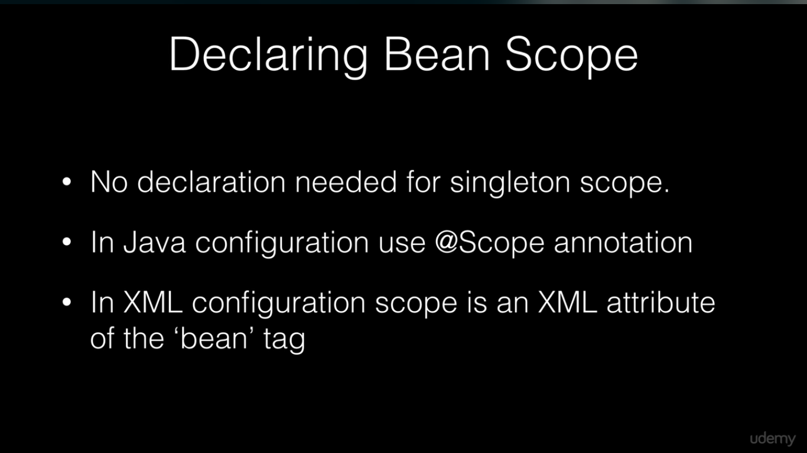

## Spring Configuration

***

### Types

* XML based configuration
    * common in legacy code
    * runtime development
* Annotation based configuration
    * Picked up by Component scan
    * Refers to class level annotations
* Java based configuration
    * Uses Java Classes to define Spring Beans
    * Configuration classes are defined by `@Configuration`
    * Beans are declared with `@Bean` annotation on Java methods
* Groovy bean DSL configuration
    * We can declare beans in Groovy

> These work seamlessly together to define beans in spring context.

#### Java Configuration

We can't Autowired third party classes Like usual classpath Interface implementation like classes. In order to do that
We
need to create Beans in Configuration class.

* We need to create a class annotated with `@Configuration`
* Create method with proper signature
    * The return type must be the Bean we want to auto-wire.
    * The name of the method should be the bean name
    * The method must be annotated with `@Bean`

```java
import org.springframework.context.annotation.Bean;
import org.springframework.context.annotation.Configuration;

@Configuration
public class Config {
    @Bean
    public Optional<Integer, String> optional() {
        return new Optional<Integer, String>();
    }
}
```

#### XML configuration

Instead of Config class we can define an XML file inside resources and create a bean tag which refers to the class we
want
and, we also give it a name. In spring boot we use `@ImportResource` and pass file location to it.

### Spring framework Stereotypes

* Stereotypes define a fixed general characteristics which represent someone or something.
* These are used to define beans in spring context.
  
  
  

### Component Scanning

In order to let spring find Java Beans we need to activate Component scanning. In spring boot applications, Package of
the class which has `@SpringApplication` by default is the base package of component scanning however, we can override
it with `@ComponentScan` and pass basePackages in an array or just one array. We can also, define basePackagesClasses.

### Spring Factory Beans

We can create one configuration file instead of creating several classes to have cleaner and much easily maintained
configuration class.

* We create a Factory class which is responsible to initiate a type based on a condition.
* We create class annotated with `@Configuration` We create a bean from factory class, Then we create
* beans with the help of factory class.

> `springcore/springconfiguration/greetingservice` is a great example


### Spring Bean scopes



