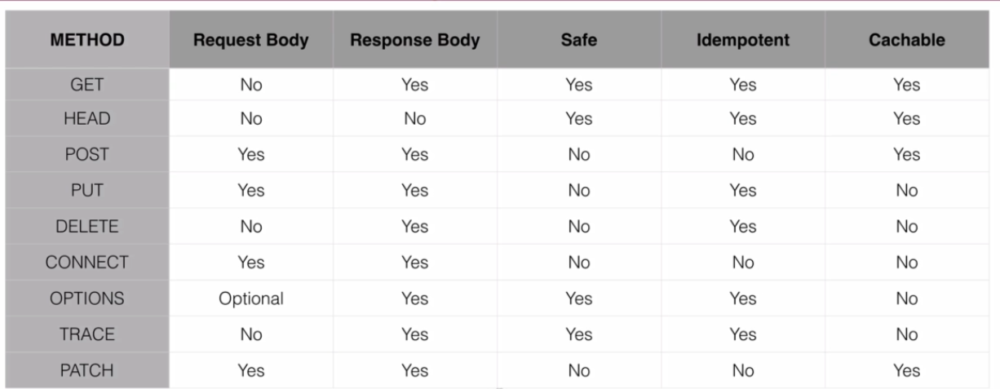

## Hyper Text Transfer Protocol

-- --
The base of Restful webservices is HTTP protocol which we can read the RFC to know about versioning details and history.

### Request methods

These methods also known as verbs indicate the desired action we want to be performed.

* GET: is a request for a resource.
    * This is used when you visit a website
* HEAD: is like get, but only asks for metadata of the resources without the body
* POST: is used to post data to server
    * post data passed to a html form
    * Post is create request
* PUT: request for enclosed entity to be stored in supplied URI. if the entity exists, it is expected to be updated.
    * put is a create/update request
* DELETE: is a request to delete the specified resource.
* TRACE: will echo the received request. can be used to see if the request was altered by intermediate servers
* OPTION: returns the http methods supported by the server for specified URL.
* CONNECT: converts request to transparent TCP/IP tunnel, typically for HTTPS through an unencrypted HTTP proxy.
* PATCH: applies partial modifications to the specified resource.

> GET, HEAD, TRACE and OPTION are safe methods, because they only fetch data from server.
> These safe methods plus DELETE and PUT are Idempotence methods meaning repeating these actions have no further effect
> on the outcome.
> POST is not Idempotence, means multiple post requests create multiple resources.

### HTTP status codes

* 100: informational in nature
* 200: successful request
    * 200 okay, 201 created, 204 accepted
* 300: redirections
    * 301 moved permanently
* 400: client errors
    * 400 bad request, 401 not authorized, 404 not found
* 500: serverside errors
    * 500 internal server, service unavailable

## Restful webservices

---- ----
_Because of simplicity and versatility, Restful web services have become a de facto standard for webservices. previously
SOAP was more ral-avant_
Rest means Representational State Transfer

* Representational: Typically JSON or XML
* State Transfer: Typically via HTTP

### Rest Terminology

* Verbs: Http methods
* Messages: payload of an action(JSON/XML)
* URI: The address to identify a resource.
* URL: A URI with network information.
* Idempotence: Operations which repeating them won't change the result like GET.
* Stateless: Service doesn't maintain any client state
* HATEOAS: Hypermedia as the Engine of application state

### Richardson Maturity Model(RMM)

* A model to describe the maturity of Restful services
* Unlike SOAP, there is no formal specification to Rest
* RMM is used to describe the quality of Restful service
* RMM defines four levels
    0. The swap of POX(Decrepit)
    1. Resources
    2. HTTP verbs(Most common)
    3. Hypermedia Controls(Provides Discoverability and making API more self documenting)

### Spring Framework and Rest Services

* Spring has 3 distinct libraries for creating restful services
* Spring has 2 distinct libraries for consuming restful services
* There are also several popular libraries for creating and consuming rest services
    * Spring MVC
    * Spring WebFlux:
        * Since Spring 5
        * reactive programming approach
    * Functional WebFlux(WebFlux.fn)
        * alternative to annotation based configuration
        * it's ideal to use for small scope microservices
        * used to rapidly create web services
    * Rest Template
        * Primary library used to consume Restful web services
        * highly configurable
        * very stable
    * Spring WebClient
        * since spring 5
        * Spring reactive web client

