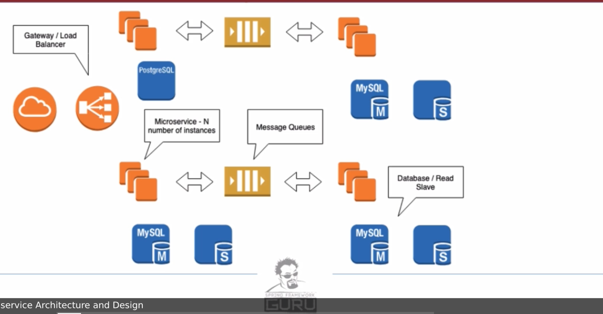

## Microservice Architecture

-- --

### Microservice Applications characteristics

**What are Microservices?**

* Microservices are small targeted services
* Microservices have their own repository
* Each of them is isolated from the other
    * They are not bundled with each other in order to get deployed
* Microservices are loosely coupled
    * They interact each other using Http/Json

**Microservices Applications**

* composed using multiple individual microservices
* Each service can have its own database
* each service is individually deployable
* scaling of individual services is now possible
* CI/CD is now easier because we have simpler and smaller services
* Each service can be implemented using different tech stack

**Cons of Microservices**

* Difficult integration testing
* Difficult deployment
* High Operational cost because each service wants its own resources
    * repo, database and ...
* Additional Hardware resources

### Microservices Architecture & Design

**Gateway**

* Endpoint that is exposed to other services
    * Can be Internet for public APIs
    * For most organizations its internal
* Abstract implementation of services
* Client calls URL and is unaware of routing that takes place to run the specific instance of the service
* Acts as proxy for network traffic
* Can also act as a load balancer

**Service Instances**

* We run N number of services
* Exact number depends on reliability and load requirement
* min 3 for high availability
* Some tools allow to dynamically scale based on the load or anticipated load

**Database tier**

* Typically, one database per microservice(Not a rule)
* Highly Scalable service will often have one transactional database
* Organizations will have more than one tech on this layer(mix of SQL & noSQL)

**Messaging**

* We expose an API endpoint using Restful API
    * Dependent microservices are message based
    * messages follow an event or common pattern
* Messaging allow decoupling and scalability
* Messaging can be used to define a work flow
    * new order, validate order, charge credit card, allocate inventory

**Downstream services**

* often an action on a microservice will invoke actions on multiple down stream services
* for example, a search on amazon may invoke lots of services to return the result

[12factor of Modern software services](http://www.12factor.net)