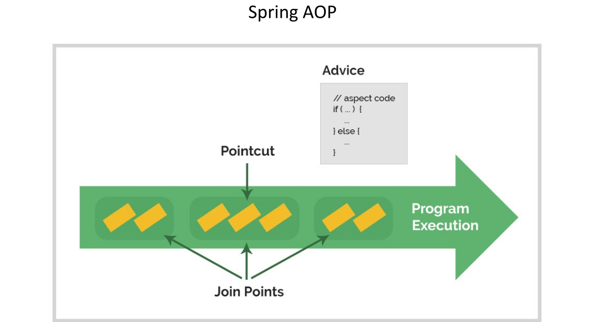

# Aspect Oriented Programming in Spring framework

We have Some cross-cutting concerns that are free of any layers in application Like Logging, Transaction management &
Security. We Write these aspects individually and apply it on different layers.

## Spring AOP vs AspectJ

Spring has its own AOP project but, we have standalone framework named AspectJ for This layer. It's recommended to use
Spring + AspectJ

## Concepts

### Advice

The piece of code we want to apply on different layers is called aspect code. These aspect codes are wrapped inside
`advice`.

### Pointcut

In order to map the advice to methods on different layers we use Pointcuts. We write an expression to apply pointcuts.

## Inside Code

We need to add the dependency of AspectJ and enable it inside configuration using `@EnableAspectJAutoProxy`.
We create a bean which is responsible for one logic we want to apply on other layers like logging.
We Wrap this bean with `@Aspect`. We create function we want to log when certain method is called. We wrap method with
`@Around(execution([expression]))`. We also need pointcut(joinPoint) to the function to control the method.

> We can use `before` or `after` instead of around to capture the specific phase we want.

